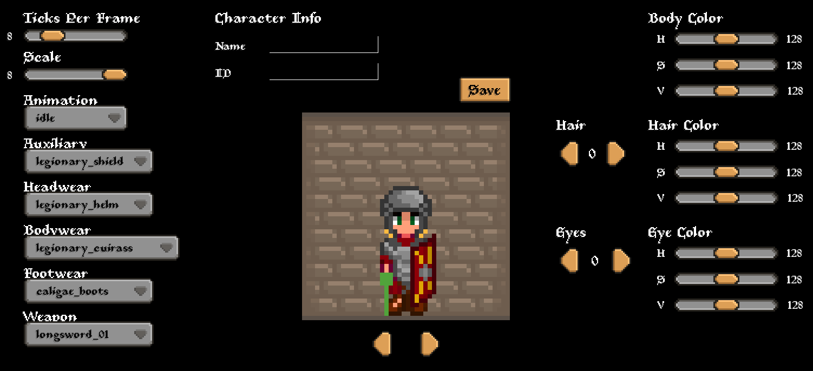

# 2026-01-23

A new update on the status of the character builder: I've changed some of the layout, added new fields for things like footwear, and have finished up (for now) a full 
suit of legionary armor (headwear, shield, boots, bodywear, etc). Things seem to be working pretty well, and I think we've pretty much covered all the different animations we'll need
for the first version of the game I'm planning to make. Here's how it looks:

# 2026-01-22

Ran into an interesting problem today, which ultimately ended up being my mistake, but I remembered that we are doing something tricky here with the body image frames,
so I wanted to take a second to quickly go over what we do and why.

## Entity Body System and Render Order

Our entity body system is a bit complex: we have multiple body parts (eyes, body, arms, legs, hair, equiped body, equiped legs, etc) which all need to move together to create the
resulting animation frames for an entity. This gets complicated and tricky really quick: If you want to add new animation frames, you have to make sure all the pieces sync up together
correctly. Also, when drawing these different pieces (in ebiten, on the screen) we have to figure out which parts draw before the others. This gets a little more complicated when you
factor in that when the entity is facing different directions, the drawing order will change (or certain things are excluded altogether).

Consider the sword slash animation. Generally, I want the hair set to appear on top of the body, because that makes sense doesn't it. I also want the hair set to appear on top of body
armor, in case the character has long hair (It might cover the shoulders). This is fine, and this all works alright with the arms, since I render the arms below the body armor too.

So, we have a render order of: body, arms, body armor, hair

However, when the character is facing up, this changes some things. The sword slash animation has the arm cocked back behind the character's head, and therefore his hand would show "above" the hair (since the hand is _behind_ the head, but we are facing _up_). But, this causes a problem: we still want the hair to draw on top of the body armor, but the body armor needs to
draw on top of the arms! There's a conflict here, because we can't draw the arms both below the body armor and above the hair.

## "Subtracting" Arms from Body Armor

So, the solution to this was a bit creative: Ebiten has some image "blending" functions that let you do things like cut out overlapping portions of two images.
In my code, I've been referring to this as "subtraction", and to get around the above problem, I "subtract" the arms body set by the body equipment set.
What this means is, if part of an arms animation frame is covered by the body armor, that portion is cut from the frame. That way, I can draw the arms body set "on top" of the body armor
without it actually showing up on top of it.

So, creative solution, yes. Also definitely adds some complexity to this code. That's for sure. But, I think it's a good enough trade off, because the alternate would probably include
making more and more frames for different possibilities and having some tricky logic in the code for detecting these different cases. Also, luckily we only really need to define a body 
parts definition once and keep reusing it. Once everything is working smoothly, I shouldn't have to touch it much anymore. But of course, anytime I do have to touch it, there are more
risks involved and I have to retest things carefully.

## Takeaways: Added Complexity, and How to Cope with it

I think in an ideal world (at least, the most simple world) I would just have a simple set of frames for every entity body animation, and not need to have everything split up into
different moving parts that need to be synchronized and drawn in the correct order. If the character only had a few possible sets of clothing and hair styles, this might be feasible,
but since this game will include lots and lots of different sets of armor, clothes, hair styles, etc, we need to make things as customizable as possible to accomodate that.

While I'm working with a lot of complexity here, one thing I keep making more robust as development continues is all of the validation and panic cases in the code.
The quicker my code can identify something is wrong, the better, as I can nip the issue in the bud. For this image subtraction issue, I ran into quite the confusing issue because suddenly,
the arms-body armor subtraction seemed to stop working. After adding new validation checks to everything, I realized that the image being used as the "subtractor" (the body armor image)
was empty... how? Well, I made a silly mistake and accidentally shifted the rows of the body armor animation frames, so suddenly an empty tile from the tileset was being used.
An annoying setback, but now I have further validation that checks if an image is "empty" and panics if so. So, if this same issue happens in the future, I should be able to catch it 
much quicker, and a lot earlier in the call stack.

# 2026-01-21

Back from New Years travel, but have finished up some refactoring that I started just before leaving. Took a little while to figure out where I left off - in hindsight, probably better
to not start that kind of big change until I was back, but we're back up and running!

I was refactoring the entity body system a bit: I've split the legs off of the body into its own body part, so that it can act independently of the head and torso.
The main reason this was necessary is that we need to be able to do some animations while both sitting and standing, or while riding a horse, etc.
For example, a character will need to be able to do the "drink from glass" animation while both standing and sitting. Also, a character should be able to swing a sword while both 
standing on the ground or riding a horse. It adds more flexibility to the character animations which is good.

But, the downside is that it complicates defining an entity's body frames a bit more. I used to just be able to clearly look at which frames were for which, but now that arms, legs, and
body are all split into their own tiles, it's trickier to spot the right ones that are supposed to be used together to form the actual full body animation frame. But, luckily I won't need
to do this much since I there won't be many different body set options. For clothing and armor, it's a little easier since there are just two parts: the torso/arms and the legs.

Speaking of which, I'm considering if I want to add support for equipping different leg equipment that differs from the body/torso equipment.
For example, maybe a character would want to wear some body armor like a legionary cuirass, but then be allowed to wear a different set of armor on the legs such as chainmail greaves.

Once I've ensured all the bugs are worked out of the new refactored body system, I'll move back on to improving/testing the combat system, improving NPC fighting AI, and then start
working on the first opening scenes and quests. A goal I have is to have some early stages of the game and the opening sequences mostly done by June, since I'll be going to the US and
can share the progress I've made with friends and family and get their feedback.

# 2025-12-03

Making more progress on the entity body animations and mechanics; I've added an additional "auxiliary" item type: the shield.

Shields use the same arm image as torches do, but they differ in a few ways:

1. they don't have an idle animation
2. they have an additional animation they support: blocking. torches can't do this, so I'll have to add some logic somewhere to handle preventing torches from running the blocking animation.

This just adds another case of special handling to the existing logic of the entity body and its animations, so it makes me wonder if I should review the code
and look for a way to further simplify or streamline things like animations. Currently, each animation is enumerated as specific fields of a BodyPart.
But, I'm wondering if it would be smarter and more scalable to instead make some kind of animations map where new animations can be simply registered in a single place,
and then in each location in the code where things like animations are handled, we can just iterate over the map of animations.

Anyway, I'm guessing I'll be spending the rest of this week and possibly next week finalizing some of these animations and entity body mechanics.
I want to get it working rock solid before I completely move on to other things. For one, if I narrow all the animations down now, then I will be able to make armor and weapons
more safely (without the risk of needing to redo or touch them up later).

I'm also thinking through how shields will work with combat. I think I have a few ideas to nerf them a bit, so that they aren't too overpowered (we don't want people to just
hold the block key forever until the enemy hits, and then just attack the enemy while they are stunned).

- While blocking, entities can't move. So, you sacrifice mobility for safety
- When holding up the shield, it takes a split second for the shield to actually reach its real effectiveness. This prevents players from just quickly spamming the block right as an attack is landing.
- if the entity is out of stamina, the shield can no longer withstand power attacks. power attacks sap the stamina from the blocking entity, and a power attack on a blocking enemy does not stagger the attacker. So, if someone is being stubborn and just sitting there holding the shield, an attacker can just hack away with power attacks if they want to break through (and they have the stamina).
- perfectly timed blocks (right at the instant of the strike, about) could trigger a "parry" where the defender counters the attack with an attack of his own.

Not sure if I'll use all of these ideas, but just wanted to brainstorm some real quick. Hopefully I can get the blocking combat mechanics working soon.

# 11/27/2025

A little snapshot of the current state of the Character Builder. I made this to facilitate creating new characters and NPCs in the game.
I've realized that this will probably be a very key thing for the future development of this game, so I'll be investing some time in making it work well,
adding new customizations and inputs, etc. Ultimately, something very similar will probably be used when players are starting a new playthrough and
designing their own characters.

# 11/21/2025

Starting this development blog to document the journey of creating this game. By now, development is already well underway, but also
probably just only really getting started.

Full history up to this point:

- started on this project, a 2d game engine, about a year or two ago (Looks like Feb 2024, according to git).
- went on a long hiatus at some point, most likely when I started my job at Hexabase.
- near the end of my time at Hexabase (mid to late 2025), I decided to pick things back up. At this point, the game engine was still very clunky and only had some basic concepts developed, like rendering maps and supporting a character walking around the screen. However, I decided to basically rip out a lot of the old logic and rewrite it, as I wasn't satisfied with how it worked. I also realized I need to change how I handle maps and animations, etc since I wanted to make use of the Tiled map editor.

So, at this point, I've been working full time on this for the past few months (August to November) and I've made a lot of considerable progress.
As of now, here are some of the major things that are working pretty well:

- Tiled maps and tileset integration is fully supported, and maps can be easily created and run in the game.
- Tiled tilesets are also widely used for any case where we need an image; it is pretty convenient to use their framework to easily organize and get tiles, frames, etc.
- Entities (NPCs, the player, etc) have been implemented and are pretty matured at this point; support for movement, collisions, animations, etc is pretty good at this point.
- NPC logic is still in its infancy, but I have created a "tasks" system to organize NPC behavior, into tasks such as "follow another entity", "attack another entity", etc. I foresee this growing in maturity until eventually there are really advanced tasks for all sorts of behaviors, and even full day schedules.
- Items have been developed to a basic level of functionality; the player has an inventory, and items can be put in the inventory. Items cannot be actually equiped yet, but that is next up.
- A trading screen and trading mechanics have been implemented, as well as a money system; the player can start a trade session and trade their items for gold, or use gold to buy items, and upon completing the trading transaction those item movements persist as expected.
- basic fighting mechanics have been implemented. Entities can do simple melee attacks on each other, and if hit there is a simple damage flicker animation and they get bumped backwards. Things like health and other vitals still need to be implemented though.

## Next Steps

So, I'm feeling pretty good about where we are at so far: a lot of the basic mechanics are doing well. Here are some things I'm planning to work on next:

- Equipping items: since the entity body can now show equipped items in all of its animations, now I need to make the body actually sync to what is equipped in the entity's inventory. If the player equips a certain helmet, I need to sync that to the body, basically. Same with weapons, auxiliary items, etc.
- Continue improving the combat system: since combat will be a big part of the game, I want to make sure it feels smooth and interesting. I don't want it to just be a single animation that you just repeatedly trigger over and over with left clicks until one of you dies. There should be certain strategies you can develop, different mechanics like power attacks, stamina involved in some way, etc. Also, it shouldn't feel frustrating or clunky.
- Continue to improve and finalize the player animations; this needs to be figured out and finished up in the early stages of this game's development, since every time an entity animation changes, I have to retest the animation's performance in the game, remake the affected clothing assets, etc. Ideally I get this squared away as soon as possible, so that I can start spending more time on new item artwork and not have the risk of needing to remake them later on.

## Lessons learned so far

Here are some big things that I've learned so far, which I've basically adopted as coding rules by now:

1. For complex and frequently used structs, always make a "constructor" function

Usually I name these "New[Struct Name]"; essentially a constructor for an object. Instead of directly instantiating a struct, use this function to guarantee that all the necessary inputs have been set, all necessary validation is done, etc. This makes things a lot easier, as you can then assume a lot of things to be confirmed throughout the rest of the lifecycle of the component or code feature.

2. Always panic and crash when state is found to be wrong (instead of trying to correct things and continue)

Basically the idea is this: if there is ever a point in the code where something is known to be incorrect, we want to crash. We don't want to ever tolerate that bad state, because that can just lead to more bad things down the road: it could materialize into other problems in other areas, and if we just continue to "work around" it, things get messy quick. I find it simpler to just add lots of assertions and panics in functions wherever I can think of a possible bad state, so that when it ends up happening - which is more often than you'd think - you can immediately nip it in the bud. Another tip is, ideally you put these assertions as close as possible to where the problem could originate. Putting the assertions/panics in the Update loop will definitely _notice_ the issue, but you won't be able to tell where that bad state actually started. So, anytime you manipulate data or process some action - those are good places to put a bunch of assertions.
