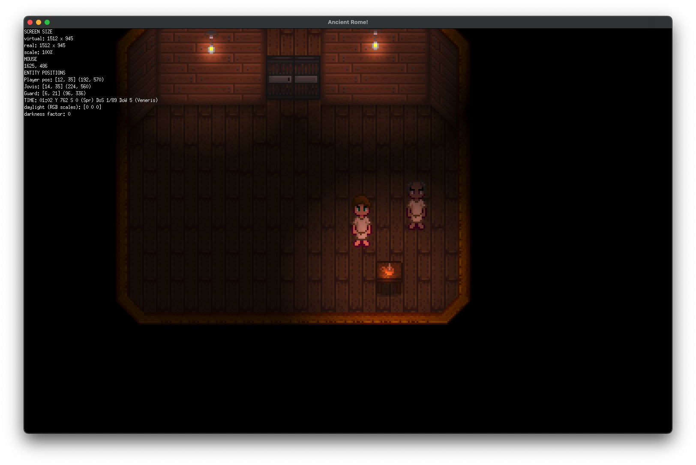
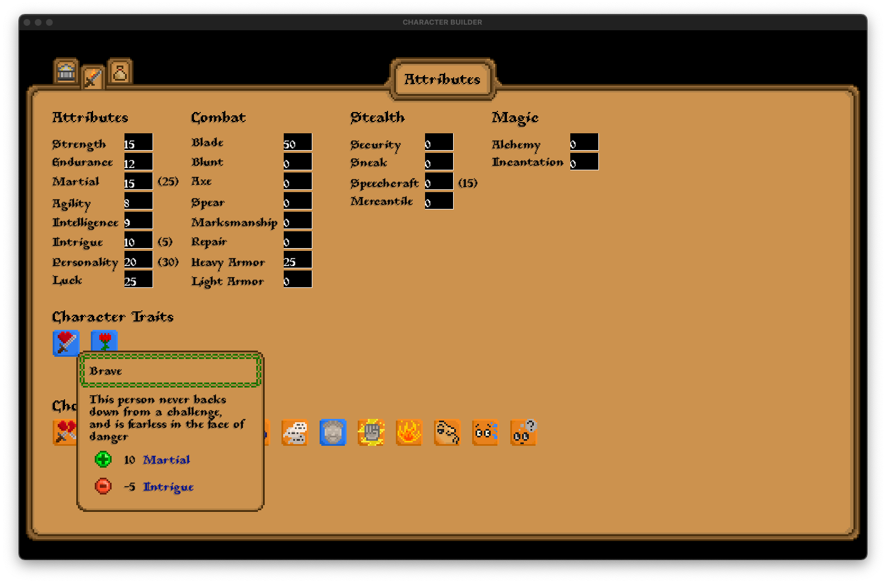
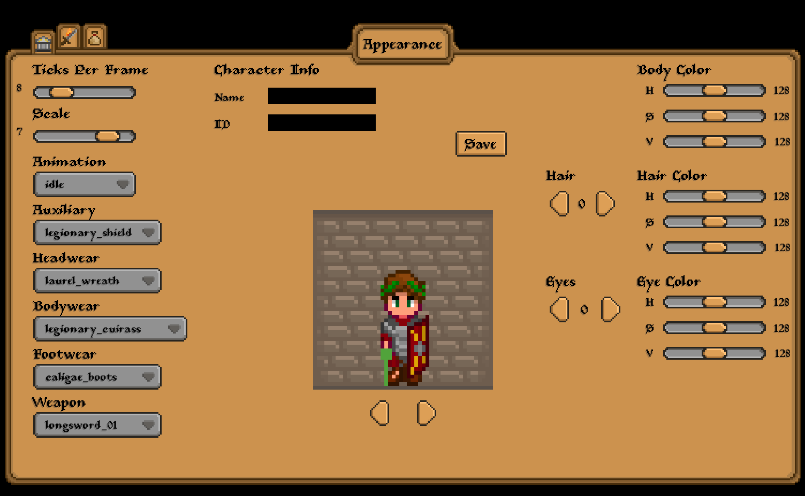

# 2026-02-26

Wow, it's been 8 days already since the last post. I guess I've just been absorbed into my work here.

Quick update on progress:

- The first quest is nearly finished; it's just the "game opening sequence" where you appear in the world, design your character, and the setting of the world is introduced.
- Continuously improving and adding upon the existing dialog and quest systems, as needed.

So, all of that is going smoothly so far.

But I wanted to talk through a new thing that has come up, which I need to figure out.

## Game vs Game Engine: Where is the line?

Up until this point, I've been designing this as a "game engine" which is built upon ebiten. I think it could be more accurately described as
a "game framework for ebiten"? But, regardless, I had this idea that this is a reusable framework or engine that handles pretty much all of the game logic,
and "consumers" of this module would be able to just do things like input all the character data, tilesets, and design some UI screens to show, etc.

But, I've just started actually splitting off all the "game code" into a separate go project that will depend on this game engine project, and I've realized
that the way I'm doing things so far kinda makes things a little messy.

### Should Ebiten be Hidden, or Exposed?

One thing I was originally sort of "planning on" is that Ebiten would be hidden from the game module. I guess I never had a strong sense of that, but it was 
a vague assumption that made sense in my head. I think it would still make sense, but unfortunately I sort of lost sight of this over time.

The main thing that is currently conflicting with this is how I design UI screens. Right now, a UI screen (player inventory screen, stats screen, etc)
are all just following the usual pattern where you have a Draw function like this:

```go 
func (ui SomeUIScreen) Draw(screen *ebiten.Image) 
```

It takes the current state of the screen on that draw tick, and adds whatever it needs to on top.
The problem here is that this function takes an `ebiten.Image` parameter, and so now, if the game needs to define a screen, it needs to be able to see ebiten.
On top of this, a lot of the UI components currently work in a way where they give you an `ebiten.Image` to use in your screen. Box is a good example of this.
So, now in the screens I've made so far, there are numerous places where we need to be able to use ebiten for handling these `ebiten.Image` values (just drawing them, really).
But I also think there are other cases where we might want to be able to access ebiten.

Another example is the `ebiten.Key`. If I want to define custom key bindings or anything like that in the game, I need to be able to access this.
If I don't want to expose this to the game project, then I'd basically need to make a wrapper over ebiten's key consts so that they can be converted into ebiten keys
on the game engine side. This feels inconvenient, and just adds needless tech debt. For example, if ebiten decided to fix or change something here, then I'd need to make sure 
I update it in my own mappings too. Or, perhaps I'm lazy and don't want to implement all key mappings, and so therefore whatever is using this game engine simply has less power
to customize inputs.

### If I Hide Ebiten, How Would I do it?

I think the simplest, quickest way would be to do the following:

1) find all places where `ebiten.Image` is being directly used in screens, and move those back into their relevant UI components or otherwise.
- Box can just keep the image data inside of it, rather than returning it. And I can add a Draw function to Box.
- If I need a tile image, I can make a TileImage struct of some kind that just holds the image within it, and has its own Draw function.

2) create a `Renderer` that manages rendering all images. This would be made in the game engine, but usable by the game.
- It would only be used for UI screens, since in-game world rendering is handled exclusively by the game engine.
- It would essentially just hide the `screen` image and do the actually drawing onto it within the game engine side of things.

3) create an `InputManager` that tracks all key presses that occur in the ebiten hardware side of things, and then manages associating those keystrokes with
user input/actions.
- Basically we would create a new set of Key consts in the game engine which are then mapped to ebiten Keys.
- Games can define their own keybindings, but the keybindings just associate a key to an action.
- The game engine then polls ebiten for key presses, matches them up and decides if an action should be fired.
- Note: this idea of binding key presses to 'actions' was by ChatGPT, and I think it points out an issue that currently exists in this engine:
  we currently just hard-code bindings like the controls for walking in a map. In the future, this concept itself might be important to implement regardless of the ebiten situation.

To be honest, I'm not really sure about making these changes just to hide ebiten. I think this for a few reasons:

- I've already tested running the game in the game project with ebiten not being hidden, and it works fine. I believe the game project just added ebiten as a dependency for itself.
- the above would cause at least another week-ish of big refactors, which seems tedious. I'm not sure it's worth it - at the end of the day, we're just trying to make a game here.
- I really don't like the idea of creating my own Key consts that just map to ebiten keys. It feels unnecessary. If wrapping over ebiten entirely makes things more tedious and we 
  lose some convenience or power in making the actual game, then maybe it should be avoided. I want this "game engine" to really just be an enhancement to working with ebiten,
  not to make things more complicated or inconvenient.

## So, what is this thing then?

I think, with the direction I'm leaning, this thing is becoming less of an all-encompassing "game engine" and more of a "game framework".
Here's the idea:

- You use this "framework" as the basis for making your game with ebiten. It abstracts away a lot of the world-logic stuff that is complicated, and instead lets you just focus on
things like defining characters, maps, quests, etc.
- It includes a lot of useful, reusable UI components, utility functions, helper functions for things like rendering, etc.
- BUT, it doesn't entirely remove ebiten from your "game" side of things. You can still use ebiten directly in your game, when useful.
- The assumption here is that this framework will make things work much smoother and quicker, and will be reusable between games of a similar genre: 2D RPG style games.

Maybe over time, as I get a clearer and clearer picture of what can be abstracted away from the game side into the "engine/framework" side, direct use of ebiten will get 
gradually lesser and lesser. Maybe, in a future hypothetical version (if this engine/framework project goes far enough) it would fully hide ebiten and have a fully fleshed suite 
of abstractions on top of it. But, for now, I think that's kind of overkill and just distracting from the real goal of making a cool game.

So, moving forward, I think I might rebrand this whole thing as a "game framework", or maybe an "RPG framework for ebiten". I'll play with the wording a bit, but since ebiten 
won't be completely hidden, I don't think it makes sense to treat this thing as a game engine alone, does it?

## Next Steps 

Ok, so besides all that "engine vs framework" stuff, here are the things I'm actually working on:

- moving all "game code" out of this engine project and into its own repo, and making sure it works smoothly there.
- continuing to develop the first quest, and more specifically, the character creation part. I need to make a screen where the player can directly create their class/major skills/etc,
  but I also need to make the "questionaire" where you can answer questions to have your class and skills decided for you.
- once the character creation part is finished, then we move onto quest 2, which is where the game starts to actually come more to life. My plans for that is the player is
  transported to a legion camp where he will start to be exposed to different mechanics, like combat, buying things, etc.

# 2026-02-18

Excited to announce that the quest system is working! So far, I've just been testing with a simple type of quest that is activated by a dialog session.

It goes like this:

1) player starts dialog with NPC 
2) when the dialog progresses to its last node, it has an "effect" that broadcasts an event. The event gives a series of tasks to another NPC.
3) the other NPC "hears" this event and starts running the specified tasks, and walks up to the player.
- cool part: the NPC can detect obstacles and react. There is a gate in the way, and the NPC is able to open it and proceed!
4) the NPC walks toward the player and starts a short dialog.
5) once that dialog ends, the NPC finishes its sequence of tasks by walking back to its original location.

... anyway, I'm super stoked about that - And we're just getting started.

My plan from here is to continue developing the "starting quest" for the game I'm planning to make, and as I go, I'll continue to implement new quest actions,
dialog effects, etc. At some point, I anticipate that I'll need to work on the "fight" task, which will basically mean I need to develop the "AI" for combat.
That will surely take some time, and I might be refining that task on and off for a long time as game development progresses and new edge cases, bugs, etc arise.

Anyway, I just wanted to report the progress there. I think I'll still spend some time refining things in other areas too, but for now it feels like I can start "running"
a little more; up until now, there's been a lot of walking.

Here's a little peek at the current state of the starting map:



## Enhancement Ideas (for existing systems)

- Dialog
  - I've noticed that dialog text writes to the screen pretty fast, and if you are trying to read along with the speed of the dialog, it's hard to notice things like 
  when one sentence ends and the next begins. I think I'd like to add some more nuanced "pacing" to dialogs; either I will introduce some notation that will tell the
  dialog when to "pause writing" (or slow down), or I might just do something simple like this: anytime a "sentence ending" character is reached (./?/!), 
  the writing pauses for a second. That way, It feels a little more like as the text is writing to the dialog box, it's following a natural pace as though it's being spoken.
- Background music / sound effects 
  - right now, the game is still very silent. I'm thinking of just putting some "place holder" BGM in so that the game feels more alive. I don't have my own music, of course,
  so maybe I'll throw in some morrowind music or something. Of course, I'll be removing it eventually once I get around to figuring out the songs for a game.

## Next Steps

1) continue designing the "starting quest", which is the quest the player would initially spawn into the world playing in. So far, the idea is this:
  - Player spawns into a ship hold; this is similar to Morrowind, and they are apparently a prisoner of some sort.
  - Player leaves the boat and enters some kind of government building ("Census & Excise?") and sorts out character creation.
    - up until this point, the player may be hidden in some kind of clothing with a hood, so that you can't see what they look like until the character has been designed.
  - After character creation, the player finds out he will be sent off to a new location (avoiding too many spoilers here) and the game does some kind of "fade to black" transition.

2) Improve dialog flow (read above)

3) Update Character Builder to allow setting some of the new fields in a CharacterDef, like:
  - DialogProfileID 
  - ScheduleID (a default schedule for tasks, when none are assigned)

4) Oh, and probably more artwork. I'm gonna need to design some more maps, and probably would like to improve the "prison ship" map that I've been using.

# 2026-02-12

I've gotten things fixed up a bit, and have started working on the dialog for the opening "scene" of the game. So that's very exciting, and I'm ready to keep working on it.

I've also finished up making the AudioManager, so now we have a good basis for gradually implementing more advanced audio playing logic, as the need arises in the future.

Right now, I'm back in the Character Builder and making some more updates. The main things I've decided I want/need to add are:

1) Input field for setting the DialogProfileID and default footstepSFX set (that's a must)

2) Extending the name system to have both a "Display Name" and "Full Name", and also adding a "Class Name".

Number 2 there is just something that I think will add more flavor to the game. It also makes logical sense, since this game is going to be set in the classical Roman world.
So, we will need to have simple "display names" that are what characters are referred to as in regular gameplay interactions, but for some "flavor" we can allow some characters,
especially Roman elites, to have fuller names.

## A More Nuanced Naming System

### The "Full Name"

In classical Rome, Romans usually followed a naming convention that included multiple names, not just a "first" and "last" name.

I'm probably going to mix it up a bit here, since I looked it up a long while back and am just attempting to remember the details now. But I think it goes like this:

"Praenomen" (I think that's what it's called): Essentially the "first name" or "personal name". There was a small set of these, things like Marcus, Gaius, Publius, etc.

"Nomen": I think this roughly equates to "family name" or "clan name". There are a lot of these, and they are things like "Cornelius", "Claudius", "Julius", etc.
I usually think of Julius Caesar's "first name" being Julius, but I believe that's actually his clan's name; his "Praenomen" is Gaius, I believe.

"Cognomen": Now, it's possible I'm getting this mixed up with "Nomen", but I believe this one is sort of a "nickname" that can be passed down. They usually have some sort of 
literal-ish meaning, or at least are often derived from actual Latin words. I think Julius Caesar's cognomen must've been "Caesar" then? For Scipio Africanus, I think "Scipio"
is his cognomen.

"Honorary Titles/nicknames": I don't remember the actual name for this, but I believe you can get an extra name tacked on the end if you are extra special.
In the example I gave above, Scipio Africanus' "honorary title" is "Africanus" actually. I think it literally means "the African", however don't get that twisted: he was a Latin Roman,
and not from anywhere near Africa to my knowledge; Instead, he got the title since he was conquered Carthage, which was situated in Northern Africa, and therefore it sort of has more of
a ring of "conqueror of Africa" too. I think there were others of these thrown around, like Britannicus, or Asiaticus, etc.

Ok, so that's probably riddled with mistakes, but you get the picture: Romans can have a lot of names.
So, while it might be nice to add some details in, like calling Scipio "Publius Cornelius Scipio Africanus", it can also be burdensome to always have that name shown.
Actually, it would be very annoying and confusing if all of the Roman characters had these excessively long names, and you had to keep track of them all.

So, instead, I think we can also keep a "Display Name".

### The "Display Name"

This will just be a shorter, more manageable and easy to use/remember name. It will more or less be "what a character is called" in dialog or anywhere else you would see his name
in game interfaces, etc. The Full Name will just be a detail you can find on his profile, to give players more context or even identify specific historical characters.

So, for example, instead of a character running around using the name "Publius Cornelius Scipio Africanus", I think we could shorten this to a nice "display name" of 
just "Scipio Africanus". That's how I usually hear his name referenced anyway. Instead of "Gaius Julius Caesar", we can just use "Julius Caesar".

For some extremely well known characters, like emperor Augustus, I'll just make his display name "Augustus" probably.

### Will all characters have full names? What about non-Roman culture characters?

I don't think most characters will have full names. This will be reserved for specific characters who have some historicity to them, or are otherwise very special or important 
to a major questline. So, due to this, I can imagine that only the elite of the elite will have these long "full names". I might use the "full name" section to include extra fancy 
titles, when appropriate.

If I have time to do more research on different cultures present in the game, maybe they will have more nuanced naming systems too. But until that happens, I predict the full name 
category will mainly be used by Romans, or other historical characters who had famous nicknames maybe. 

## A Different, but Bigger Topic: Skills, Attributes, and Levels

I'm pretty sure I've gone over this topic already before, so I won't explain the concepts of Skills, Attributes, etc here. But, as a quick reference,
these things basically are intended to function the same as in games like Morrowind.

I'm back in the Character Builder, and I've decided I need to go ahead and tackle the issue of calculating levels based on skills, how attributes and levels are influenced
by each other, and other things like adding a "class" system.

### A Class System 

First thing I'll explain is the idea of a "class". To be honest, it doesn't really mean much for the player, because I don't think the player will be choosing a specific class,
unless they want to as a means of convenience and to avoid spending time manually choosing skills, attributes, etc.

But the main motivation for me to make a class system is just for speeding up NPC character creation. I don't want to have to manually set each and every skill/attribute for every
character. I'd rather pick a class, set a level for the character, and let it compute the skills and attributes for me. Then, I can handle adding traits for extra flavor.

Here's what I'm thinking (I'm also just inventing this as I type, using this as a thinking space). A class defines:

"Favored attributes": Simply, these attributes get a boost right from the start.

"Major and Minor (and misc) skills": setting a skill as a major or minor skill affect the following:

- a higher base skill level: major skills start out with a bigger base than minor, which starts out bigger than misc.
- how much a skill increase affects overall level-up progress (major being more significant than minor, etc)

Note: I believe in Morrowind, misc skill increases did not contribute to level growth (I think?). But in this game, they will contribute to level growth. Just not as much 
as major and minor skills.

Now, for each "level", we will calculate a valid number for each skill and attribute. But, these skill and attribute levels will be distributed based on what was selected for 
major and minor skills.

> Note: this is me explaining how the "automatic character creating" system will work. For actual players, they will just hone their skills however they like and their attributes
and skills will change organically based on that.

#### A Level Calculation Model 

Let's remind ourselves how leveling up works, and its relationship to Attributes:

If you gain enough level-ups in skills, you increase in your overall character level.
Each skill has a different "weight" in this calculation since major skills are more important than minor skills, which are more important than "misc" skills.

Here's a formula for calculating levels which looks decent. 

> Level = 1 + floor( (WeightedSkillTotal - BaseSkillTotal) / K )

WeightedSkillTotal: sum of all skills with weights (weights applied to major and minor skills)
BaseSkillTotal: starting skill baseline 
K: how much skill growth equals one level

Skill Weights:

- Major: 3 
- Minor: 2 
- Misc: 1

So... 

> WeightedSkillTotal = 3(sum of major skills) + 2(sum of minor skills) + (sum of misc skills)

Let's also clarify how BaseSkillTotal works, since that is also needed. Each major skill will have a base of a certain level (starting at level 1).
The same applies to Minor and Misc skills. Let's set them like this:

- BaseMajor: 30
- BaseMinor: 15
- BaseMisc: 5

So, now we can calculate the BaseSkillTotal like this:

> BaseSkillTotal = 30(number of major skills) + 15(number of minor skills) + 5(number of misc skills)

Finally, we choose a value for K. K is a number of "weighted skill points per level", which means if the (weighted) skill points reaches a certain number, we have reached
the next level.

To decide this value, we can sort of reverse engineer a value based on how fast we want leveling to occur.

Let's say, for each level, we could expect some sort of "rate of change" like this to each level group.

Major rate: 5 
Minor rate: 4 
Misc rate: 2

What this means is, maybe on average, we would expect 5 levels of increase to all major skills, 4 increases to minor skills, and 2 increases to misc skills.
This is of course not going to be "true" for a player who is leveling up organically (all misc skills definitely won't be always going up by 2, for example) but
it sets an expectation for what we could expect as an "overall, averaged character" at a given level.

So, you take these "rates" and multiply them by the _number_ of skills in its category, and then multiply by the weight of skills in that category too:

> Major Gain = (number of major skills) * (major rate) * (major weight)
>
> Minor Gain = (... same thing for minor skills, rate, and weight)
>
> ...

And finally, you add them all up to calculate a value for K:

> K = MajorGain + MinorGain + MiscGain

Now we have all the pieces needed to calculate a level based on skills.

### To be continued 

I think this whole skill and attributes topic is a lot bigger than I initially realized, so I'm going to pick up on the topic again in a later post.
For now, I'm satisfied with this level calculating formula, and I know I can reverse it to ultimately figure out how to generate skill levels for a character of a certain level.

Next time, I think we will need to dive into the topic of: how do attributes and skills affect gameplay, fighting, and other mechanics? That's gonna be a pretty big topic I imagine.

# 2026-02-11

... Whew! Finally finished that massive refactor I started a few days ago. In short, I moved almost everything I could think of into this new Defs/State dichotomy.
Everything from characters, items, shopkeepers, dialog, body parts (for entity bodies), skills, traits, etc are now all cleaned up and defined with Definitions in a
`data/defs` package, and where applicable, with States in `data/state`. I'm pretty sure by now I've edited damn near all of the files in this project - at least, anything that
directly deals with in-game concepts and state. But, I'm much happier with this setup, and I also feel like I understand how things will work going forward much better.
There was always a looming question hanging over my head which I never really understood until now: "How will I save and load a game playthrough?".

I'll go ahead and just sum up the details of how this "Defs/State" system works, and any rules I have going forward if I end up implementing new features or concepts in the game
engine.

## The "Defs/State" System 

This basically means, all game data will be broken down into one of two things (if it's to be saved and is not temporary runtime stuff).
I'm guessing in the last post I started diving into these concepts, but let's try to give them a good definition now that this refactor is done and I've gone through all the
code changes.

### Definitions 

A "Definition" is something that defines a "starting point", or also can define "what is possible to occur" for a particular concept in the game.

Let's look at the "Character" concept in the game.

> By the way, up until now, I've largely been using the word "Entity" instead of "Character". I've stopped using Entity for really anything besides the runtime concept of 
showing a character in a game map; the "entity" is just a shell in the world that is associated with a specific character, and can move, fight, etc.

A Character has a definition that defines things like:

- what items does this character start with when it is instantiated in the game world?
- what are its base skills?
- what is it's body/skin definition?

... and pretty much anything else that might be considered "immutable" (unchangeable). Some of these things **will** change at some point, but they also serve to
define how a character that is spawned into the game using this Def would start out. What items it initially has, it's initial skill levels, etc.

### State 

A "State" essentially keeps track of the ongoing progression of something in the game. It's what is saved when you "save the game", and it's what's loaded back in when you
start up a previous save.

Using the Character example again, the Character's state will tell you the current skill levels, the current items in the character's inventory, etc.
As things change during a playthrough, the State is where those details are saved and remembered.

## Saving and Loading Games 

So, with these definitions in mind, it becomes a lot clearer exactly what you need to save and load for a specific playthrough.

The Definitions are immutable, so there's nothing to "save" here. As long as the game can access these same definitions every time, there's no problem.

So, for saving the game, you really just need to save all of the States for anything in the world that matters and that needs to be remembered between play sessions.
I think that simplifies things very nicely, and it makes it clear too about what data to include in a save file. Just get all the states for anything that has a state in the whole game,
and save it in a file.

## Going Forward: New Rules

From now on, here are some new rules I will try to remember and strictly adhere to:

1) Whenever creating a new concept, ALWAYS design it by Def and State first.
- Create the necessary structs and interfaces that define these two concepts, and put them in the correct data packages.
- Do this first, since it will help in the long run. Don't build something really massive and THEN go back and try to split up the pieces.

2) Clearly separate the concepts of State and Def from eachother, and ALSO (especially) from Runtime.
- I might go as far as just defining three structs for any new concepts going forward: Def, State, and Runtime. And the concept itself will wrap these three.
- It's just nice to have these things broken up cleanly. It will probably lead to cleaner code too. 

For now, I think these rules will work nicely. If I run into any new issues in the future, I'll add em here.

## Next Up 

Ok, I know I've been claiming that I'm about to start working on quests for a while now... but I think I'm really finally getting to that point!
A couple likely things that _could_ come up besides quest work though:

1) Update CharacterBuilder to support choosing DialogProfileIDs
- (I haven't introduced this concept yet here, but I will in the future. Basically, this just defines how a character behaves in a dialog session.)

2) Misc bug fixes. I did a massive refactor, so I'm sure there are bound to be at least a few places where I've accidentally broken things. Hopefully no more major refactors...

3) Redo the sound system: planning to make a centralized sound player, for a couple reasons:
- I want to manage it all in a single place, so that sounds playing simultaneously are aware of each other and there can be some managing done if needed.
- Also, reduce memory usage. The current system means each entity will load its own set of audio data, but that doesn't make sense. I think all audio data should be loaded 
into a single, centralized sound manager so that there isn't duplicate memory usage anywhere.

# 2026-02-08

Currently going through another learning moment - I've discovered that I've kind of fused together the concepts of "State" and "Runtime" in a lot of places.
I'm just now learning why I will want to ensure these two things are decoupled and clearly delineated. I'll go into the details of that concept here, and point out some of the 
main challenging points with how things are currently set up. My goal is to get most of this worked out as soon as possible, so I can get cracking again on the actual game content.

## "Definitions", "State", and "Runtime"

These are three concepts that I've been gradually understanding better and better as I've been working on this. Until now, though, I haven't given it too much thought.
The main reason is probably because, up until now, I've been mainly just testing things out, getting them to work, and not worrying about overall architecture.
But now as I see the pieces come together and I'm ready to really get into game development, I see a lot of flaws and potential problems with how I've designed a lot of the 
structs for things like entities, NPCs, dialog, etc.

## First, Dialog 

I started on this realization when I was working on improving the dialog system. I basically realized that I should try to rewrite it better, since before it was basically put 
together just for testing, and it was well before a lot of the other concepts of the game were starting to be imagined and planned.

After working through things with ChatGPT, and aiming for a "morrowind style" dialog system, I found that my current schema for dialogs was all out of whack.
It was really just way too unsophisticated for what I was wanting. I needed reusable topics, with responses that rely on conditions about the player, game state, or
conversation memory, and since things were so different I settled on rewriting all of the dialog schema and logic.

Eventually I had a nicely designed system, and it was also decoupled nicely into these concepts of "definitions" (topic definitions, dialog profile definitions, etc)
and "dialog state" - which topics the player has discussed before, what kind of decisions he's made. Really, just a map of strings that serves as a memory system for dialogs.

Definitions were hard-coded and retrieved by ID from a centralized data store. State represented data that we want to persist in save-games and be loadable into a dialog session.

Runtime logic is pretty much everything else that you need for the dialog system to work: statuses, UI flags, timers, etc. These should not be saved or persisted anywhere, as they 
vanish once a dialog session has ended.

## Next, NPCs 

Once I had this shiny new-and-improved system for dialogs (and it only really took me about a day and a half, luckily), I realized I probably need to do the same for NPCs.
At this current point, NPCs could be defined like this:  a wrapper around an entity that allows for "smart" or scheduled behavior, like fighting, following daily schedules, or any 
miscellaneous task that you want to assign. Much as the player is a wrapper around an entity and allows the player to control it, the NPC is the same and allows an entity to 
"come to life".

I started to realize that the current definition for NPCs is pretty messy though. Firstly, there is no "NPC Def" yet. NPCs basically are just given an entity ID, and that data is
loaded into it so it can start doing things in the map with that entity. I started trying to de-couple the NPC in the same way, picking out "Definition" data from "State" data, etc.
However, I've now noticed that a lot of the NPC's "definition" data actually lies in the entity itself. The same with it's state - it's health, inventory items, skills, etc are 
all defined within the entity right now. 

## So, Entity first then

Actually, once in the past I must've been slightly moving along this path, albeit at an earlier stage of realization, and I had done the 
due diligence of splitting off the "character data" from the runtime logic. I even split off the "UI controller" for the entity, which is called a Body. 
So, it's not all bad, and that is definitely not a bad place to be starting from now. I think I had made this decision to split the entity data up as such because of the
character builder; I needed a single struct that would represent who the entity/character actually "is". I didn't want to save off a bunch of runtime logic flags and values into 
a JSON, I just wanted to save off things like the entity's items, name, ID, skills, etc.

So, now I need to go one step further: I need to split this CharacterData struct up into two things:

1) The Entity's Definition: what is the immutable data and identity of this entity/character?
2) The Entity's State: what are the details about this entity that will change over time, and that we should save in between playing sessions?

Once I have these things determined, then I have to figure out how this should work with NPCs.

### Q: Does an entity have a "state"? Or is that just part of the NPC's state?

This is something that I'm trying to figure out now, so let's just dive into it.
I guess the crux of the issue is, are there ever entities in the world that aren't either a Player or NPC?

... I'm thinking the answer is no. First of all, what's the point of an entity that isn't either one of those? I don't think it will have any capabilities at all.
It won't be able to engage in dialog, it won't be able to fight, and it won't be able to walk around on its own or do anything besides stand there.
Plus, I don't see why I couldn't just make an empty little NPC wrapper for an entity, even if it wasn't going to do anything besides stand there.

So let's settle it: "an entity's state is just part of its container player/npc's state."

I guess the implication here is, when we load an NPC and it's spinning up it's inner entity, it will have to pass to it an `EntityState` struct. Same with the Player.
And when saving the game, each NPC will save its inner entity's `EntityState` into its own state data.

### Q: Does an entity have a "def"?

I think the answer here is yes. The reason being, you can reuse a single entity def for multiple NPCs. Imagine there's a basic entity definition for a legionary soldier.
If there were two NPCs who represent just rank-and-file legionaries, then this entity def could be reused.

## Last: How Should Save Data Work?

This is likely going to play a part in this issue, so I'll need to get this figured out now too.

Until now, I've only had "temporary" solutions for saving data. Like I said above, I save CharacterData into JSON files, which can then be loaded at runtime.
I think ultimately, it will probably end up something like this:

Definitions:

- either hard-coded in a code file somewhere (especially for more simple data, like dialog topic content)
- or, saved as a JSON file, for data that is more complex and won't be written or defined by hand. E.g. character definitions from character builder.

State:

- all game state, including dialog state, NPC state, etc, will be saved in a big save file. I'm not sure what format - I guess it could be a JSON - but I also like 
the idea of something more opaque so you can't just open the file and start making changes all willy nilly.

## Next Steps 

Anyway, I just wanted a chance to write this all out to help me put it all into context and contemplate my approach. I think for now, I'm going to get this Entity vs NPC thing
worked out, get those definitions centralized in the "definition manager" (as I've taken to calling it), and once that is done I'll look around if there are yet more places I need 
to fix up. Hopefully not many more, because I really feel like I've been in a cycle of refactoring and rewriting code over time. I guess that's the consequence of doing something
new and learning lessons along the way.

I think moving forward, I should make sure to split all data along these lines of "runtime", "def", and "state". This is only important for data concepts that might need to be
saved and reloaded though, so if I'm designing a UI component, it may not be as important. But, for quests as an example (probably the next major thing I'll be architecting),
I'll definitely make sure to design it from the start along these three pillars, probably simply as structs named as such.

# 2026-02-03

## Attributes Screen of Character Builder

I've finished up a basic version of the "Attributes" page of the character builder. This is what I've settled on calling it, but in the last post I was referring to it as 
the "stats" or "skills" page. This page lets you do two main things: 1) set the base attribute and skill levels of a character, and 2) add traits to the character.
Altogether, these things will calculate the attributes and skills of a character.

### Attributes vs Skills 

This concept of "attributes" and "skills" is very much the same as what you will find in games like Morrowind:

There are a set of attributes which describe general "skill areas" you might say. If a player has a high "strength" attribute level, then all skills related to that attribute 
will be positively influenced.

A skill is more specific and tied directly to some kind of specific weapon type, mechanic, or other concept in the game. The "blade" skill affects how well your character uses 
a blade-style weapon like a sword or knife, for example. The "repair" skill affects how good your character is at repairing his armor or weapons. All of these skills have 
"governing attributes" (as Morrowind terms it) which are just attributes that are linked to the skill. The blade skill, for example, might have governing attributes of "Strength"
and "Martial" for example. I won't go into the weeds of things from here though, since a lot of this is still not really defined yet in terms of this game I'm making.
But this gives you the general picture.


### Traits 

This is a concept I snagged from Crusader Kings 2 - a game I've spent countless hours playing as well.

Basically, a trait can represent and cause a few different things:

1) chiefly, they can buff or debuff attributes and skills. 

Take the "brave" trait that I've come up with now: It increases the "Martial" attribute but damages the "Intrigue" attribute.
This modifies the character's skills and traits, but their base levels remain the same. So if a character has a "base" Martial level of 15, and then the character earns the
"brave" trait, that Martial level is modified up to 25. If they were to lose the trait at some point, they would lose this modification to their Martial level.

2) dialog and other worldly interactions can be influenced or changed.

One thing I'm definitely planning to do is have traits play into dialog options. Suppose you are in a dialog situation where someone challenges you to a fight.
If you have the brave trait, perhaps there will be some penalty to declining fight (since a truly "brave" character perhaps would never do so).
Or, if you had the "timid" trait, perhaps it is the other way around and it either the accept-fight option is disabled, or comes with a penalty.

I think this will add a lot of fun and interesting dynamics to the game. Perhaps there are humorous or ridiculous dialog options that ordinarily you wouldn't want to choose, 
but unfortunately your character recently acquired the "lunatic" trait which can randomly cause them to be forced to do the ridiculous dialog options. This could be frustrating,
of course, but in my experience playing games like CK2, it actually is kind of fun and makes your role-playing experience a little more sincere.

3) informs about the character's personality, background, or other context - which makes for a little more "immersive" role-playing.

One thing that makes CK2 more fun is how you can look at a character's profile and see which traits they have - which can sort of paint a picture of who they are:

"Oh, I see, this guy is a priest, he's a drunkard, and he believes he's a werewolf."

Especially in a game like CK2 where there are lots of random events that occur involving other characters, it can make for a lot of funny moments. I don't know how much "random events"
this game would have, but either way it will add a little more color to the game I think.



## Up Next 

Now that I've made pretty much everything the character builder needs, I think I'm in a good position to start working more seriously on the following:

1) Combat system 

I've already worked on this a little so far, and it's in a very primitive form as of now. Basically, characters can use a shield to block, and do a slash with a sword.
I've also made a mechanic where, if you are holding the right mouse button ("right clicking") then the character will face towards the mouse pointer even while walking.
The idea here is, it helps you focus on facing towards an opponent while still being able to move freely and not have to turn away.

I do believe that overall, the combat system won't be super sophisticated in this first version of the game I'm planning. One constraint is that it's hard to define too many 
body animations since every time a new frame is created, that means more drawing work for every equipable item. I'd like to be able to create a lot of items, so I've been trying to keep 
unique body animation frames to a minimum and reuse them when I can. But, the downside there of course is the animations are not quite as "pretty" and can look slightly awkward at times.
If I were really good at this art stuff, maybe I could optimize the frames to look really smooth for multiple different animations.

So, anyway, here are some ideas I might pursue in the combat system:

- add a "stun"/"recoil" animation, which happens when a character is hit by an attack.
- add a "backslash", which happens if you swing your sword immediately after a first swing has ended. Like a sword being swung back and forth. Adds a tiny bit of color to the combat,
although not much.
- add a stab attack for swords. maybe this would be triggered if you are moving in a certain direction? or maybe if you attack while bracing with your shield? But, adding more attack 
options and mechanics there would improve things a lot, since they are pretty dull and repetitive right now.
- adding ranged weapons like bows, javelins, etc. this will definitely happen at some point, but probably later on.
- oh, and of course, factor in the skills and attributes into combat. I need to do some things like define how weapons' damage is calculated, and then factor in skill 
and attribute levels. This will be really important and have big implications on how the game overall is played, so will take some careful planning.

2) Quest system, and improve dialog system

What I'm really excited to get cracking on is getting the first quests created. I'm not exactly sure where to start, but maybe it would make sense to just start creating the opening 
game scenes and the first quests as you begin a new playthrough. I'm envisioning an opening scene very similar to Morrowind, where you arrive on a boat. So, something like that,
add in the character creation screens (basically just copying the character builder, with some limitations), and then an initial quest that involves dialog.
The dialog system is still very basic and not very sophisticated yet, so I'm sure it will be getting a lot of reworking as I go.

...

For now, I think I might just move on to option 2, because that's what I'm really excited for. I've been spending a lot of time poring over character animations and stuff for a while,
so let's give that a break and work on option 2 some more, until we are at our first combat-related quest in the game.

# 2026-01-30

## Improvements to the Character Builder

In the past couple days, I've been continuing to add new features to the character builder to help facilitate building new characters and NPCs in the future.
I think this will be a vital part of the game development process, so I've spent some time trying to make it work well, fixing up bugs, and eventually I plan for it to have everything 
you would want or need when designing a new NPC to place into a game.

From the start, it was all on a single page: there were options to choose which body armor, headwear, and weapons to equip, and then a dropdown menu to choose which animation to demo.
It was really originally made just to help with the design process for the player and its animations. But by now, I've made it so you can save the characters off to a JSON file, and this
has become the actual tool I plan to use for creating any and every NPC. Perhaps once everything is fully refined and streamlined in terms of code, I will be able to write some code 
that can auto-generate some generic NPCs too.

So, by now with the vision of it being a fully fleshed character designer, I decided to add an inventory page. This inventory page lets you add items to the character's inventory and 
set their gold. When you add armor to the character from the "Appearance" screen, it adds that armor item to the inventory too, as you would expect.




### Next Up for Character Builder 

I need to polish up a couple things on the inventory page, but everything already seems to be working as expected so next I'll probably move on to the stats page.
This "stats" or "skills" page will show all the details about what level the character is, how much stamina and HP it has, what levels its skills are, etc. I'm assuming this will 
be a lot more work than the inventory page since I will also be making a lot of decisions about the game and its mechanics as I go. Perhaps I'll just stick with the basic concepts 
for now, and then as the regular game development proceeds and the different concepts with combat etc mature, then I'll finish it up here. However, I do think it's better to have 
all of this figured out and finished up before I really start work on the game, because if I need to go back and change things later that could get messy, especially for characters 
that I've already made (e.g. I might have to go back and clean up character definitions if I change them after they've been created).

# 2026-01-28

## Choosing a Name for the Engine

Up until this point, this game engine has just been called "2d-game-engine". I think it's time we actually chose a name for this thing. 

Since I'm planning to make a game set in the classical Roman world, I think something in that theme would be cool. I think using Greek and Roman names for tech-related projects
is quite popular already though, so I'll need to get creative and avoid overly common names.

Ideas:

- Mundus: means "world" or "universe". Seems fitting, since this is ultimately for designing a world.
- Saturn: father of the gods.

The "Saturn Engine" maybe? And in go, I could either name it `saturn` or `saturnEngine`. I like Saturn because it's nice and simple, and it also has a couple different
ways it can be represented: perhaps the logo could be something like the shape of the planet Saturn, but then in other places there can be greco-roman themes to remind you
that it's also a reference to the god Saturn. 

I'll keep this is the front-runner for now, and maybe soon I'll get to work on changing the name of this go module.

# 2026-01-23

A new update on the status of the character builder: I've changed some of the layout, added new fields for things like footwear, and have finished up (for now) a full 
suit of legionary armor (headwear, shield, boots, bodywear, etc). Things seem to be working pretty well, and I think we've pretty much covered all the different animations we'll need
for the first version of the game I'm planning to make. Here's how it looks:


# 2026-01-22

Ran into an interesting problem today, which ultimately ended up being my mistake, but I remembered that we are doing something tricky here with the body image frames,
so I wanted to take a second to quickly go over what we do and why.

## Entity Body System and Render Order

Our entity body system is a bit complex: we have multiple body parts (eyes, body, arms, legs, hair, equiped body, equiped legs, etc) which all need to move together to create the
resulting animation frames for an entity. This gets complicated and tricky really quick: If you want to add new animation frames, you have to make sure all the pieces sync up together
correctly. Also, when drawing these different pieces (in ebiten, on the screen) we have to figure out which parts draw before the others. This gets a little more complicated when you
factor in that when the entity is facing different directions, the drawing order will change (or certain things are excluded altogether).

Consider the sword slash animation. Generally, I want the hair set to appear on top of the body, because that makes sense doesn't it. I also want the hair set to appear on top of body
armor, in case the character has long hair (It might cover the shoulders). This is fine, and this all works alright with the arms, since I render the arms below the body armor too.

So, we have a render order of: body, arms, body armor, hair

However, when the character is facing up, this changes some things. The sword slash animation has the arm cocked back behind the character's head, and therefore his hand would show "above" the hair (since the hand is _behind_ the head, but we are facing _up_). But, this causes a problem: we still want the hair to draw on top of the body armor, but the body armor needs to
draw on top of the arms! There's a conflict here, because we can't draw the arms both below the body armor and above the hair.

## "Subtracting" Arms from Body Armor

So, the solution to this was a bit creative: Ebiten has some image "blending" functions that let you do things like cut out overlapping portions of two images.
In my code, I've been referring to this as "subtraction", and to get around the above problem, I "subtract" the arms body set by the body equipment set.
What this means is, if part of an arms animation frame is covered by the body armor, that portion is cut from the frame. That way, I can draw the arms body set "on top" of the body armor
without it actually showing up on top of it.

So, creative solution, yes. Also definitely adds some complexity to this code. That's for sure. But, I think it's a good enough trade off, because the alternate would probably include
making more and more frames for different possibilities and having some tricky logic in the code for detecting these different cases. Also, luckily we only really need to define a body 
parts definition once and keep reusing it. Once everything is working smoothly, I shouldn't have to touch it much anymore. But of course, anytime I do have to touch it, there are more
risks involved and I have to retest things carefully.

## Takeaways: Added Complexity, and How to Cope with it

I think in an ideal world (at least, the most simple world) I would just have a simple set of frames for every entity body animation, and not need to have everything split up into
different moving parts that need to be synchronized and drawn in the correct order. If the character only had a few possible sets of clothing and hair styles, this might be feasible,
but since this game will include lots and lots of different sets of armor, clothes, hair styles, etc, we need to make things as customizable as possible to accomodate that.

While I'm working with a lot of complexity here, one thing I keep making more robust as development continues is all of the validation and panic cases in the code.
The quicker my code can identify something is wrong, the better, as I can nip the issue in the bud. For this image subtraction issue, I ran into quite the confusing issue because suddenly,
the arms-body armor subtraction seemed to stop working. After adding new validation checks to everything, I realized that the image being used as the "subtractor" (the body armor image)
was empty... how? Well, I made a silly mistake and accidentally shifted the rows of the body armor animation frames, so suddenly an empty tile from the tileset was being used.
An annoying setback, but now I have further validation that checks if an image is "empty" and panics if so. So, if this same issue happens in the future, I should be able to catch it 
much quicker, and a lot earlier in the call stack.


# 2026-01-21

Back from New Years travel, but have finished up some refactoring that I started just before leaving. Took a little while to figure out where I left off - in hindsight, probably better
to not start that kind of big change until I was back, but we're back up and running!

I was refactoring the entity body system a bit: I've split the legs off of the body into its own body part, so that it can act independently of the head and torso.
The main reason this was necessary is that we need to be able to do some animations while both sitting and standing, or while riding a horse, etc.
For example, a character will need to be able to do the "drink from glass" animation while both standing and sitting. Also, a character should be able to swing a sword while both 
standing on the ground or riding a horse. It adds more flexibility to the character animations which is good.

But, the downside is that it complicates defining an entity's body frames a bit more. I used to just be able to clearly look at which frames were for which, but now that arms, legs, and
body are all split into their own tiles, it's trickier to spot the right ones that are supposed to be used together to form the actual full body animation frame. But, luckily I won't need
to do this much since I there won't be many different body set options. For clothing and armor, it's a little easier since there are just two parts: the torso/arms and the legs.

Speaking of which, I'm considering if I want to add support for equipping different leg equipment that differs from the body/torso equipment.
For example, maybe a character would want to wear some body armor like a legionary cuirass, but then be allowed to wear a different set of armor on the legs such as chainmail greaves.

Once I've ensured all the bugs are worked out of the new refactored body system, I'll move back on to improving/testing the combat system, improving NPC fighting AI, and then start
working on the first opening scenes and quests. A goal I have is to have some early stages of the game and the opening sequences mostly done by June, since I'll be going to the US and
can share the progress I've made with friends and family and get their feedback.

# 2025-12-03

Making more progress on the entity body animations and mechanics; I've added an additional "auxiliary" item type: the shield.

Shields use the same arm image as torches do, but they differ in a few ways:

1. they don't have an idle animation
2. they have an additional animation they support: blocking. torches can't do this, so I'll have to add some logic somewhere to handle preventing torches from running the blocking animation.

This just adds another case of special handling to the existing logic of the entity body and its animations, so it makes me wonder if I should review the code
and look for a way to further simplify or streamline things like animations. Currently, each animation is enumerated as specific fields of a BodyPart.
But, I'm wondering if it would be smarter and more scalable to instead make some kind of animations map where new animations can be simply registered in a single place,
and then in each location in the code where things like animations are handled, we can just iterate over the map of animations.

Anyway, I'm guessing I'll be spending the rest of this week and possibly next week finalizing some of these animations and entity body mechanics.
I want to get it working rock solid before I completely move on to other things. For one, if I narrow all the animations down now, then I will be able to make armor and weapons
more safely (without the risk of needing to redo or touch them up later).

I'm also thinking through how shields will work with combat. I think I have a few ideas to nerf them a bit, so that they aren't too overpowered (we don't want people to just
hold the block key forever until the enemy hits, and then just attack the enemy while they are stunned).

- While blocking, entities can't move. So, you sacrifice mobility for safety
- When holding up the shield, it takes a split second for the shield to actually reach its real effectiveness. This prevents players from just quickly spamming the block right as an attack is landing.
- if the entity is out of stamina, the shield can no longer withstand power attacks. power attacks sap the stamina from the blocking entity, and a power attack on a blocking enemy does not stagger the attacker. So, if someone is being stubborn and just sitting there holding the shield, an attacker can just hack away with power attacks if they want to break through (and they have the stamina).
- perfectly timed blocks (right at the instant of the strike, about) could trigger a "parry" where the defender counters the attack with an attack of his own.

Not sure if I'll use all of these ideas, but just wanted to brainstorm some real quick. Hopefully I can get the blocking combat mechanics working soon.

# 11/27/2025

A little snapshot of the current state of the Character Builder. I made this to facilitate creating new characters and NPCs in the game.
I've realized that this will probably be a very key thing for the future development of this game, so I'll be investing some time in making it work well,
adding new customizations and inputs, etc. Ultimately, something very similar will probably be used when players are starting a new playthrough and
designing their own characters.


# 11/21/2025

Starting this development blog to document the journey of creating this game. By now, development is already well underway, but also
probably just only really getting started.

Full history up to this point:

- started on this project, a 2d game engine, about a year or two ago (Looks like Feb 2024, according to git).
- went on a long hiatus at some point, most likely when I started my job at Hexabase.
- near the end of my time at Hexabase (mid to late 2025), I decided to pick things back up. At this point, the game engine was still very clunky and only had some basic concepts developed, like rendering maps and supporting a character walking around the screen. However, I decided to basically rip out a lot of the old logic and rewrite it, as I wasn't satisfied with how it worked. I also realized I need to change how I handle maps and animations, etc since I wanted to make use of the Tiled map editor.

So, at this point, I've been working full time on this for the past few months (August to November) and I've made a lot of considerable progress.
As of now, here are some of the major things that are working pretty well:

- Tiled maps and tileset integration is fully supported, and maps can be easily created and run in the game.
- Tiled tilesets are also widely used for any case where we need an image; it is pretty convenient to use their framework to easily organize and get tiles, frames, etc.
- Entities (NPCs, the player, etc) have been implemented and are pretty matured at this point; support for movement, collisions, animations, etc is pretty good at this point.
- NPC logic is still in its infancy, but I have created a "tasks" system to organize NPC behavior, into tasks such as "follow another entity", "attack another entity", etc. I foresee this growing in maturity until eventually there are really advanced tasks for all sorts of behaviors, and even full day schedules.
- Items have been developed to a basic level of functionality; the player has an inventory, and items can be put in the inventory. Items cannot be actually equiped yet, but that is next up.
- A trading screen and trading mechanics have been implemented, as well as a money system; the player can start a trade session and trade their items for gold, or use gold to buy items, and upon completing the trading transaction those item movements persist as expected.
- basic fighting mechanics have been implemented. Entities can do simple melee attacks on each other, and if hit there is a simple damage flicker animation and they get bumped backwards. Things like health and other vitals still need to be implemented though.

## Next Steps

So, I'm feeling pretty good about where we are at so far: a lot of the basic mechanics are doing well. Here are some things I'm planning to work on next:

- Equipping items: since the entity body can now show equipped items in all of its animations, now I need to make the body actually sync to what is equipped in the entity's inventory. If the player equips a certain helmet, I need to sync that to the body, basically. Same with weapons, auxiliary items, etc.
- Continue improving the combat system: since combat will be a big part of the game, I want to make sure it feels smooth and interesting. I don't want it to just be a single animation that you just repeatedly trigger over and over with left clicks until one of you dies. There should be certain strategies you can develop, different mechanics like power attacks, stamina involved in some way, etc. Also, it shouldn't feel frustrating or clunky.
- Continue to improve and finalize the player animations; this needs to be figured out and finished up in the early stages of this game's development, since every time an entity animation changes, I have to retest the animation's performance in the game, remake the affected clothing assets, etc. Ideally I get this squared away as soon as possible, so that I can start spending more time on new item artwork and not have the risk of needing to remake them later on.

## Lessons learned so far

Here are some big things that I've learned so far, which I've basically adopted as coding rules by now:

1. For complex and frequently used structs, always make a "constructor" function

Usually I name these "New[Struct Name]"; essentially a constructor for an object. Instead of directly instantiating a struct, use this function to guarantee that all the necessary inputs have been set, all necessary validation is done, etc. This makes things a lot easier, as you can then assume a lot of things to be confirmed throughout the rest of the lifecycle of the component or code feature.

2. Always panic and crash when state is found to be wrong (instead of trying to correct things and continue)

Basically the idea is this: if there is ever a point in the code where something is known to be incorrect, we want to crash. We don't want to ever tolerate that bad state, because that can just lead to more bad things down the road: it could materialize into other problems in other areas, and if we just continue to "work around" it, things get messy quick. I find it simpler to just add lots of assertions and panics in functions wherever I can think of a possible bad state, so that when it ends up happening - which is more often than you'd think - you can immediately nip it in the bud. Another tip is, ideally you put these assertions as close as possible to where the problem could originate. Putting the assertions/panics in the Update loop will definitely _notice_ the issue, but you won't be able to tell where that bad state actually started. So, anytime you manipulate data or process some action - those are good places to put a bunch of assertions.
