# 2026-06-06

Today, I want to discuss the concept of "opinion"/"disposition". These two words basically refer to how much an NPC likes the player.
But, in some games, NPCs could also have dispositions towards each other, like in Crusader Kings 2. Anyway, let's discuss it because I'm wondering
how I should implement it into my own game.

## First: What is Disposition?

Disposition (or "opinion", as it's called in some games) is how much an NPC likes the player. If the player has some traits about himself,
it could cause the NPC to like him more or less. If the player has done something nice (or mean) for the NPC, that can also influence it.

And, if an NPC has a higher disposition with the player, he will cooperate more during dialog, telling the player more useful information.
He might give better prices during trading. There are probably lots of ways that disposition can affect gameplay.

## Disposition in Morrowind/Oblivion/etc

In Morrowind, disposition is relatively simple. It's mainly influenced by a few things, such as:

- Player's race vs NPC's race; same-race usually means better baseline disposition, whereas different race could mean worse.
- Player's faction membership; if the player is in a certain faction, that will influence an NPC's disposition if the NPC is also in a faction that is
either friendly or in a rivalry. 
- Scripted changes; quests, dialog, etc can cause an NPC's disposition to change. You can also do the persuasion mini-games to try to change their disposition
by bribing, admiring, taunting, etc.

## Disposition in CK2

Another influential game on my concept of disposition is CK2; in this game, disposition is a little more complicated.
There are all sorts of things that can affect it. Similar things to above, such as culture, will give a baseline modifier to it.
But also some things unique to the game, like:

- Traits; some traits change the disposition of certain NPCs, and sometimes different combinations of traits between two characters will have different effects.
(e.g. one trait causes characters of another trait to dislike them, etc).
- Past interactions; characters in CK2 have a lot of ways they can interact, and they can either help or hurt a relationship.
- Political situations; if you are at war with someone, they will of course like you less. If you are in a political alliance with them, they like you more, etc.

## So, where does my game fit in?

My game is a bit of a mixture of these two. Overall, I guess it will lean a little more towards that of Morrowind, just given the game's overall style.
But, I've added some elements from CK2, like traits, and that will also have an effect. And hopefully at some point the character interactions can get
advanced enough that other things can influence disposition.

But - what's the point of it?

I think the main place that disposition will have an effect is in dialog. I think I'll be adding conditions to a lot of places in dialog that checks disposition level,
so if an NPC doesn't like the player, he may not tell him much.

I think one of the biggest questions I have right now is, will characters in my game have opinions of other characters?
In CK2, I believe they do. And that is important because characters interact with each other in CK2, independent of the player. Characters declare war on each other,
try to assassinate each other, etc. It's a really advanced game in that regard, actually, and I think part of me wants to make my game similar in that way.
But, that of course will be something I have to work on later, and could be quite complicated.

I think for now, it makes sense to design a system such that opinions are calculated between two characters in general - be it the player, or a random NPC.
There will be baseline modifiers, like culture based modifiers, then there will be trait based modifiers, and then finally there may be changes to opinion that
happen from dialog effects, faction membership, etc. But, the calculation should be based on something such that any two characters can have opinions calculated between them.

Let's leave it at that for now, and see how it develops once I start working on it. I do think it's a feature I want in the game, so let's get started.

## Technical Design: Opinion

(I'm gonna start using the word opinion now, because disposition is too annoying to keep typing.)

Q: How do we track opinion modifying variables? 

We have the inherent opinion modifiers based on objective things like traits, culture, etc. But how should we store and track "random" opinion modifiers, like ones 
triggered from dialog? Say, in a dialog, the player chooses a reply that makes an NPC angry. It's just a temporary issue though - not something that will forever damage the
relationship. How should we track that?

```go
type OpinionModifier struct {
  Mod int // how much the opinion is modified (positive or negative)
  Until *clock.GameTime // how long this modifier is active (if nil, it is permanent)
}

type CharacterState {
  // ...

  // a mapping of the (temporary/non-inherent) opinion modifiers this character has towards other characters
  OpinionModifiers map[state.CharacterStateID][]OpinionModifier

  // ...
}
```

I think the above is a decent schema for how it could work. I guess I'd probably program it so that everytime an opinion is calculated for
a specific character interaction, the `Until` field would be checked and, if expired, that modifier would be discarded. That way we don't have to plug into
more complex things like listening for time change events and checking for expired opinion modifiers in all of the NPCs in the game world.

And so, maybe the function for calculating an opinion for a certain character would go like this:

```go 
func CalculateOpinion(from, to *state.CharacterState) int {
  opinion := 0 

  if opinionMods, exists := from.OpinionModifiers[to.ID]; exists {
    currentGameTime := GetCurrentTime()
    for _, mod := range opinionMods {
      if mod.Until != nil && currentGameTime.IsAfter(mod.Until) {
        // remove opinion mod, since it's expired
      }
      opinion += mod.Mod
    }
  }

  // also, check traits, culture, etc
  // ...
  
  return opinion
}
```

# 2026-06-05

Just wanted to take a moment to give myself a little pat on the back. Or maybe to give OpenCode one?

I got load times for starting a new game down from ~30 seconds to just ~2 seconds! Pretty awesome.

Here's the gist of the optimizations:

## First, the problems

The biggest bottlenecks before was that I was loading all maps that exist in the entire game at the game start.
I'm still doing this actually, because this is how I do a couple crucial things:

1. build the "world graph", which is used to allow NPCs to find paths between different maps
2. to detect all NPCs that exist in the world; NPCs with a bed in some map, anywhere in the world, are officially "part of the world"
and will be running task simulations in the background.

So, I do need to explore all maps in the game universe and figure out the paths between them, the NPCs that exist, etc.

But, the big problems were:

1. Map data wasn't being cached

It actually was being cached in a specific place, but only for the path finding algorithm. Obviously, I don't want to have to load map data 
every single time an NPC tries to find a path between two maps.

But, it wasn't being cached in a way that was accessible for all use cases of loading maps.

2. During the initialization of the game world, we were loading all the tile images for all maps, even though that tile image data wouldn't be used
until the map would actually be loaded by the player entering it.

3. Ah another thing: we were regenerating all tile images on every new session start; "generating a tile image" means taking the tileset image and
cutting it up into the individual tile images.

## The Optimizations

Well, I think it's a bit self-explanatory: using caches, and not loading data that we don't need to load.

I think overall the biggest thing ended up being not doing extra image loading and prep in the initialization phase. But the caching definitely helped too,
and brought the world graph building process down by 10 seconds.

As for the last point, about not regenerating tile images on each new session, I made this a config parameter since sometimes I'll want to do this.
Tilesets continue to change and get expanded upon, so I'll still need to rebuild them somewhat often. But of course, once the game is ready for production, that
should be turned off.

## The Numbers

To give an idea of the improvements, here are some logs of the performance for various functions.

### Pre Optimization 

```
2026/06/05 23:29:56 T 3164 [TIMER] == Record Report ==
2026/06/05 23:29:56 T 3164 [NewActiveMap] Total calls: 1 Ave: 432.274792ms Total: 432.274792ms
2026/06/05 23:29:56 T 3164 [NewActiveMap] Min: 432.274792ms Max: 432.274792ms
2026/06/05 23:29:56 T 3164 [TIMER] == End of Report ==
2026/06/05 23:29:56 T 3164 [TIMER] == Record Report ==
2026/06/05 23:29:56 T 3164 [generateTiles] Total calls: 28 Ave: 178.471095ms Total: 4.997190668s
2026/06/05 23:29:56 T 3164 [generateTiles] Min: 10.556875ms Max: 603.532375ms
2026/06/05 23:29:56 T 3164 [TIMER] == End of Report ==
2026/06/05 23:29:56 T 3164 [TIMER] == Record Report ==
2026/06/05 23:29:56 T 3164 [InitializeGameWorld] Total calls: 1 Ave: 47.298979709s Total: 47.298979709s
2026/06/05 23:29:56 T 3164 [InitializeGameWorld] Min: 47.298979709s Max: 47.298979709s
2026/06/05 23:29:56 T 3164 [TIMER] == End of Report ==
2026/06/05 23:29:56 T 3164 [TIMER] == Record Report ==
2026/06/05 23:29:56 T 3164 [LoadMap] Total calls: 55 Ave: 855.089836ms Total: 47.029940999s
2026/06/05 23:29:56 T 3164 [LoadMap] Min: 835.958µs Max: 4.690710791s
2026/06/05 23:29:56 T 3164 [TIMER] == End of Report ==
2026/06/05 23:29:56 T 3164 [TIMER] == Record Report ==
2026/06/05 23:29:56 T 3164 [loadTileImageMap] Total calls: 55 Ave: 703.80494ms Total: 38.709271751s
2026/06/05 23:29:56 T 3164 [loadTileImageMap] Min: 125ns Max: 4.201282459s
2026/06/05 23:29:56 T 3164 [TIMER] == End of Report ==
2026/06/05 23:29:56 T 3164 [TIMER] == Record Report ==
2026/06/05 23:29:56 T 3164 [BuildWorldGraph] Total calls: 1 Ave: 19.278788083s Total: 19.278788083s
2026/06/05 23:29:56 T 3164 [BuildWorldGraph] Min: 19.278788083s Max: 19.278788083s
2026/06/05 23:29:56 T 3164 [TIMER] == End of Report ==
2026/06/05 23:29:56 T 3164 [TIMER] == Record Report ==
2026/06/05 23:29:56 T 3164 [setupNewMap] Total calls: 1 Ave: 721.36275ms Total: 721.36275ms
2026/06/05 23:29:56 T 3164 [setupNewMap] Min: 721.36275ms Max: 721.36275ms
2026/06/05 23:29:56 T 3164 [TIMER] == End of Report == 
```

> 47 seconds is on the high end - I think usually it was more like 30 seconds, but this one was a little bit of an outlier probably.
> Notice how much time `loadTileImageMap` takes in total... But, `BuildWorldGraph`, which is only called once, is the most expensive overall function at 19 seconds.

### Post Optimization 

```
2026/06/06 00:13:49 T 731 [TIMER] == Record Report ==
2026/06/06 00:13:49 T 731 [loadTileImageMap] Total calls: 1 Ave: 599.564084ms Total: 599.564084ms
2026/06/06 00:13:49 T 731 [loadTileImageMap] Min: 599.564084ms Max: 599.564084ms
2026/06/06 00:13:49 T 731 [TIMER] == End of Report ==
2026/06/06 00:13:49 T 731 [TIMER] == Record Report ==
2026/06/06 00:13:49 T 731 [InitializeGameWorld] Total calls: 1 Ave: 2.831244959s Total: 2.831244959s
2026/06/06 00:13:49 T 731 [InitializeGameWorld] Min: 2.831244959s Max: 2.831244959s
2026/06/06 00:13:49 T 731 [TIMER] == End of Report ==
2026/06/06 00:13:49 T 731 [TIMER] == Record Report ==
2026/06/06 00:13:49 T 731 [LoadMap] Total calls: 26 Ave: 94.405096ms Total: 2.454532501s
2026/06/06 00:13:49 T 731 [LoadMap] Min: 1.028292ms Max: 713.068375ms
2026/06/06 00:13:49 T 731 [TIMER] == End of Report ==
2026/06/06 00:13:49 T 731 [TIMER] == Record Report ==
2026/06/06 00:13:49 T 731 [BuildWorldGraph] Total calls: 1 Ave: 5.922208ms Total: 5.922208ms
2026/06/06 00:13:49 T 731 [BuildWorldGraph] Min: 5.922208ms Max: 5.922208ms
2026/06/06 00:13:49 T 731 [TIMER] == End of Report ==
2026/06/06 00:13:49 T 731 [TIMER] == Record Report ==
2026/06/06 00:13:49 T 731 [setupNewMap] Total calls: 1 Ave: 789.808834ms Total: 789.808834ms
2026/06/06 00:13:49 T 731 [setupNewMap] Min: 789.808834ms Max: 789.808834ms
2026/06/06 00:13:49 T 731 [TIMER] == End of Report ==
2026/06/06 00:13:49 T 731 [TIMER] == Record Report ==
2026/06/06 00:13:49 T 731 [NewActiveMap] Total calls: 1 Ave: 616.039834ms Total: 616.039834ms
2026/06/06 00:13:49 T 731 [NewActiveMap] Min: 616.039834ms Max: 616.039834ms
2026/06/06 00:13:49 T 731 [TIMER] == End of Report == 
```

> `InitializeGameWorld` is down to 2 seconds! That's pretty awesome.
> The biggest changes are that `loadTileImageMap` is only called once now, and `BuildWorldGraph` is down to just 6 seconds (down more than 10 seconds!)

## Takeaways

Like I said, OpenCode helped me identify the bottle necks. Partly because it's easier to tell the AI to pore over the code painstakingly than it is for me to,
but I started just out of curiosity by asking it to look for performance bottlenecks. It found some things I found convincing, and then we argued over the correct code solutions
and approaches for a good half hour or so. But in the end, it worked out well. I'm not using a super powerful AI model here - just the free "Big Pickle" model provided
by OpenCode. But I find that it's really useful for searching through codebases and prototyping solutions. I can fire it off while I'm working on something else,
see what it came up with, and consider what to do next. Unrelated to performance, but it's also really useful for investigating random bugs that normally would be quite tedious
to track down.

Still, the AI can make mistakes, so I can't blindly trust it. I pretty much always leave it in Plan mode, since sometimes it'll go rogue and start making changes I don't want.
Since these optimizations touch super crucial code in the game engine, I just implemented the changes myself while consulting the AI.

# 2026-06-03

Another brainstorming session. I've been getting into dialog for quests, and a new thing I realize I want is to have some visual information
about replies. The main thing I'm looking to implement is the fallout style replies where, if you have a certain skill level, you can give better answers,
but if you are lacking a skill level, you give a worse or silly answer. But not only that (because that can already be implemented as is), I want there 
to be visual information on the reply that indicates this.

For example, suppose the player is haggling with an NPC, and the NPC tries to offer an item to the player for 100 gold.

The player will have a couple natural reactions, like accepting or declining. But maybe you can add some skill based responses:

- "100 gold? You're out of your mind. I checked the price listings yesterday and it should sell for 40 gold!"
(mercantile skill >= 50)

OR 

- "100 gold? That's way too expensive! Uh... my brother sells these things for 50 gold... yeah!"
(mercantile skill < 50)

for the first reply option there, there should be visual feedback that this is a good answer, or that you meet some requirement to give it.
Probably will show a skill level threshold to indicate you meet that requirement. Maybe a green box around the reply, and a small "50/50 MERC" below the text.

For the second reply option, it should indicate that you don't meet the required threshold. maybe an orange or red box around the reply, and the same text to
indicate your lack of skill: "35/50 MERC"

# 2026-05-30

I want to brainstorm about the player inventory screen real quick. 

I need to figure out how activating items should work. What does this mean? I'm glad you asked.

## Activating Items 

Activating an item means, basically, using/consuming an item. If you have a potion in your inventory, you need some way to use it, right?
Well, you "activate" it. The same goes for books, when you want to read the book. I'm sure there will be other items that will need activation,
such as special items that trigger some kind of unique event or something.

Anyway, I need to decide how the inventory UI should support "activation" of items. If there's a book in my inventory, how do I activate it,
as opposed to just picking it up and carrying it to a new item slot?

## Inventory Controls 

As of now, the only control that exists is the left click; if you left click an item, it gets picked up and you can carry it to a new item slot.
That's it.

Let's think about some other games and how their controls systems work.

### Minecraft

In Minecraft, if you want to consume an item, you have to get the item into one of the active item slots that you can toggle to (the top row of item slots?).
Anyway, I'm talking about the ones that you can see even when you're not in the inventory screen.

When you have that item slot selected, you right click I think. And that causes you to drink the potion, eat the food, etc.

This doesn't work for us as of now, since we don't have that persistent top-level items row that is visible outside of the inventory menu.

### Morrowind 

In Morrowind, I believe you would click an item to pick it up, and if it's a consumable (like a book, or a potion, etc) you drag it to the player's avatar
and drop it on the player avatar. This could work actually, because I've had a player avatar in the menu in previous iterations, and probably plan to 
bring it back into the inventory menu (temporarily removed it due to some random issue).

But, I also think that's a bit cumbersome. I mean, it's okay if we support that method, but I'd rather if there was another more straight-forward way 
of activating items. 

## Other ideas

What about a right click? I guess that could bring up a little menu/option select thingy. And, based on the item type, there could be different options,
and for items that support activation, that could be the main option. That means, for any item that you want to use, you have to right click -> Activate.

Another idea is double click? I think that would work too. Maybe, the right click menu can be for getting access to all actions, but the main action would
be to activate the item, and the double click does that automatically.

There are other control ideas, like shift+click, but I plan to use that for automatically moving items. For example, if you are opening a chest, you can
shift+click items to automatically transfer them to your inventory.

I think for now, I'm just going to go with the right click menu idea, and probably implement a double click too.

> Although, now that I think about it, double click in Minecraft was for gathering all instances of an item together.
> This was useful if you had lots of the same item in different slots, and you wanted to stack them all together. That could be useful too?

I think I'm just going to mimic how it works in Morrowind, but add in some Minecraft parts too:

- left click: picks up an item
- shift click: auto-moves an item to its most reasonable slot, like a matching equipment slot (if open) or to the chest you have open.
- click on player avatar while holding activatable item: activates item 
- right click on item: opens menu (which lets you pick up or activate, etc)

# 2026-05-28

Wow, it's been 20 days since I last wrote. I whoooole lot has happened in these past 20 days, and I think because I've been so busy making changes
I was too distracted to sit down here and officially record my progress. Let's review what's happened:

## New Storyline

That's right - I think by this point I've probably changed the storyline a couple times now... lol. But this time, I feel quite confident
that I can stick with this new storyline. I was a bit unsure about the previous storylines, and so I spent some time just brainstorming
this game and the original purpose for why I started making it anyway. It was helpful in reminding me of those reasons, but I realized
that those reasons were mainly revolving around mechanics and features in the game - not the game's storyline. And because of this, I had
before just been focused on finding a storyline that is "good enough" to justify a game.

Well, I realized that if I want to make an RPG, I'm gonna need a decent storyline. But I also wanted to make sure the player wouldn't feel
railroaded into the storyline against their will. I went with a pretty "Morrowind" style approach where you start the game, and feel intrigued to
proceed with the main storyline. But you are not forced to, and from the moment you start the game you can ultimately decide where you go and what
you do. That's also good, because it means the storyline needs to be captivating and exciting; mysterious and making you feel some urgency to 
continue. Ultimately, after some brainstorming, I came up with a new storyline idea that feels quite satisfactory to me compared to the previous
concepts, and also allows for some room in what direction I ultimately want to take it, once I have time to really dive into the deeper parts of the lore,
background to characters, and end game scenarios, etc. But, to give a hint, it will be more or less based on Augustus' succession.
This changes the setting of the game too: We are no longer at 9 AD, but 12~13 (ish) AD. The final years of Augustus' reign.
It also drags the center of gravity south to Rome, rather than where it previously was in Aquileia. In hindsight, it now seems kind of obvious 
that I should've made Rome the central city of this game. I mean... it's a game set in ancient Rome. Am I _not_ going to have _Rome_ in it??

So, the new storyline feels both a lot more compelling, and it improves the setting too which is great. I'm a lot more optimistic now about
where it's headed.

## Redoing the maps and creating Rome

Since the setting and storyline changed, that means I needed to pretty much start from scratch again with the maps. But this wasn't too bad,
because I actually had already spent a lot of time sketching out maps of Rome earlier this year, since I always intended to make Rome anyway.
So I was able to dig up those plans and go from there, and have put together a good outline of what Rome will be like. I've also been building Ostia,
which will be the city the player starts in (still going with the "arriving in a boat" starting scene).

Building Rome will of course be a massive part of the game, but luckily my previous work on maps like Aquileia have been great learning experiences,
and I think it's improved both my art and my overall "level design" (city design?). So the new maps in Rome are looking a lot better anyway, since it benefits
from my previous trial and error. Plus, I got to reorganize my tilesets since I was scrapping my previous maps, so now my tiles are much more organized and 
can be reused to make lots of new buildings, and they look a bit better too.

## New Features

I've implemented a few new code features I think, but most of the time has been spent on the above two sections. Notable new features include the following:

1. Speech bubbles (I guess I already discussed this last time, but it's implemented now)

2. Fast travel: from dialog, the player can now be transported to new maps, causing a time lapse at the same time. It works really well actually,
so I've very excited about it.

3. "Map Generators" / Map Templates: I realized that some maps could be generic and reusable, like little shacks and unimportant buildings for generic NPCs to live in.
So I created the concept of "Map Generators" which let me instantiate new maps using a "template map", and customize which NPCs live in them, etc.
For now, I started by using this with "taxi" NPCs (the NPCs that can perform fast travel for the player, like boats and stage coaches).

4. Not sure if this was present before, but recently I also implemented containers (chests, barrels, etc).

5. Almost forgot - I also implemented a basic version of "books". "books" is just a general term for a body of text that you can read;
Book items (not yet implemented) is one of the main use cases, but for now it's implemented for things like signs that you can read in a town, on a road, etc.

## Next Up

Next, I plan to focus on the following things. I'm actually hitting a little "sprint" since I'll be on vacation in a couple weeks, and likely showing off
my game as a demo. So the pressure is on.

1. Get the first quest or two of the main quest line built. Storyline changed, so the first couple quests from before will need to be rewritten or modified a bit.

2. Continue building out Rome and Ostia; adding buildings, NPCs, shops, civilians, etc.

3. Start work on a merchants guild? or Thieves guild? some kind of guild.

Soon I'll add some pictures, since it's been a long time. Maybe in the next day or so. Until next time.

# 2026-05-08

A new thing I want to implement is speech bubbles that can appear next to NPCs even while the player is not in direct dialog with them.
This is something that can bring the world a little more to life, since it will make the NPCs appear to be more aware of things around them, and give them
reactions to certain things.

For example, I envision that a shopkeeper NPC could show a speech bubble that says something like "Welcome!" when the player enters their shop.
Or, if the player stole something, a nearby NPC might say something like "Stop, thief!".

So, I need to work out the technical side of how this could work, and how these things can be defined for an NPC.

## Use Events?

My first idea is that I could map event types to specific strings. This could work, in theory, but I feel like this requires more logic
than just simply mapping an event type to a string. For example, suppose there's an event like "player_enters_map".
Should the shopkeeper always say "Welcome"? What if the shopkeeper isn't currently working, or is even in a different map than the shop?
It feels like we would need some additional logic, like checking if the shopkeeper is currently working, if they are in the right map,
and possibly more. I guess we could have some code running somewhere that checks these things, and then sends out a specific event type that tells this specific
NPC to show the "welcome" speech bubble.

### Make a "Speech bubble" event type?

More or less continuing that line of thought, maybe a specific NPC can have custom logic that handles events, checks the event data, and decides if a speech bubble
is necessary for the NPC. And, if so, it could broadcast a new "speech bubble" event directed at that NPC, which simply triggers that speech bubble to show.

If we went this route, I guess each dialog profile definition would include an OnEvent function where I'd write in the logic.
It's not the worst idea: functions could be re-used, especially for standard reaction sets, and then more specific speech bubble reactions could be made custom
for certain NPCs. Maybe I could make an individual function for each speech bubble, which determines if the conditions are right for the speech bubble to show,
and then when defining a given NPC, you just give it a slice of these functions. Then, on each event, those functions would be checked to see if any speech bubble
should show.

```go
type DialogProfileDef struct {
  // all the existing stuff ... 

  // the first function to return a string has the returned string broadcast to the NPC to show the speech bubble
  SpeechBubbleReactions []func(e defs.EventDef, ctx NPCContext)string
}

func SpeechBubbleWelcomeToShop(e defs.EventDef, ctx NPCContext) string {
  if e.EventType != "player_enters_map" {
    return ""
  }
  if ctx.CurrentMap() != ctx.GetNPCWorkMap() {
    return ""
  }
  if ctx.NPCDistFromPlayer() > Tilesize*10 {
    return ""
  }
  return "Welcome!"
}
```

You know, I think this would work pretty well actually. I do now recall how other things in dialog work, like greetings for example,
where you have a list of DialogResponse and the first one whose conditions evaluate true will be chosen. And those conditions are structs,
but those structs have an `IsMet` function attached to them that checks dialog context and other things. So, this would be quite similar to that approach,
just skipping the step of making a struct. If I wanted to make it match that pattern more, I could create something like this:

```go
type SpeechBubbleReaction interface {
  Reaction(e defs.EventDef, ctx NPCContext) string 
}
```

One issue with this current setup is there isn't any way to subscribe these functions to certain event types. It seems inefficient to have all NPCs
in the active map listening to all events, and running all their speech bubble logic on each of those events. It would be better to follow the usual
pattern of subscribing to specific events, and then running some logic once those specific events have been called.

So, for each function, we also would need a way to define a slice of event types that it would be subscribing to.

Maybe we could try something like this?

```go
type SpeechBubbleReaction struct {
  SubscribeEvents []defs.EventType // the events we subscribe to
  Reaction SpeechBubbleReaction // the interface we defined above
}
```

I think I like this version of things the best. It follows the patterns of previous things, and everything is nicely packaged up into a struct.
With things nicely packaged into structs, it makes it easier to reuse too, which will be crucial.

I guess the last thing to consider is what `NPCContext` should be. I guess it will mainly rely on information about the NPC's surroundings in the map.
Things like how close the NPC is to the player, maybe even things like if the NPC is facing in the direction of the player (e.g. "did the NPC see something happen?").
I don't think it would ever need to know about more complex things, like quest state. It might make sense for it to know about dialog profile state, though.

Ok, I think this is good enough for now. I'm going to go ahead and go with the above type definitions and see if I can get this implemented.

# 2026-05-04

One thing I need to work out is how exactly events should be used, versus other things like dialog effects.

What I mean by this is, up until now I've mainly used things like dialog or quest effects to do things like add gold or items to the player's 
inventory, or add and remove roles, or really almost anything. However, I've found myself considering making events handle those things too.

One reason I might want to have events handle this sort of stuff is I'll need a way to schedule future effects to take place.
For example, the player goes to an inn and rents a bed. A dialog effect grants the player the `"xyz_inn_rent_room_01"` which lets the player unlock
the door to a certain inn room and sleep in the inn bed. However, we don't want this to be permanently granted, and in 24 hours we want that role to be revoked.

So the question is, how should this be managed?

1. Can we use dialog effects?

I don't think so, no. I'm not sure how that would work. We don't want to rely on a dialog occurring in order to revoke the role.

2. Should we use "future events"?

This is the main idea I have right now. I've created this system of scheduling future events already, so it would just be a matter of adding a new event listener function
to handle adding or revoking roles, and then scheduling the event to trigger this for the future.

The only problem with this approach is, it starts to make things confusing about which place "owns" these kinds of changes. Should events be the main way to 
do "effects"? Or should it only be used in specific cases? Is it okay to have both methods and use either one as its convenient?

It does make me uncomfortable to have two ways that are side-by-side and do the same things. Should I just migrate to using an event-based system, 
and make all dialog effects use events too? I don't know, that seems kind of pointless too. I generally prefer not to use events just because that feels
more indirect and hard to debug. Instead of directly calling the code to make the change, we are queuing the change to occur later on or on the next tick,
which seems more difficult to trace.

3. Add support for "future effects"?

This would be quite similar to the scheduled event thing, but maybe I could implement a "scheduled effects" thing that lives in the world state or something.
I'd need to make a centralized library of these effects, and then dialog could reference those effects as well as queue them for a future scheduled time.
I could just move the infrastructure for future event scheduling to future effects. One of the effects can be to send an event (which we already have in dialog effects),
and so a "future event" could just be a future effect that broadcasts an event.

If we went this route, I think events would effectively be reduced to a couple major use cases:

- broadcasting whenever something specific happens in the game engine (like whenever a certain "effect" happens) in case something random wants to subscribe to that info.
- allowing UI notifications to react to certain events, like showing notifications or pop ups to the player.
- triggering quest starts or quest stage changes.

After typing out the various options, I think I like option 3 the best. It offers a nice separation of the events and effects system, and doesn't make it too confusing 
to understand which one to use in given situation.

# 2026-04-29

It's been awhile, and a lot has happened since last post (or at least it feels like it).

Probably the biggest thing I've most recently accomplished is, now I can fully load save files and start where they left off.
Saving currently only works when you sleep in a bed, and once you enter a bed a little screen pops up that lets you choose how long to sleep.
It's not very fancy yet, but once you click accept, a time lapse occurs and a new save file is created afterwards.
When you load the save, you appear at the same position as you were at before you entered the bed, in the same map, and at the same time as when you woke up.
So it's sort of like starting you up at the point in which your character got out of bed after sleeping. I was gonna try to make it so you load in and are sleeping 
in the bed, but there were some technical difficulties so I decided to skip that for now. Nice to have, but not worth spending lots of time on it right now.

I also just got done fixing up some movement bugs. There was an issue where the player could get stuck at a corner when trying to turn around it.
It was similar to a past issue I've had, but this time it was because I was trying to turn into a doorway, which means there were two different "corners" that the
player's entity kept bumping into, resulting in collisions that couldn't be resolved. It's not perfect, but it works a lot smoother now that you don't get "stuck".

Also been doing some fine tuning of task management, and ensuring that NPCs don't glitch out when following their schedule tasks. There were a handful of issues,
but that's to be expected considering I just wrote must of these tasks' logic recently, so they haven't really been tested thoroughly yet.

In the same vein as that, I've been fixing things up with what has come to be called the "Simulation loop". Basically, ensuring that any real actions it needs to take
are sorted out in the main update loop, while letting expensive calculations like path finding work in the background. As of now (knock on wood) things seem to work 
pretty smoothly, but then again there are only 3 NPCs in my game's world that actually have schedules... I imagine once I have a whole city of dozens of NPCs, I'll
start to find more and more issues.

I'll hold off on adding new screenshots for now, partly because I'm too lazy to gather them, but also because I'd like to get a little more actual world progress done first
so that I have something extra interesting to show off. I've mainly just been building new houses and building interiors, so there isn't a whole lot of "new" stuff to
showcase yet.

## Next Steps

My main focus right now is building out the first quests in the main quest line, adding new dialog and quest features as needed, and also fleshing out the first 
in-game city, Aquileia. Will also probably need to continue designing new items as I go, but I'm trying not to make too many items yet since there's always a risk 
that something with the player animations could change. And if that happens, lots of equipable items will need to be partially redrawn to align with the new body
animation frames, which is quite tedious to do.

I guess, the way I see things, here's a vague outline of how development could progress from here:

1. Work on getting core content of first few main quests done (dialog, maps, character definitions, etc)

2. Work on getting general game features implemented and working nice (merchants, dialog in general, fighting mechanics, etc)

3. Once 1 and 2 are looking nice, revisit the artistic side of things and really confirm exactly how I want characters to look, animations to look, etc.
My goal here would be to 100% nail down the look, so that I never have to worry about touching up or fixing item animation frames. But, since I'm not much of a
digital artist, I think this step could be pretty time consuming.

4. Once the above are going well... hopefully the art style will be rock solid, the core game mechanics will be 90% coded up, and so it'll be time to
just do lots of writing and filling in game data for things like quests and dialog. Once I truly get to this stage (assuming things go as planned), progress
should be able to speed up considerably. I'm sure there will be a continuous need to make more art, which will probably end up slowing things down here and there,
but at least I won't be tied down with creating the core systems and debugging them too frequently.

I have a milestone coming up by the middle of June which I hope to achieve: it's to have a semi-playable/demo-able game ready.
I'm not 100% sure what all will be included in that demo, but I imagine it'll include the following:

- At least one town (probably the one I'm making now) that has at least a handful of characters in it, with their own daily schedules.
- At least a couple quests implemented, along with a quest tracking UI so that you can see your progress, which quests are active, completed, etc.
- Fully functioning player inventory, merchant system of buying and selling items for gold, wearing items, using (some) special use items (like reading books, maybe?)
- A rudimentary combat system where you can fight and kill NPCs. This has sort of been started on, but still has a long way to go.

As I write things out, I realize I still have a long way to go. But, hopefully I can manage to get things things together by the end of the next couple months.

# 2026-04-17

Wanted to cover something I've learned recently, just because I thought it was interesting, and I'm excited to gain some real hands-on experience 
with asynchronous programming and parallelism.

This game engine, and more specifically `ebiten`, uses a "main update loop" to trigger all updates in the game. If you have a list of NPCs,
you could call their update logic on each "tick" of this update loop.

During development of this game/game engine, I've had to make a separate thread/background "update loop" to help process expensive calculations. This is to prevent 
lag in the main update loop. For example, if an NPC needs to do an expensive path finding calculation, if we let that execute in the main update loop, then 
you'd notice a split second of lag in updates processing. So, instead we can offload that kind of work to a separate goroutine and just get the result when it's ready.

However, when you're messing with threads, things can get messy. The most common problem is what you call a "race condition": when two different threads
or asynchronous processes are "racing" each other to access or modify the same resource.

I ran into an issue here once I implemented what I call the "simulation loop". This "simulation loop" is what simulates NPC task updates in the background while said
NPCs are not in the "active map" (i.e. the map the player is in). Obviously, I want this to be its own separate thread/goroutine, because I don't want lower priority
processing of NPCs not in the map to cause any sort of lag or performance issue.

But, one issue was handling when maps change. The player could change maps, and suddenly the NPCs who were using the simulation loop could now be expected to switch to
processing their task updates in the main update loop. This is usually not really a problem, because the simulation loop doesn't do almost any work at all for most tasks.
But the tricky task where things get complicated is the `RouteTask`.

In case I haven't mentioned it before, I'll describe the RouteTask now. This task is a general "utility task" for getting an NPC from one map to another. Most tasks
will call this task under the hood if the NPC's task needs to send it to a new map.

So, suppose an NPC is routing to a new map in the simulation loop. It's possible that around the same moment the player is changing maps, the simulation loop could
be in the process of doing the same thing, and suddenly the behavior of the tasks can enter a race condition - since tasks update different in the simulation loop
vs the main update loop.

To handle this, one basic principle is to avoid manipulating NPCs directly in the simulation loop. In the case I described above, the simulation loop shouldn't
directly change the NPC's map. Instead, it can send an event, and that event can be processed in the main update loop synchronously with all the other logic.

So, due to these changes, I've also changed how all events are processed in general. Previously, events were fired right when they were published.
But, due to the multi-threaded nature of this game engine now, I've moved the actually event firing to the main update loop. When an event is "published", it's just 
sent to a channel and queued up until the update loop reaches the point to process events. So, if the simulation loop wants to make real changes to an NPC, like
changing maps or something, then we can associate that action with an event and have it processed synchronously with the main update loop now.

Much better, and hopefully less error prone in the future.

# 2026-04-15

New topic to discuss: Character "Knowledge".

In a game like the one I'm creating, it's an open world, and there are lots of different things that exist in that world.
There are lots of physical places, like cities, and there are lots of things that you can learn about, which lead to new topics. This is especially true
when it comes to things like quest lines. When the player starts out in a guild, he knows nothing about the different members of the guild, or the way things work.
As he completes quests, he will "unlock" new topics of discussion as he learns about new things. For example, maybe someone mentions in a dialog something about 
a "Conspiracy against the guildmaster". Suddenly you see this is a new topic that you can discuss and learn more about. And now, you can also go to other 
characters in the same guild and find that they too can discuss this topic, possibly with their own twist on it.

Until now, I haven't been completely clear about how unlocking topics should work. So far, we have a "new topics" mechanism in dialog which will unlock it with 
the current dialog profile. But, the problem there is, it's not unlocked for other dialog profiles. You talk to one person, unlock the topic, but then you talk to 
another person (who should know about it) but the topic isn't there.

So, I want to do a couple things here:

1) Clarify how topics get unlocked, and how to decide which NPCs/dialog profiles can discuss which topics 
2) Introduce the concept of "knowledge" to the player, and clarify its scope and purpose.

## Unlocking Dialog Topics 

As I said above, currently the only way to unlock a topic is:

- on a profile by profile basis (not across profiles)
- using the NextTopic field in a dialog response

In addition to this, each dialog profile will have a set of topics set in its definition.
I think we should first work out exactly what that set of topics is for, because it seems a bit ambiguous to me.

### Topics in DialogProfileDef 

The Topics field in DialogProfileDef is just a slice of Topic IDs, and no comment. So let's take a look at how it's used in the code currently.

```go 
func (ds *DialogSession) GetTopicOptions() []defs.DialogTopic {
	// use a map at first to ensure de-duplication
	topics := make(map[defs.TopicID]defs.DialogTopic)
	topicOptions := []defs.DialogTopic{}

	// first, get them from the profile
	for _, topicID := range ds.ProfileDef.TopicsIDs {
		topic := ds.dataman.GetDialogTopic(topicID)
		if ConditionsMet(topic.Conditions, ds.Ctx) {
			topics[topicID] = *topic
		}
	}

	// next, go through unlocked topics
	for _, topicID := range ds.Ctx.GetUnlockedTopics() {
		topic := ds.dataman.GetDialogTopic(topicID)
		if ConditionsMet(topic.Conditions, ds.Ctx) {
			topics[topicID] = *topic
		}
	}

	// convert map to slice
	for _, topic := range topics {
		topicOptions = append(topicOptions, topic)
	}

	return topicOptions
}
```

It's used in this single place, in the dialog system, in the function for getting topic options.
This function is called every time the dialog session goes back to showing topics and waiting for the player to select one.
If a topic's conditions are met, then it is shown. It also does the same thing with "unlocked topics", which are topics that are unlocked
according to the dialog profile's memory map. These "unlocked" topics are specific to the dialog profile of course, and not globally unlocked.

Ok, so I think that makes sense. Now the question is, what do we _want_ Topics to be for. Should it be for...

- default topics that the NPC immediately can discuss?
- all possible topics that the NPC could discuss, including unlockable topics?

I guess as I look at how the code is written now, it seems like it's more of the first point: default topics that the NPC is already prepared to discuss
(as long as its conditions are met). And that conditions part does make things a bit tricky, because "unlocking" a topic does seem sort of like a condition.
But, I guess you wouldn't put NPC-specific conditions into a topic definition, so those two "conditions" are a bit different:

Topic Def Conditions: general conditions for this topic to be allowed, not NPC-specific.
Unlocking topics: done to add a new topic that isn't default-ly available to an NPC/dialog profile. still will check those general topic conditions.

So, currently, when it comes to a dialog profile, the topics that are shown come down to:

1) Default Topics that are set in the dialogProfileDef. These will always show as long as their conditions are met.
2) Unlocked Topics that are unlocked **during dialog**. This can only happen if one of the default topics unlocks another topic.

Therefore, all topics shown ultimately derive from the Topics list in the dialog profile def.

## Introducing Topics "from the world"

What if we want topics to be able to be introduced by conversations with other NPCs/dialog profiles? Or, maybe even from other places in the game, like say,
from reading a book? Well, if we want that, we will need to introduce something new to the equation.

At first I simply thought: we can have a "topics knowledge" map with the player which, when a new "knowledge topic" arises in a dialog, is updated to include that topic.
Then, everytime you enter a dialog with someone those knowledge topics can also be considered, and their conditions can be run.

... But, the obvious problem there is, not everyone is going to be relevant to a given "knowledge topic". And, like I said before, the conditions attached to topics
are meant to be generalized, and not specific conditions that check things like which dialog profile/NPC the player is talking to. The conditions on a topic are supposed 
to be something like "quest has certain status" or "player has certain role". Not something like `DialogProfile == X || DialogProfile == Y || ...`

So, I'm thinking we can do two things:

1) the player has a "knowledge map" that can introduce topics into dialog 
2) each dialog profile def has a "knowledge topics" list that defines what "knowledge topics" it can possibly discuss, as long as the player has knowledge of it.

And so when topics are calculated to show in a dialog session, it does the existing logic, but in addition to that it includes the intersection of the player's and the NPC's 
knowledge topics.

## "Knowledge" In-Game

Now that we've cleared that up, I want to get back to one of the original points: a "knowledge map" in the character def and character state.

One thing that isn't quite clarified yet is if knowledge is only for dialog topics, or if it can influence other things.
For example, I think it would be nice if knowledge can also give the player access to certain replies in a dialog, rather than just topics.
Maybe the player is asked a question about a specific lore topic, but the player happened to have read a relevant book (in-game) before, so 
he can give a new, better answer. Maybe knowledge is added in other ways that will be convenient or add depth to the game, that I'm not thinking of now.
But anyway, I can at least foresee that I want to use knowledge to add dialog topics as well as being a condition for certain replies.

Before, the knowledge map might've looked something like this:

`map[defs.TopicID]bool`

However, this would mean every piece of worldly knowledge would have to be defined as a topic. I guess that _could_ work, but it'll be awkward for
knowledge that doesn't have an actual topic that can be discussed in a dialog conversation.

But, it's not necessarily a big problem. Semantically, "topic" does match what is represented by having "knowledge" of something anyway.

Another consideration is, if there end up being lots and lots of "world knowledge" that isn't tied to topics, it seems possible that it _could_ be a slight performance
thing for dialog. I guess it should be pretty unlikely that the player will end up having unlocked knowledge topics to the tunes of hundreds or thousands though.
I'm guessing that it would only get up to maybe 100 or so at most, and we can always be smart about calculating the intersection of knowledge topics only when necessary,
like at the start of a dialog session or whenever a new knowledge topic is unlocked midway through dialog.

Okay, I think it's settled: let's make "worldly knowledge" just as topic IDs that don't have a corresponding dialog topic definition.

## Q: Should the `NextTopics` system be changed? 

Now as I'm working on implementing this new knowledge concept, I realized that Knowledge and `NextTopics` ("unlockable topics" from dialog responses)
seems to work quite similarly to this new Knowledge concept. Both are things that can be unlocked during dialog, but only one ("unlockable topics") doesn't
require a predefined list of possibly unlockable topics. In other words, a "world topic" will show in dialog if the NPC/dialog profile has access to that topic.
But an "unlocked topic" doesn't require any other checks about "should this dialog profile have access?".

I'm starting to think that we should just convert `NextTopics` into something that adds new "knowledge" topics to the player, and then of course if the NPC/dialog profile
in the dialog also supports that new world topic, then you will see it show up. It could get messy if we have two places where "unlockable" topics live, and it's
a little safer to ensure that a random dialog profile wouldn't accidentally be showing an unexpected topic because we were accidentally sharing a dialog response between 
dialog profiles.

Ok, so my next conclusion is to change `NextTopics` in dialog responses to simply add the topic to the player's knowledge map, and remove the mechanism of registering 
"unlocked topics" in the dialog profile's memory.

## Q: What topics should be "unlockable" vs "default"?

One thing I'm now thinking about is, when making a dialog profile def, which topics should I make as default vs unlockable (i.e. knowledge topics for the NPC)?

I guess the default topics should mainly be very standard things that _don't_ require unlocking... right?
But, what if I accidentally give one NPC some default topics that normally _do_ require unlocking? Does that mean that the player could discuss this topic
with that specific NPC, then go talk to another NPC and not see the topic, even though that NPC has that same topic as unlockable?

I guess there are several things we could do about this hypothetical situation:

1) automatically register every topic discussed as "unlocked" (i.e. add it to the player's knowledge map)
2) add a field to topic defs that designates a topic as "Knowledge" or "Locked", so that it cannot be added as a default topic 

I think that 1 is unappealing because it would unnecessarily bloat up the knowledge map. It would mean that the knowledge map would approach the total number of all existing topics,
in the worst case, but at that point it would represent something more like a "topic history" rather than specific knowledge, since 99% of topics in it wouldn't be used for
any "knowledge" purpose.

Number 2 would work well enough, but the unappealing part is that it adds an extra field to consider for every single topic we make. Not a big deal necessarily, but
I hesitate to add it just because the benefit is not that great. This would all go towards solving a problem which, at worst case, just causes an odd or awkward dialog interaction
maybe once or twice. It seems pretty unlikely to be a real problem.

Instead, I think we can just define specific purposes and meanings to the two different lists of topics.
Each dialog profile will have the two topic lists, and here's how we will view them:

**TopicIDs**:
- Default topics that this character immediately is prepared to talk about.
- They represent mainly topics that are "publicly known" or don't include any prior context or knowledge.
  - Ex: "Rumors", "Background" (you don't need to be introduced to these things or "discover" the concepts)
- Or, they represent character specific topics that wouldn't be able to be introduced by other people anyway.
  - Ex: "Lost my dog", "Help me out", "A funny joke" (often something that would lead to a unique side quest)
- Shopkeepers or NPCs that offer services would put their service's topic here, most likely at the very top.

Knowledge Topics:
- Topics that are related to lore, or is specific to some quest line
- Topics that would not be immediately available to a new character
- Ex: "The Empire", "Aquileia", "The Rhine" (all specific concepts or geography that the player may hear about in dialog.)
- Ex: "The Thieves Guild", "The Cherusci", "The Legion" (all guilds, political entities, or groups of people involved in the game's lore)

## Q: How should topics be mentioned in dialog text? Should they have links or be highlighted?

In games like Morrowind, when other topics are mentioned in a dialog, the topic's text is always highlighted and serves as a link to start that topic.
I think it would be good to have something like this in my game here. It would definitely be good for usability, since it would be annoying to have to
hunt down the topic in the topic list each time. It also helps as a visual cue to tell you "this is a topic I can discuss further".

I'm thinking about the best way to do this. I'm considered some ideas in the past about how to add formatting to text. For example, I've considered using underscores
to make text an "aside", like the character is talking to himself or muttering something. I could also do something similar with asterisks to make text appear bold
or in a larger, emphasized font, as though the character is yelling something or to symbolize a loud noise.

I could do something similar with topics, but it's a bit trickier because I have to decide add some guardrails and handle more complex logic:

- what if the conditions of the topic mentioned are not met? normally, such topics don't show up in the topic options list, so we'd need to block them.
- how do we ensure the right topic is linked to the right text? (e.g. ensure that we don't accidentally connect the "background" topic to text that says "rumors")
- how do we ensure safety? I want to make sure I'm not just writing topic IDs into text as string literals - we need to use constants one way or another.

One system I considered before is to use the NextTopics slice (in a dialog response) to set which topics would be linked in a dialog response.
Alongside this, in the text, I could put some kind of syntax that denotes a link, like using square brackets: `"I've heard some strange [rumors] recently..."`.
I think this could work well, because it doesn't depend on the text in the string having the correct topic ID, or anything related to spelling.
It also would allow topics to be introduced as NextTopics without needing to put them into the text; but, if you use the brackets in the text and there are
NextTopics set, it will assume it should put links to those topics in the text within the brackets.
The only problem here is, it does require the usage of NextTopics, which is meant to record topic knowledge. It's not a huge problem, because often times
a linked topic would also represent a "knowledge topic". The only case where that's not correct is when you have a unique side quest for an NPC, and his greeting may include
a mention of the topic that introduces the side-quest; not a knowledge topic that would ever be relevant to other situations, and so not something that's important
to put in a knowledge map. But, realistically it's not a big problem if those topics end up in the knowledge map.

On the "conditions" note, I guess we will just have to add an extra check before rendering the text as a link and ensure that the topic's conditions are met by
the NPC/dialog profile. I don't think it'll be a big issue, and I also don't think there's anyway to avoid it, as long as I want this feature in the first place.

Okay, let's sum up my conclusions here:

- use `"... [topic reference] ..."` to reference topics in text, and put the topic ID (in the correct order) in `NextTopics`
  - it's okay even if this causes unimportant topics to get added to the player's knowledge map
- update dialog logic to check if topics in `NextTopics` have their conditions met, and if _not_, then don't show make it into an actual link (just plain text).

# 2026-04-12

I just wanted to add a screenshot of the first city I'm making, Aquileia. This is how it looks in Tiled, when viewed as a collection of maps in the game world.
Not very developed yet, but I've put together a rough outline of what the city may end up looking like. It mainly consists of a central map that is the forum, and
3 maps around it that represent each "gate" area. I made this city while actually trying to study what Aquileia would've been like (roughly speaking) in antiquity,
but of course I'm only working with maps I've found on wikipedia, and some basic information about Roman cities, such as the road layouts, what kind of buildings you'd 
find in a forum, and things like that. Aquileia's overall size and other characteristics may come to represent what a "medium sized" city in the game is like.
Perhaps villages or smaller towns will only consist of one or two maps, while larger cities may have many more. For example, I'm considering designing Rome where each of its 
districts (as defined in ancient city) are their own maps - which could mean I end up making something like 10 or 12 maps if I remember correctly. So Rome could up being
quite huge, but we will see if I end up having enough time for that.

I'll include more screenshots in the future as things continue to develop.

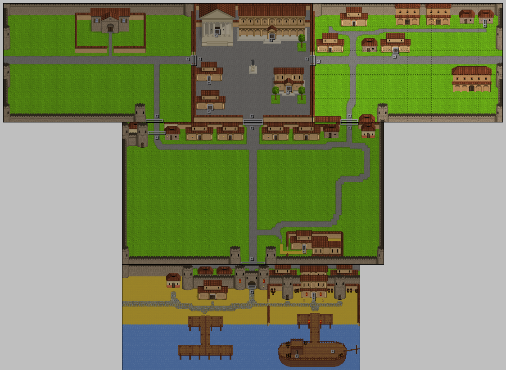

# 2026-04-09

Today I want to explore a new concept which I've been considering recently: the concept of "roles" for characters/NPCs.

## Roles

So firstly, let me explain why I'm considering this. Up until this point, objects in maps have needed a way to identify with certain characters.
For example, certain beds should be "owned" by certain characters, since characters usually shouldn't let random people sleep in their beds.

The same logic could be applied to chairs: if a chair has a specific purpose, like being the chair at a certain character's desk, it would be weird for a random
character to sit in that chair. It would be even weirder if, say, a random person in the imperial palace were to sit in the emperor's throne.

So, my first idea has been to assign objects "owner" characters. If a bed or chair has an owner, then only that character should be allowed to use it.

That works well enough, but what about the case where the specific character's ID isn't certain? This could happen in a few different situations, like
if if the character is an auto-generated NPC whose ID is not known until runtime. Or it could happen if a character were temporarily staying in a new
place, like an inn for example; a bed in an inn will not be able to have a specific character ID assigned to it.

So what's the solution here? I think each character can be assigned a list of "roles" which will give it access to different things.
In the example of chairs and beds, a chair and bed in a private room in an inn could have the role "aquileia_tavern01_room01" or something like that.
This tells the game that only a character with this specific role can use these (at least for NPCs). And, so, if an NPC were to stay at a tavern, they would
be given the specific role for that room. The same applies to the player, so that the player can safely use the bed in his room at the inn without possibly
breaking the law or upsetting other characters.

The more I think about it, I realize that roles could be used for other things as well. They could be used for accessing locked places;
ordinarily the tavern room doors would be locked, but when the player has the role assigned to him, he now can open those doors (even though he doesn't have a key item for it).
Roles could also include more generalized definitions, such as ones that simply denote their rank in a faction or general trade/purpose (you might say "role" even) in the game.
A shopkeeper might have "shopkeeper" role which lets the NPC get behind the counter in a shop. In a legion barracks, the regular bunks might be for characters who have 
the rank of "legionary_recruit" while the main bedroom/office has beds and chairs for the role of "legion_centurion". This way, even if a different legion were
temporarily staying in a new barracks, all the soldiers would be able to figure out their correct places.

## Conclusion 

So, anyway, I'm now thoroughly convinced on this "role" business and I'll get to work on implementing it. Shouldn't take too long to set up the basic infrastructure,
just a map for each character state to know what roles he or she has, and then some new property types in Tiled objects.

Same as yesterday, I'm still working on creating a city, so this will play into that in terms of making some new characters that know correctly which beds to sleep in 
and chairs to sleep in. The innkeeper should hopefully soon know that he should sleep in his own bed, not the guest beds!

# 2026-04-08

I'm happy to say that I've managed to make some pretty big changes to the NPC task management system and AI.

I've created the "Routing" task, which sends an NPC on a path to get from its current map to a new map - whether the NPC is in the active map, or in a random
map somewhere else in the game world. What this means is, if the NPC is in the same map as the player (i.e. the "active map") then the NPC will start walking to
the correct map exit ("door") and active that exit to leave the map.  Then, it will continue to simulate its travel path in a separate goroutine (there is a goroutine
that handles all of these background simulation tasks together, so we aren't spawning endless goroutines - just a single one). This simulation continues until
the NPC ends up in the destination map, which is the map where its next task is. This task simulates travel time in each map based on the actual in-map travel path
for each map it passes through, so if the player were to enter one of the maps along the path at the right time, it would see the NPC walking along its expected path
and continuing on its merry way. (This particular last part hasn't been tested yet, so perhaps I will still end up needing to work out some bugs there... but it seems to
work well enough with the other parts).

That routing task was quite a heavy lift by itself. I reckon I spent at least an entire day working on that logic. Beyond that, I also had to make the logic for
the background simulation loop. This simulation loop is spawned in its own goroutine so that it won't interrupt or add latency to the main update loop,
but it handles simulating updates to each NPC that _isn't_ in the active map. So, when an NPC has a task that takes him to a different map than the one the player is in,
the NPC walks to the exit of the map, and then once it's left the active map, its further task updates are processed with this "simulation loop" as I call it.
For most tasks, no background simulation is required, but this routing task does use it, so that's why I had to go ahead and make it right now.

It's nice to have this background simulation stuff started up though, because I always knew I'd want to have that as a feature in this game.
In the future, I will probably be making more tasks that use it to varying degrees. But at the very least, it will be cool to make it possible for NPCs to travel 
around the world to different maps, in realistic ways that take time and require it to traverse a "real world path".

## Up Next

This is all a big milestone for what I'm working on in the bigger picture, which is (still) trying to get an entire in-game city up and running.
I'm working on a tavern, and so far just the tavern keeper who lives in the same tavern building, but in an upstairs room. The upstairs room is its own map, as well as the 
main tavern room, which is then connected to the rest of the town via a town main square map. So, since it seems like the tavern keeper's schedule is working correctly
(he can go from his bed upstairs to his working spot at the bar counter), next will probably be to add some villagers in the town who possibly live in a nearby house,
or maybe rent a room in the tavern. And I'll add some kind of schedule so that they will go between different buildings, and I'll make sure all of that is working
really well.

Once making new NPCs is trivial, then I'll move on more with the main storyline quests.

# 2026-04-06

I'm back with another "design discussion" so to speak. Just talking into the void to figure out some technical things I want to work out.

## Task Simulation

As I start working on building out an entire city, I'm confronted with a big question which is, how should NPCs handle tasks when they are _not_
in the active map? Originally (based on the code), I think I was at least initially thinking of doing things this way:

- NPCs have schedules, which define the task for a given hour
- When the player enters a map, the NPCs for that map are loaded, and the current hour's schedule task is initialized and run

This was fine for getting started, but now I realize that this simple system won't work for the bigger plans I have in mind for NPCs and the game world.
First of all, NPCs will need to be able to travel around the game world. This travel may occur even when the player is not present (i.e. the NPC isn't in the active map).
The most basic reason for this need is, some schedule tasks will be set for different maps: the NPC sleeps in his house, and then goes to work at the docks.
We don't want the NPC to "teleport" from his house to the docks right at the hour of his dock working task, so he will be routed there. This means a couple things:

1. While the NPC is not in the active map, we will be simulating his travel progress.
2. If the player enters a map that is logically "along the way" to the NPC's task, and the progress suggests that the NPC should be in that map, then the NPC will
   be loaded into the map and continue walking on his way.

There will likely be other tasks in the future that need to run in the "simulation" background loop (as I'm calling it), but for now we at least have one concrete
use case in the "routing" task.

However, in order to have that routing process start even while the player is not in the NPC's house map, we need something checking in on what task an NPC should be
doing at any given time. Take this scenario for instance:

The player is in the town square map of Ravenna, and Publius, an NPC, is in his house map sleeping. The clock strikes a new hour, and according to Publius' schedule,
he should wake up and go work at the harbor (which the town square happens to be along the path to).
We need a way for Publius to have his task change from sleeping to routing to the harbor. Then, when Publius is, according to the logical progress of his routing task, supposed to
be in the town square map, he should spawn in at the correct spawn point and walk across the map to his next door/portal to the next map in his routing path.

We've described this process in a previous post, so today I'll be focused on figuring out the technical aspects of making this work.

### Should NPCs Always be Running Tasks?

This is the first thing to decide. Originally I was assuming that this was unnecessary; Unless the player is entering the map that the NPC is in, then there is
no need to spend any resources processing updates to their tasks. However, this idea has one major flaw: How will we know which map the NPC ought to be in?

Unless we have a system to determine the NPCs current map based on schedule and current hour, then we would have no way of knowing which map the NPC should be in at any given moment.
We already have an "occupancy map" that says which map an NPC is currently in, but this would only get updated as NPC tasks update and need to move NPCs to new maps.

It would be possible to come up with a deterministic function that tells you what map an NPC is in based on the schedule and hour, and that is an interesting idea the more
I think of it. I think it would go something like this:

- for the given hour, get the scheduled task.
- if the current hour's scheduled task is different from the previous hour, check if the maps are different too.
- if they are in different maps, then calculate the theoretical travel path and total travel time per map.
- using these theoretical travel times, calculate exactly which map the NPC is supposed to be in.

While I do think this would work well enough, if we truly don't do any background "simulation" of tasks, then that would mean that nothing in the game world could
be changed by NPCs unless they were actively in the active map.  Which, isn't necessarily a big problem... But still, something about it feels incorrect to me.

Another reason it would be a problem though is, we wouldn't be able to keep track of the MapOccupancy (map that tracks which NPCs are in which map) very well.
Currently, we rely on that map being correct because it's used to determine which NPCs are supposed to be in a map when the player enters a map.
So, if we don't have a background simulation that runs and keeps track of tasks, then we wouldn't be able to have this map automatically maintained and there would need
to be something that periodically goes over all NPCs and makes sure they are in the correct map, given their tasks. I guess that work could even just only
be done whenever a player changes maps, but that would cause longer load times.

Another issue I just thought of is, without tasks being simulated for NPCs that aren't in the active map, then we wouldn't be able to have NPCs enter a map
while the player is already in it. What I mean by this is, let's say the player is hanging around in the town square map. How would the game know if and when to have a new
NPC enter the map? I guess that would still require some form of background NPC task checks or simulation, no matter how you go about things.
I guess from here, we get to the specific question of "deterministic vs simulated progress": should an NPC's position be calculated in with a deterministic algorithm,
or should it be tracked and updated as a task progresses in real (in-game) time?

Generally, I do like the idea of determinism with functions. It's nice to know that something should always behave in the exact same way given the same inputs. And, maybe both methods
would ultimately end up behaving that way. But, I imagine that at some point we will want to have tasks that do cause game world updates to occur in the background, so I think 
it might ultimately serve us better to just assume that sort of system.

So, I think the conclusion to this question is: yes, all NPCs should be running their scheduled tasks in the background, even if they aren't in the active map.
The active map handles updates for the NPCs that are in it, and then a simulation loop runs in a separate goroutine that handles updates to other NPCs in other maps.
We already have a 'hook' for this in tasks: I think it's called "SimulationUpdate". The idea is, you put some logic into this function which is effectively the "Update" function
for a task while it's running in the background for an NPC that isn't in the active map. If a task doesn't need background updates, then this function implementation for the task 
is just left empty.

What this means though is, now we need to make sure to "kick off" all NPC's tasks at the start of the game - not just when the player enters the map where the NPC is.

## Task Simulation - Technical Details 

So, I think the task simulation can be done by a goroutine that runs parallel to the main Update loop. This is of course to prevent any sort of lag
in the regular active map updates. If the game world ends up someday having hundreds of NPCs, and possibly many of those NPCs are needing to do pathfinding
A* searches, then this will definitely be necessary.

One important thing to consider though is, as NPCs move between maps, it's certainly possible that NPCs may go from using this background simulation to entering the 
active map and using the main Update loop instead. When this happens, we need to ensure that no two goroutines are writing to the same data at the same time.

To handle this, I think we can put a `sync.Mutex` on each NPC, which effectively serves as its "lock". Whenever changes are being made to an NPC, we should make the goroutine
that is enacting the change get the lock on an NPC. This will help ensure that, if an NPC is actively moving into the active map, it won't accidentally be both updated
by the simulation goroutine and the active map's update function at the same time. One will have to wait for the other to finish before working, in the event that they simultaneously
fired. 

Also, we will need to make simulation update ticks only happen at a standardized frequency; each tick will imply some time has passed, so we need to decide how much time that should be.
Should it be every second? Every in-game minute? This is actually somewhat of a tricky issue, because we need to also decide how passage of time should work.
If the player sleeps and 8 hours of in-game time passes, how do we handle that?  I don't think we should simulate 8 hours of simulation ticks, so I guess it would just result in
starting up the scheduled task of whatever hour it is when the player wakes up. 

So, I think we could go with the following system for now:

- for regular time passage (game time ticking while in-map), a simulation tick happens every in-game minute (which is equivalent to 1 second).
- for time lapses (sleeping, waiting, traveling, etc) the NPC just starts the task that is registered at the hour that time lapses to.

This does leave open the problem of when an NPC is doing a Route task to a sufficiently far destination; what if the NPC is routing to a map that is on the opposite
end of the game world? Perhaps the real in-game travel time is multiple days, so we wouldn't want the NPC to teleport to that distant location if the player waited for 2 hours.

I suppose if an NPC is traveling to the opposite end of the game world (ex: Rome to Alexandria) then we will have to make some special handling of some kind. Somehow,
the NPC will need to have a plan of travel that includes going to certain cities along the way, staying the night in certain inns, taking specific transportation like boats,
etc. Since this travel plan would be longer than a single day, it's possible that it would require a sequence of daily schedules that have been calculated for the specific
journey. We'll figure that out when the time comes.

# 2026-04-01

It's been a little bit, and I'm still in the middle of things, but I wanted to drop back in to add a quick update.

Firstly, I should add a correction to the below post: although the idea of a cutscene is nice, and I still may implement it at some point,
I decided not to implement it yet. The main reason for this is that I thought it started to get in the way of what the actual game is supposed to be.

To elaborate a bit, one of the main influences for this game is Morrowind. Morrowind is largely a text based game (in terms of story telling of course) since
the dialog is all text, and there really is no kind of "cutscene" in the game. Now, this isn't a reason to _exclude_ it from my own, but it does inform me that,
at least while I'm getting the basics of my game worked out, it shouldn't be a priority. I also found myself designing all the quests around cutscenes.
They were used to usher in any kind of action, or introduce any kind of dramatic moment. But I realized that a cutscene really isn't completely necessary for this.
I think I will implement cutscenes at some point, but I shouldn't rely on it too much and have cutscenes happening all over the place. It can also confuse the
"game world" since, in theory, characters will be following their daily schedules and won't necessarily appear in a certain place at any time that a cutscene would occur.
This doesn't rule cutscenes out, but it does complicate them a bit.

So, when considering everything, I decided to put it off for a while. I don't want all the quest design concepts to be tied too closely to cutscenes from the get-go.
I think it would be better to come up with a nice quest design system that doesn't rely on them, and then find certain cases where it would be useful to insert them.

## What's Next 

I redesigned the main quest line, since I thought the existing concept I had was a little too restrictive, and required too lengthy of an intro/"tutorial" period
before fully releasing the player into the world. Additionally, I think the new quest line is more flexible and might be more fun.

Luckily, the redesign didn't really change much of what I had already done. I had spent a lot of time creating castle ("castrum"/fortress) tilesets,
but I think that was still time well spent since I'll inevitably end up using that stuff.

The main thing I'm working on is building my first official in-game city! This is gonna be a major task, though, so I don't think it's something I'll be able to finish up
too quickly. There are a lot of reasons for this, so maybe I should just go through them and discuss what will be challenging about each:

### Creating a City 

Creating a city will involve a bunch of different things:

1. Lots of new art

This is true especially for the first few cities; Since this is the very first one, I need to create art for houses, shops, taverns, streets/walking areas (ground textures),
I'm still pretty much in this phase for the city I'm currently making, but I go back and forth between making art, building out the map, and making sure the coding is working well.

2. Building the map 

This refers to making a map in Tiled, and then adding all the tiles to it to show the actual city in the game. You draw the ground, then draw buildings on top, and
keep going until you have all the different elements of a city, including everything from walk ways to trees, to lighting and decorations.

3. Designing building interiors

This is one of the big time sinks: for each building you want to make in a town, you have to also make a separate map for its interior. Even if you are just making a tiny house
for a single villager, that tiny house needs a map. I imagine as I go on building lots of houses, eventually I'll be able to just start copying house layouts and basically just
reusing them. But, for each important building, I think it will be best to hand craft all of them. It also often requires going back to step 1 so that I can create new art to
put into new buildings: new furniture, floor textures, wall textures, objects, rugs, etc.

4. Creating new characters 

This is probably even more time consuming than any of the other individual steps. It depends on what kind of character you're making, of course. If it's just a simple villager
who won't play any important role, then it's a matter of designing the character's appearance and name, and making sure he's placed in the right house. But, for most characters
of any significance in the game, it implies a lot more than that. Thinking through what the character's role will be, thoughtfully designing their appearance, name, and
crafting some kind of personality for the character through their dialog, etc. I won't know all of the quests of a given character at first of course, so I don't need to
design _too much_ stuff like dialog, but this is where the line between "creating a city" and "writing a storyline" starts to blur together. Because, of course, I can't forget 
that the storyline of the game will be very, very important (if not the most important part? pretty damn close, at least).

Another big part about creating characters is, they all will need schedules. The concept of schedules is still under development, but it's also a very complex one.
So, as I create new characters, I will probably often find myself either implementing new task types, putting together new schedules, testing them and fixing them, etc.

## Conclusion 

So, all together, I vaguely estimate that making the basics of a functional city will take me probably around a month at least. And this would just be for making a city that
has a well enough architected system of roads, buildings, etc so the city feels nice to move through, making sure the artwork is presentable and looks nice, and adding enough NPCs so that the city feels alive enough. On top of that, I hope to have maybe a quest or two figured out.

One of the big things I'm hoping is, as I successfully build new cities, new quests, or what have you, it will get easier and easier to make the next one.
This has been true enough for making building interiors and maps; I feel like I've started to get the hang of it, and the artwork has improved significantly in just the past few
months. I've also managed to work out a lot of random bugs and kinks, so that's good too. But, hopefully once I have my first fully developed city, creating the next one will
be a bit easier. By that point, I should have a healthy supply of existing art that I can draw upon and reuse, and have a good number of buildings and maps designed that I can
use in similar ways. Maybe the quest making process will get easier too, as I get used to certain patterns of doing things.

I think for now, my current goals are as follows, all of which I aim to get as close to finishing as possible by July of this year:

1. Create a fully functional city of Aquileia. (Not necessarily "finished", but working and feeling alive.)

2. Get as close as possible to finishing the "introduction" quests of the main quest line. This refers to the first few quests that basically introduce the player to the
world, and open up doors to the player to making some decisions (like joining factions) that will have long term effects on the player.

Don't want to spoil much here, so let's just leave it at that. I also just realized as I typed this out that point 2 will require me to design several other cities too...
lol. So, I definitely have my hands full.

# 2026-03-23

I think it's high time we tackled the concept of a "cutscene". What is it, what is its purpose, and when are they used?

## What is a Cutscene?

A "cutscene" for this game will be a situation where the player cannot move or make actions, unless those actions are part of a dialog.
Instead, a script plays out that causes the player to do things, NPCs to do things, and dialogs to play out.

Imagine a cutscene from an old pokemon game, such as pokemon Emerald or something. An NPC might walk into the scene, start talking, and the player really just
is there to witness something occurring. At most, the player might turn to look in a certain directly, or be led to walk with someone else, etc.
Our cutscene will be very much similar to this, except there will potentially be dialogs where the player can give replies to things.

## What is the purpose of a cutscene? When are they used?

The main reason I want to introduce cutscenes is, I think it will add some change of pace, some action, and some controlled narration where the player is not actually directing things,
but witnessing things instead. It can allow the game designer to add some cinematic moments, or some dramatic moments without the risk of the player unexpectedly intervening, etc.
It's a moment where the player should just be watching and listening, not taking action.

One example of a situation I'm planning to turn into a cutscene is, the player will wake up in a new bed at his new location, and a legion officer will be standing next to him, waking him up.
In this situation, normally the player would not be able to be in dialog while laying in a bed. It also lets me control some things, like add some "emotes" (similar to pokemon, again),
And control the player's movement and behavior briefly. Then, it allows the officer to exit the screen without the player being able to directly follow him and trace where he's going.

So, a cutscene is really just a way to briefly interrupt the gameplay to clearly state something and add some cinematic flair to it.

## Ok, so down to the technical aspects

The reason I'm writing about all of this is, I want to make some decisions about how cutscenes should work, what their limitations should be, when can they occur, how they are intended to be queued up, etc.

Under the hood, I intend to make cutscenes along the following lines:

- Has a Scenario defined alongside it; this scenario defines the initial state of the cutscene: the map, who's in it, and where everyone is standing/what their initial task is.
- A series of "cutscene steps" which will execute one at a time as the cutscene progresses, causing things like NPCs to carry out tasks, cinematic effects, etc.
- The entry and exit of a cutscene involves a cinematic transition, like a fade in/fade out.

So, the first thing I'm looking at is how to get the scenario setup. Right now, scenarios are usually "queued" for a map. A map can be assigned a new scenario, and when that map is opened up next time,
the scenario in the queue will automatically be setup, instead of running the regular game world.

A regular scenario is queued up by some other event, often by a quest. A quest reaches a certain stage and then it queues up a scenario for a specific map. Then, the next time you enter that map, the 
scenario plays out. This brings the question: how will cutscenes be "queued"? Should they work in the same way as scenarios?

Honestly, the more I think about it, I wonder if a cutscene should be directly tied to a scenario, rather than the other way around. Maybe, a scenario will have the option of defining a cutscene with it,
and so then when a scenario is loaded, if a cutscene is defined for it, that cutscene will play out. If not, then the player simply spawns into the scenario as normal.

I like this system, because it doesn't really change much about how we currently handle scenarios; it just adds on a new feature to it, basically allowing scenarios to have an "intro cinematic".

Alright, I think that'll do for now. I'll come back here if I run into new issues that I need to work out.

Conclusion:

- Cutscenes are an optional part of a scenario. If defined, the cutscene will execute when its scenario is loaded up.

# 2026-03-20

I've made some good progress in the last few days on the NPC AI/task system. I've implemented a few new tasks, which altogether seem to be working well.

Here are the tasks I've made:

- Sit in Chair: NPC goes to a chair and sits in it
- Sleep in Bed: NPC goes to a bed and sleeps in it 
- Activate Object: this is used in both of these above tasks - when an NPC goes to a chair or bed, they use this to actually sit/sleep.
- Idle: NPC just stands around somewhere in the map, occasionally turning or walking a step.
- Lounge: NPC finds a nearby chair and sits; otherwise, if no chair is available, does the Idle task.

I've also made it so that these tasks can work in concert with the Schedule system in the following way:

- If the player enters a map, NPCs can initialize at an "active state" for a task. In other words, if the NPC should be sleeping, the NPC is already sleeping in their bed 
  when the player enters the map.
- If the player is already in the map and the hour changes, and it's now time for a new task, the NPC will work towards its next task. If the next task is to sleep, the NPC will go 
  to his bed and sleep.

So, very exciting to have these fundamental tasks working, and also working well in the schedule system. On top of this, the world is able to decide which NPCs should spawn
into the map when the player enters. There is a global "map occupancy" map which maps a map to a list of NPCs (that's a whole lot of "map" right there).
So, in the future, once NPCs can change maps, they will just have to update the occupancy map.

## Screenshots 

I noticed I haven't posted any screenshots in a while, so I took some to showcase new developments, new maps and buildings I've been working in, etc. Still avoiding showing
anything that could be a "spoiler" though, so mostly just indoors shots showing some UI and tasks stuff in action.

Character Creation:

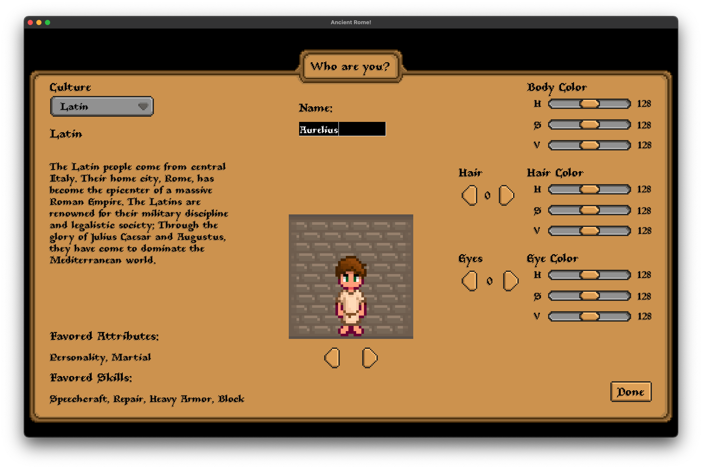

This (as of now) is the screen that shows up when you start a new game. Unlike the "Character Builder" (which I use internally for making new NPCs),
this screen only lets you change your name, hair/eye/body colors, and culture (a new concept I should discuss soon). But, this is probably what the screen for
creating your own player will look like, for the most part.

Prison ship (starting map):

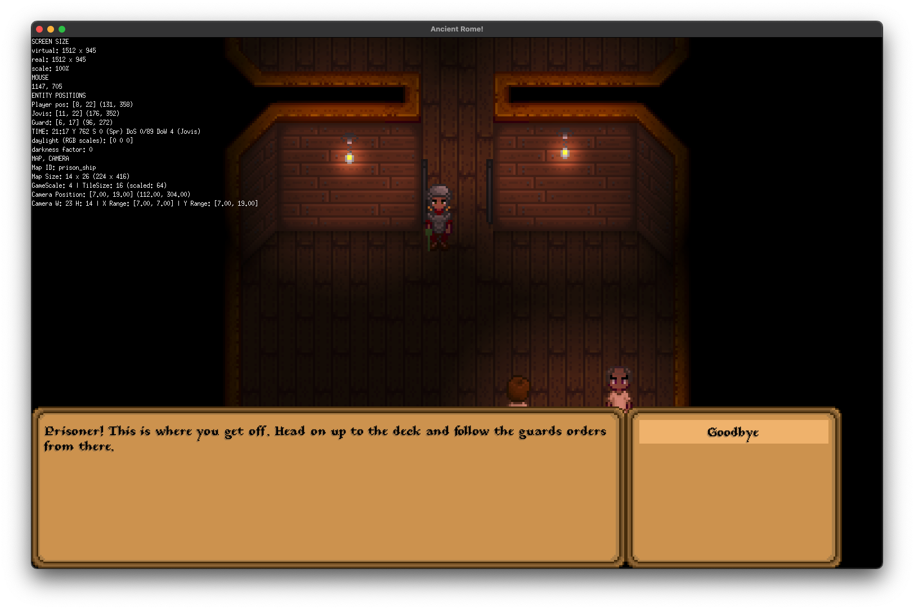

Now NPCs can perform tasks! The guard NPC walks through the map, opens the gate, and walks in to start dialog with the player. I know that seems pretty basic, but I was 
very psyched when that started working lol.

"The Customs Office":

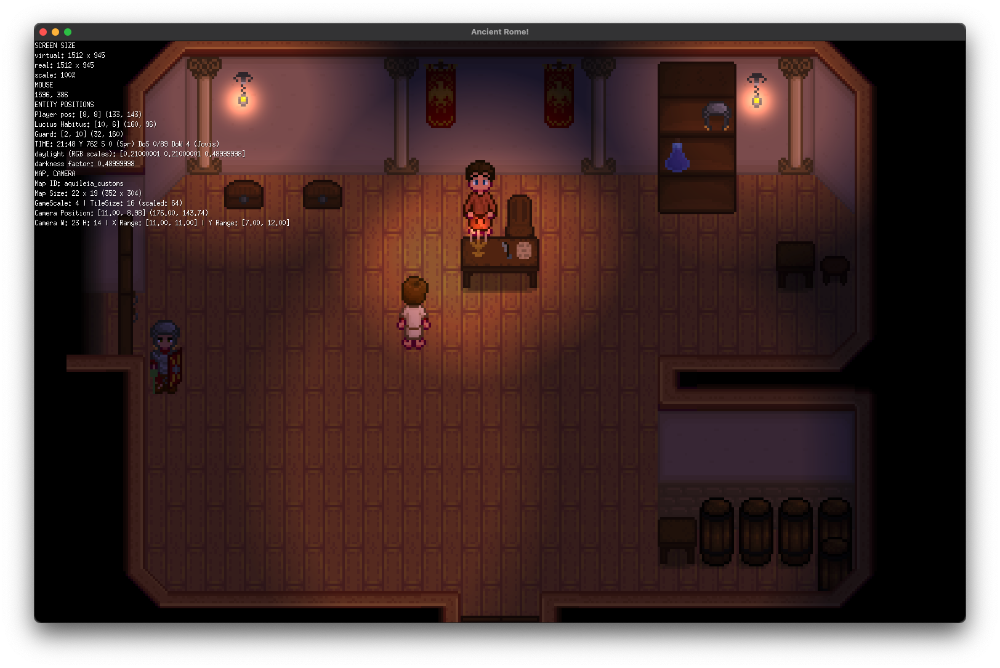

This is one of the maps you enter in the beginning of the game as you're getting set up. Just wanted to show it here to give a feel for what some of the buildings 
are looking like in the game so far.

Dialog Replies:

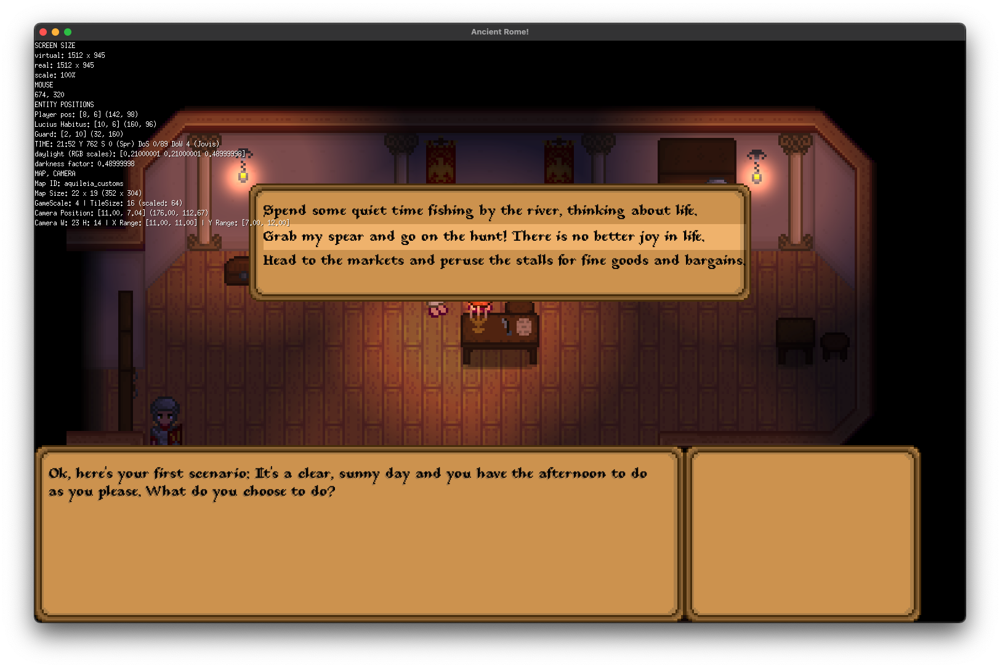

This just shows an example of a dialog reply. The current system is such that, if all replies are short enough, they appear in the "topic box" (bottom right),
but if there are longer replies that wouldn't fit there, we show a larger "replies box". This specific dialog is part of a "class creation" flow where you can
answer questions to determine your skills and attributes.

Legion Barracks:

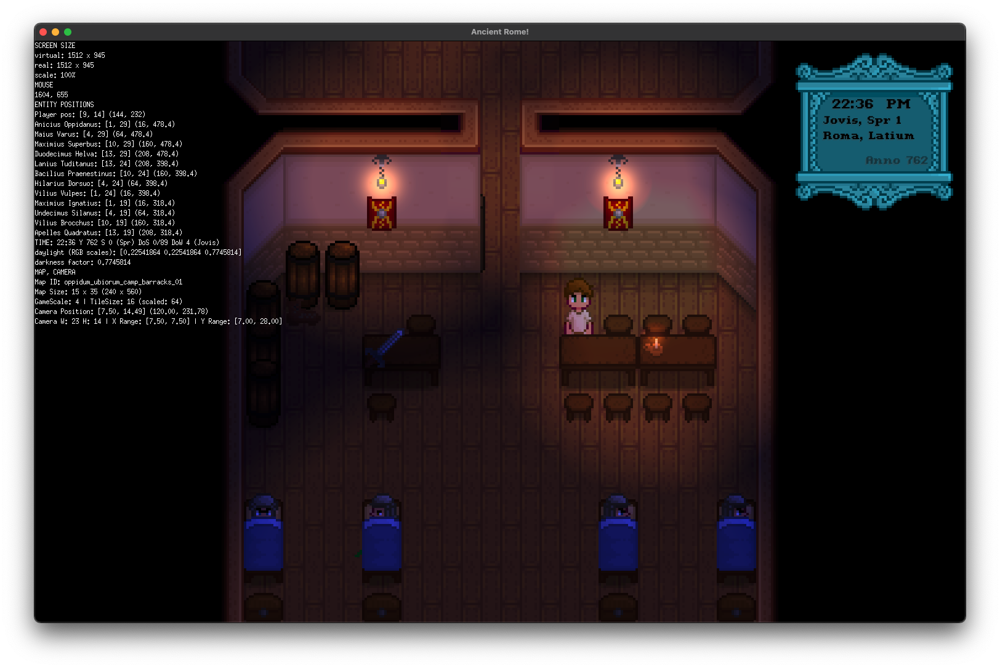

Just another map/building I've been making, a legion barracks. You'll see the legionaries are sleeping in their beds - this is the schedule and tasks system at work.
At some point soon, I'll make it so that eyes are closed while sleeping, and they probably also won't be wearing all their armor while sleeping either.

## Up Next 

So, at this point it's fair to say that the basic framework of tasks and schedules is working well. I think next I'll continue developing new tasks as the need arises,
and also continue building the main storyline. That's been my strategy for the most part recently: Make progress on the main storyline, and once I hit a wall or some kind of 
functionality/technical barrier, I implement new features to support the new content I want to make. Code -> Build -> Repeat.

# 2026-03-17

Today I want to talk more about NPC schedules and tasks. I've been trying to figure out some more details of how these things will work,
and I think I've had an interesting idea, so I wanted to get it down while it's still fresh in my mind.

## Problem: Making tasks reusable, and "how do they know where to go?"

One central problem since I've started on the idea of schedules has been: "should I make them reusable? and if so, how can I?"

Schedules consist of a list of tasks basically, and each task can contain a lot of complex logic.
For example, what if I want one part of the daily schedule to be for the NPC to sit in a chair?
This sounds simple, but in reality it includes a lot of steps to achieve this. Firstly, which chair should the NPC sit in?
How should the NPC get to this chair? What if another NPC is already sitting in it?

A naive way to approach this problem would be to just hardcode a specific chair to the task. If you know a specific NPC will be in a specific room,
then you could just identify the specific chair he should sit in for the task. That solves all of those problems: it will be given a specific location to walk to,
and other NPCs can be given the same type of instructions for their own "chair sitting" tasks.

However, the major problem with that is, it's not reusable at all. If I wanted to just define a "sit in a chair and hang out" task, I couldn't rely on hardcoded 
information, since of course different NPCs may be in different maps with different layouts, chairs, etc. Tasks need to be as flexible as possible, so that they 
can react to new maps and different environment, and different variables too. What if the player is sitting in the chair that the NPC would've tried to sit in?
This should be handled in a nice, graceful way.

## Solution: make tasks generic and dynamic, and able to react to the specific environment.

The solution I've come up with is, a task can look for specific types of objects in the map that the NPC is currently in.

Let's continue with the "sit in chair" task example: When this task starts, the first thing the NPC's logic will do is try to find a suitable chair candidate.
It can look through all the objects in the map, and for each one judge if it is a suitable target. It can consider things like:

- is another NPC already sitting in this chair?
- does this chair "belong" to a specific character def or role? (to prevent funny things, like a servant sitting in the king's chair)
- is the chair reachable via pathfinding? (e.g. is it behind a locked door that this NPC cannot unlock?)

This does add extra work to the logic involved for a given task, but the upside is, once you have smaller tasks built and working robustly, you can "stack" them 
to make increasingly complex tasks. For example, once you have a very robust "go to target" task, then you can use that as one of the sub-tasks to "sit in a chair".
Once "sit in a chair" is perfected, then you can add that to a wider scoped "lounge" task where among a few different possible options, the NPC will try to do something
like find a chair and sit in it, or maybe just be idle and stand around, turning and pacing every once in a while.

So, you start with making the smaller building block tasks, and then eventually you can have really complex tasks like "go to a library and lounge".
The NPC doesn't need to be given "which library" as a parameter, it just needs to be able to find a nearby one that is a suitable target.

## Recent Updates

Quick updates on what I've done since last posting:

- introduced transitions and loading screens to the game. feels much, much smoother now when going between maps, which is great.
- did some refactoring (not too much this time, I swear) to organize the logic for the "game world" better. Now, it's decoupled from the Game struct,
  and in it's own nice little package.
- In this new "world" package, I added some logic for processing and loading in all NPCs in all maps. NPCs are "defined" by having a bed in some map, somewhere in the world.
  Once the World Initialization process finds these beds, it identifies the owner NPC and initializes its character state.
  This ensures all NPCs exist in the game world and can be processed at any given time; used for identifying which NPC should be where, depending on their schedules (TODO).

Next up:

- Make beds "sleepable"
- Make chairs "sittable"
- Actually place NPCs in the maps that they are supposed to be in, determined by their schedule and the current in-game time.

# 2026-03-12

Back to the drawing board: now, I need to nail down how NPC schedules and tasks are going to work.

I've come up with the Character Generator concept last time, which looks like it'll work well. But now, I need to actually know when and where an NPC
should be in the game universe.

You might think: "well, obviously they should be in the specific map that you placed them, right?"
This is wrong - at least for what I'm wanting to do. See, basically, no NPCs are placed directly into maps. At least, not right now they aren't and they probably
never will unless I find a situation where I'd always want a specific NPC to always be at the exact same position, all the time.

The reason I _don't_ want that, is, NPCs have schedules that they follow throughout the day. I think we've gone over the concept of schedules already below, so 
I won't dive into the concept too deeply, but basically a schedule defines what "task" an NPC should be doing at any given time of day.
For example, an NPC might have a schedule that says:

- sleep from 10PM to 6AM
- hang around the market from 7AM to 11AM
- come home to have lunch from 12PM to 2PM
- work in study from 3PM to 9PM

... and, that cycle would just repeat.

Now, there are a couple problems here that we need to figure out:

1) How do we decide the map an NPC is in at any given time?

2) How do we decide exactly where IN the map an NPC is, at any given time?

There might be more, but let's just start with these two.

## How do we know which map an NPC is in, at any given time?

Well, if we look at the schedule above, I think it's not too hard for us to deduce the answer to this. It could be something like this:

10PM - 6AM: at "home" map

6AM - 7AM: in "country road" map, walking to market?

7AM - 11AM: at "market" map 

11AM - 12PM: back in "country road" map, walking back home?

12PM ~ (until next day cycle): at "home map"

The easiest thing to discern is that during sleeping time (and other contiguous tasks at home), the character is at the "home" map.

The trickier part is figuring out which map they should be at during the transition from being at home to the market, since it seems possible they could be
in a few different maps at any given time: if the clock strikes 6AM, maybe they are still in their house, getting ready to leave.
Or, if it's 6:30AM, maybe they are still enroute, walking in the country road map. You get the picture.

### Why does knowing this level of detail matter, anyway?

You might ask yourself, why do we really need to know exactly where an NPC is while they are "commuting" to a new task? Does it matter that much?
It would certainly be a lot easier if we could just teleport an NPC to their next map when it's time for them to do a new task. We don't have to
consider difficult things, like where exactly along the path they should be. There are some problems with just simply doing the "teleport" method though:

If we just teleport NPCs to their next task's map...

1) NPCs would possibly be "teleporting" into the map suddenly if a player happens to be in the same map.
- For example, you are hanging around the market, and then at 7AM, suddenly the NPC appears out of nowhere. That certainly would be weird.
- Okay, but at the same time, to be fair, we could just have the NPC enter from a normal map entrance area and walk to his position. So it wouldn't be that bad if handled right.

2) NPCs wouldn't "travel" to their next spot. This could break immersion, if you were planning to intercept a character on their way.
- For example, maybe you know that this NPC goes to the market at 7AM, but you want to interact with him before he gets there. You might try to wait outside his house, or
  maybe outside the town gate along the path that the NPC is expected to take. You never see him though, but you enter the town and voila, he's there already!
- I think this is the worst part about it. It breaks some of the feeling that the world truly is "alive" or "moving around you" without your direct input.
  It also limits some possibilities for the game which seem cool, like I mentioned in the example.

So, I think point 2 alone does justify us making some kind of system or calculation method to determine the "exact" map that an NPC would be in, even during task transition times.

### Back to the question then: how to determine which map an NPC is in, at any given time

To do this, I think we will need to calculate a path TO the next task's map, and also an estimated distance.

Let's consider our game universe looks nice and simple like this:

Map 1: "NPC's home" <----> Map 2: "country road to town" <----> Map 3: "market place"

The maps can be traversed in this linear, bidirectional fashion. To get between the home and the market, you have to go via the country road.

So, the clock strikes 6AM: the NPC is heading to its next task. We need to calculate the route it will take.
This is easy, in this scenario: it's going to "country road" -> "market place".

So, on one hand, we could use just this knowledge alone to approximate locations. Say we assume the size of the maps are all equal, and so we divide the travel time up in equal
percentages: 50% of it is spent in "country road", and the other 50% is spent in "market place".

However... this would only work if the time between tasks is accurately set. What if during the hour gap, the NPC actually needs to travel to an entirely new city that would take
much longer, say, 3 hours? It's not a catastrophic problem, but it isn't really good enough I don't think. I think if we already have the map path determined, it wouldn't be too much
harder to also determine the total distance (roughly) traveled inside maps, and then have a more accurate estimate on how long it should take. This way, even if the schedule is
somewhat poorly defined, the NPC still follows a realistic path to accomplishing the schedule. Even if the programmer does something silly like makes a character have breakfast
in Rome and then go shopping in Alexandria, the NPC will still "take" the correct amount of time to accomplish that.

> Actually, if such a schedule exists, we will probably have to have a mechanism that cancels an ongoing task once the next hourly task is triggered.
> For example, it might take 2 days to travel that distance, so it would be impossible for a regular 24 schedule to not "reset" before that task is finished anyway.
> If an NPC is going to travel between cities and live in different cities periodically, then we will just have to trigger a new schedule which is based out of
> that new city, and the NPC would naturally start to "travel" there anyway to start it's next task.

So, to calculate the total distance, I think we just need to calculate the actual, entire route, such that it includes the entire instructions:

1) which maps to pass through
2) for each map, the actual path (slice of map coordinates) that would be traveled.

From there, total distance is easy to calculate: just sum up the lengths of all the map coordinate paths.

And now, it's not so hard to decide, roughly, where an NPC should "be" at any given time. There's a little bit of math to do here, but I'll not worry about
writing it out for now - I'll work it out in the code, when the time comes.

## How do we decide exactly where IN a map an NPC is, at any given time?

I think we can use the same method and data as above to do this part. With the exact route, estimated distance, and the time it takes, then at any given moment we
could calculate roughly where the NPC should be. There are two cases to consider here though:

1) Case where the NPC is "en route"
2) Case where the NPC is already at the task, and should've begun the task

In case 1, as described above, we place them at roughly the correct position in the map that they are expected to be at, on the route between last task and next task.
In case 2, we would have to know that the task is already started, and once that is clear, probably just place them at the "start location" of a task.

For case 2, I think this means we will want to define the state that the NPC should be in if the task is "in progress". Imagine the NPC has a task where they are sitting
at a desk, ostensibly working on something. If the player enters the room (map) while that task is underway, we want to see the NPC is already seated at the table, not
walking towards the desk to sit down.

## Summary

Ok, so I think we've come up with a decent plan for how all of this should work. Let's sum it all up.

Traveling between maps:

- we calculate the "actual distance/time" it takes to get to the next task.
- the NPC should appear at intermediate locations along the path to the next task (if the path spans more than one map).

Requirements for Tasks:

- tasks need to define a "in progress state" of some kind, that gets the NPC into the exact position and activity that it is expected to be in while the task is underway.
- this is mainly meant to be used if the player walks into a map where the NPC is currently present and their task should already be underway.

Let's imagine a scenario where I load into a room at, say, 10:30 AM:

- NPCs that are meant to be in this map are loaded and prepared to be placed
- NPCs exact positions are placed either at their "traveling between" locations (if they are between tasks), or at their "in progress" positions if they are already doing a task.

I think the first thing I should get cracking on is, some kind of "global character manager" that runs in the background and keeps track of where all characters should be at any
given time.

## Future questions to consider 

I can already see myself stumbling into new questions about how tasks should work. But, rather than diving into those headfirst right now, I think I can let them simmer here
a while, and pick back up on them next time. Here are some things to consider:

- Do tasks need to define "exact" positions for tasks? Or, how should they determine where an NPC should be? For example, to define a "sit at the table" task, does the NPC need to
have a specific, assigned seat? or should it just find an open seat? I think I prefer to flexible "find an open seat", and so, I think that means we need to work out how to identify 
object types in tasks, and how to find the right one to interact with. This would be super helpful, since it would make task definitions much more reusable.

# 2026-03-11

Today I want to use this space for some more brainstorming: I'm trying to figure out how maps and characters should be related to each other.
That's a very vague way to describe it; let's start by describing what my end goal is.

Goal behavior:

- maps can be the "home" of a character (or multiple characters).
- characters have a bed in their "home map", which they can identify as theirs, and sleep in at night.

Ok, I think that sums up the bulk of it. I'm trying to figure out how to identify characters that use a certain map as their home.
This brings me to a couple questions:

1) How does a character know where his bed is (which map, and which bed)?

2) Where do we define this relationship? (e.g. in the Tiled map? In a code definition?)

to answer #1, I think we have to acknowledge what kind of characters there may be. I'm anticipating that there will be a couple types:

- Type A: a character that is personally defined by me, and part of a real storyline. E.g. a specific shopkeeper.
- Type B: an auto-generated character that is not directly instantiated by me. E.g. a misc town guard.

I'm currently envisioning that I will define "type A" characters myself, build their house maps, and set things up such that they live there and have their
personal bed.
For "type B" characters like a random town guard, I will still build the map where he lives (probably a town guard barracks of some kind), but I want a system such that,
if that town guard dies, a new one can spawn and it will know where to go to find it's "home" and bed.

I think this bed identification stuff could be part of the "defs" in our "defs/state dichotomy". What I mean is, there is an initial definition for everything, which as the game 
goes on can possibly be changed due to events happening in game - in which those changes will be tracked in a "state". So, perhaps a "map def" will include information about 
which bed is meant for which character, and in a "map state" we can handle identifying who the "current owner" is - if the town guard dies, the bed ownership is discarded,
and once a new one is spawned, that empty bed ownership is assigned to him.

Well, if we go with that, now the question because, more specifically, _how_ do we point beds to specific characters (or character types)?
Let's consider both cases:

1) The bed owned by a specific, unique character, like a specific shopkeeper.
- For this case, I think it makes sense to directly set a character def ID onto the bed object.
- This way, when loading a map definition, it can look through all bed objects in the map and find character def IDs; then, it can either identify 
  existing characters and set their bed location, or instantiate it if the character hasn't been created for some reason (let's not get into that logic yet).

2) The bed owned by a augo-generated NPC, like a town guard.
- For this case, we'd need a "wider category" of character. I guess you could use a character def for a non-unique character def, and it would work.
- BUT, one case I'm thinking of is, what if town guards should have multiple possible character defs? For example, maybe some town guards have different appearances.
  It would look a little bland if ALL town guards had the same eyes, skin tone, hair, etc.

## Character Generators?

This 2nd point here is starting to make me wonder: do we need to create some kind of "character generator" concept? Perhaps, beds can be what ultimately places characters
in the "real game world" (non-scenarios). And so, maybe beds will also basically be where we reference some kind of "NPC generator" concept which defines what kind of NPC
to spawn:

- which character defs it can use 
- schedule defs?
- ... anything else?

So, how about this: in code defs, we can create a new concept called a CharacterGenerator which defines the data, defs, etc to use in generating an NPC.
Then, a bed object in a map can have a property for one of two things: either a `characterDefID`, or a `characterGeneratorID`.
When a `characterDefID` is encountered (at whatever stage we handle defining NPCs in a world), we define the unique character defined by that character def.
When a `characterGeneratorID` is encountered, we use the generator to create a new, dynamically created NPC that will live there.
If a unique character dies, its bed remains empty. If a dynamically created character dies, after an interval of time passes, a new instance of that character is spawned.

In the future, as the game gets much more advanced, we can add further logic to these mechanisms; for example, maybe we have a fortress that has dynamically generated
soldier NPCs. However, maybe there will be a way to "destroy" a fortress or conquer it - after which, these soldier NPCs should no longer spawn, since the fortress is abandoned.
Perhaps there is a misc NPC that lives in a cottage, and the player decides he wants to live there, and does what any logical ex-Morrowind player would do: kills the innocent
villager and sets up shop in their house. In this case, too, we wouldn't want the NPC to respawn, at least while the player is living there. So, we can add some other logic, or
control that determines if the player now "owns" the house and therefore NPCs shouldn't spawn in there. But all of this logic comes much later, maybe as finishing touches to the game.

## Implications for the Game 

I think, since we are starting to get into the "meat" of how maps and characters are defined, that this will ultimately lead us to needing to define the process that
"sets up" the game world before the player enters it. I already have very primitive and simple versions of this, but now we will need something that, on "new world creation"
(i.e. player starts a new game) goes through all the maps in the game, and instantiates all the NPCs that should exist in the overall game universe. Obviously, these characters 
won't all appear in the same map that the player loads into, but we will need to instantiate the characters and their states anyway, and set their "current map" locations.
This is because, we don't want characters to only exist once you've entered their personal "home" map for the first time. That would cause a lot of problems, like for example,
no town guards existing in the town until you happen to enter the "town guard barracks" map eventually. No bueno.

This brings me to my larger designs for the game: I envision having a world where NPCs always have a calculated location where they currently exist, even if it's not in the currently 
opened map. Let's say you're in one town, Rome, but there are other towns all over the game universe, like Athens or Alexandria. Even while you, the player, are in Rome,
all the characters/NPCs (I've just noticed I use these terms interchangeably) in Athens and Alexandria will also be semi-active. They won't get much advanced computations, but they 
will at least have their current map, current schedule task, etc calculated. If these things end up taking any notable amount of computation time, then it will all be relegated to 
a background process/goroutine. But grander picture of all this is, at some point, it would be cool for there to be NPCs that actually have some autonomy in pursuing their own goals,
and making changes in the world. I'm not sure what the scope of that would be yet, but maybe certain characters might fight each other and kill each other, or maybe certain ones 
will be traveling around the wider game universe themselves, much like the player, and could be currently visiting a certain city for the next week or two. That would make the game 
feel a whole lot more alive, because well, it sort of _would_ be.

... But, all of this day dreaming will have to wait for a future day, because I have a lot of work before I get to that point. For now, I'm just glad I've come up with
the concept of character generators and all that, which I think will be a flexible system that can be adapted over time and support what I need to do.

## Current Progress / Next Steps 

Just a quick update to keep myself accountable; it's been about a week since I last posted, but right now I'm building the first "real world" map, a legionary fortress.
It will tie into a nearby town, too, and have some intermediary maps in a forest, so right away we are getting started with building out a certain "region" of the game universe,
essentially. That's very exciting for me, but also likely to lead to a WHOLE lot of work. Even just making new maps takes days, but I'm sure I'll need to code new logic as I keep 
developing new in-game concepts and mechanics.

Next steps:

- Define a first "home" map for some NPCs, including "generated" and unique characters.
- Start building an overall "town" ecosystem, which will come with a whole lot more definitions and stuff.

# 2026-03-03

Figured it's time for more updates. I've now basically finished the whole first level and character creation, which included some things like
designing the player's character body/appearance, and also designing the player's class (major/minor skills, etc). To do these things, I had to figure out how to make 
specific screens appear mid-dialog, and in doing so I ended up designing a Screen interface and also implemented the concept of a main menu.
This is exciting because it finally ties together pretty much all the different pieces of the game: before, I was just writing the code for running an in-game world,
loading a specific map and running around in it, collisions, interacting with NPCs, etc. But now with this screens system, I have a way to show a start screen/main menu,
and then choose to start a new game or load an existing game, etc. Additionally, screens as a concept introduce another way that custom code logic can be inserted into the
game.

## The "Screen" Concept 

A "screen" in this game engine is a UI screen essentially. It's not part of the game world or a map, so when you're in a screen you're basically either already outside of the 
game world, or briefly suspending it. For example, right now I have it so that in a certain dialog, we trigger a class creation screen to appear. when this happens, the screen 
takes over and we are no longer in the dialog session. You do what you gotta do in the screen (design your character's class, in this case), and then when the Screen sees it's
done, the screen goes away and dialog can proceed from there.

But, it doesn't have to just be something like a UI screen that appears mid-game.  I realized that I can use this same concept for making things like the start menu, if I want.
So, I've started doing just that, and in my main Game struct, I made it so that a Main Menu screen can be set, and now there are (so far) two "game stages":
`MainMenu`, and `InGame`. Once the MainMenu screen is done, the game switches to the in-game stage. And, later on I'll probably make a screen or some kind of in-game control that
can switch back to the main-menu stage once in-game play should end (e.g. you've saved and chosen to go back to the main menu).

### Adding "Custom Logic" into the Game

Until now, I've also been trying to figure out if and how the "game" project should be able to inject its own logic into the Update loop, so that it can have more control 
over things. But I've now realized that Screens will help a little with that. If there is a point in the game where I'd want to have specific control over what happens
(and would need to inject some custom logic or behavior somewhere), well, if it's something that should be done in a user interface, like a settings page for example,
a Screen is the perfect solution.

Probably though, there will be cases soon where I want custom logic to execute, but I don't want a UI screen involved. Maybe, for example, I want some magical item that 
can do something specific like cause a monster to appear, or maybe a potion that once drank, transforms you into a dog. These are things that _could_ work with a screen
(maybe a pop-up appears that explains what happened, and you click OK for the change to take effect?) but, maybe a screen involved would just make things clunkier.
In such a case, I'm imagining making "custom event logic" which will listen for a specific event to occur, and then execute some bit of code.
I guess I could call it an event script or something.

## Next Steps 

Anyway, I'm just excited that I've got this concept worked out, and it's helping me see the path forward a lot more clearly now too.
Oh, also I've just made the logic for saving and loading games, so that is exciting too. Soon I'll experiment with saving after the first quest, and seeing if I can 
load back in and continue the game where I left off. It's all starting to feel a lot more like a "game", which is cool.

Next things I'm planning to tackle:

1) Cinematic Transitions, and Cutscenes
- I want some effects that can fire to fade the screen to black, for example. Would be used for moving between maps anyway, since right now it's just an instant transition.
- Might want to do a cutscene at the end of the first quest, so maybe I should go ahead and get that logic figured out.
  - I think it'll mainly just be setting some tasks on NPCs and freezing the controls of the player though, so may not end up being all that much work.

2) Quest 2, and new maps, and cities 
- Not going to spoil what the next quest is, but I'll need to make a new map that will be an actual, live city in the game.
- These cities are going to be highly dynamic and complex places; lots of NPCs going about their scheduled tasks, and hopefully a feeling that the world is "alive".

# 2026-02-26

Wow, it's been 8 days already since the last post. I guess I've just been absorbed into my work here.

Quick update on progress:

- The first quest is nearly finished; it's just the "game opening sequence" where you appear in the world, design your character, and the setting of the world is introduced.
- Continuously improving and adding upon the existing dialog and quest systems, as needed.

So, all of that is going smoothly so far.

But I wanted to talk through a new thing that has come up, which I need to figure out.

## Game vs Game Engine: Where is the line?

Up until this point, I've been designing this as a "game engine" which is built upon ebiten. I think it could be more accurately described as
a "game framework for ebiten"? But, regardless, I had this idea that this is a reusable framework or engine that handles pretty much all of the game logic,
and "consumers" of this module would be able to just do things like input all the character data, tilesets, and design some UI screens to show, etc.

But, I've just started actually splitting off all the "game code" into a separate go project that will depend on this game engine project, and I've realized
that the way I'm doing things so far kinda makes things a little messy.

### Should Ebiten be Hidden, or Exposed?

One thing I was originally sort of "planning on" is that Ebiten would be hidden from the game module. I guess I never had a strong sense of that, but it was 
a vague assumption that made sense in my head. I think it would still make sense, but unfortunately I sort of lost sight of this over time.

The main thing that is currently conflicting with this is how I design UI screens. Right now, a UI screen (player inventory screen, stats screen, etc)
are all just following the usual pattern where you have a Draw function like this:

```go 
func (ui SomeUIScreen) Draw(screen *ebiten.Image) 
```

It takes the current state of the screen on that draw tick, and adds whatever it needs to on top.
The problem here is that this function takes an `ebiten.Image` parameter, and so now, if the game needs to define a screen, it needs to be able to see ebiten.
On top of this, a lot of the UI components currently work in a way where they give you an `ebiten.Image` to use in your screen. Box is a good example of this.
So, now in the screens I've made so far, there are numerous places where we need to be able to use ebiten for handling these `ebiten.Image` values (just drawing them, really).
But I also think there are other cases where we might want to be able to access ebiten.

Another example is the `ebiten.Key`. If I want to define custom key bindings or anything like that in the game, I need to be able to access this.
If I don't want to expose this to the game project, then I'd basically need to make a wrapper over ebiten's key consts so that they can be converted into ebiten keys
on the game engine side. This feels inconvenient, and just adds needless tech debt. For example, if ebiten decided to fix or change something here, then I'd need to make sure 
I update it in my own mappings too. Or, perhaps I'm lazy and don't want to implement all key mappings, and so therefore whatever is using this game engine simply has less power
to customize inputs.

### If I Hide Ebiten, How Would I do it?

I think the simplest, quickest way would be to do the following:

1) find all places where `ebiten.Image` is being directly used in screens, and move those back into their relevant UI components or otherwise.
- Box can just keep the image data inside of it, rather than returning it. And I can add a Draw function to Box.
- If I need a tile image, I can make a TileImage struct of some kind that just holds the image within it, and has its own Draw function.

2) create a `Renderer` that manages rendering all images. This would be made in the game engine, but usable by the game.
- It would only be used for UI screens, since in-game world rendering is handled exclusively by the game engine.
- It would essentially just hide the `screen` image and do the actually drawing onto it within the game engine side of things.

3) create an `InputManager` that tracks all key presses that occur in the ebiten hardware side of things, and then manages associating those keystrokes with
user input/actions.
- Basically we would create a new set of Key consts in the game engine which are then mapped to ebiten Keys.
- Games can define their own keybindings, but the keybindings just associate a key to an action.
- The game engine then polls ebiten for key presses, matches them up and decides if an action should be fired.
- Note: this idea of binding key presses to 'actions' was by ChatGPT, and I think it points out an issue that currently exists in this engine:
  we currently just hard-code bindings like the controls for walking in a map. In the future, this concept itself might be important to implement regardless of the ebiten situation.

To be honest, I'm not really sure about making these changes just to hide ebiten. I think this for a few reasons:

- I've already tested running the game in the game project with ebiten not being hidden, and it works fine. I believe the game project just added ebiten as a dependency for itself.
- the above would cause at least another week-ish of big refactors, which seems tedious. I'm not sure it's worth it - at the end of the day, we're just trying to make a game here.
- I really don't like the idea of creating my own Key consts that just map to ebiten keys. It feels unnecessary. If wrapping over ebiten entirely makes things more tedious and we 
  lose some convenience or power in making the actual game, then maybe it should be avoided. I want this "game engine" to really just be an enhancement to working with ebiten,
  not to make things more complicated or inconvenient.

## So, what is this thing then?

I think, with the direction I'm leaning, this thing is becoming less of an all-encompassing "game engine" and more of a "game framework".
Here's the idea:

- You use this "framework" as the basis for making your game with ebiten. It abstracts away a lot of the world-logic stuff that is complicated, and instead lets you just focus on
things like defining characters, maps, quests, etc.
- It includes a lot of useful, reusable UI components, utility functions, helper functions for things like rendering, etc.
- BUT, it doesn't entirely remove ebiten from your "game" side of things. You can still use ebiten directly in your game, when useful.
- The assumption here is that this framework will make things work much smoother and quicker, and will be reusable between games of a similar genre: 2D RPG style games.

Maybe over time, as I get a clearer and clearer picture of what can be abstracted away from the game side into the "engine/framework" side, direct use of ebiten will get 
gradually lesser and lesser. Maybe, in a future hypothetical version (if this engine/framework project goes far enough) it would fully hide ebiten and have a fully fleshed suite 
of abstractions on top of it. But, for now, I think that's kind of overkill and just distracting from the real goal of making a cool game.

So, moving forward, I think I might rebrand this whole thing as a "game framework", or maybe an "RPG framework for ebiten". I'll play with the wording a bit, but since ebiten 
won't be completely hidden, I don't think it makes sense to treat this thing as a game engine alone, does it?

## Next Steps 

Ok, so besides all that "engine vs framework" stuff, here are the things I'm actually working on:

- moving all "game code" out of this engine project and into its own repo, and making sure it works smoothly there.
- continuing to develop the first quest, and more specifically, the character creation part. I need to make a screen where the player can directly create their class/major skills/etc,
  but I also need to make the "questionaire" where you can answer questions to have your class and skills decided for you.
- once the character creation part is finished, then we move onto quest 2, which is where the game starts to actually come more to life. My plans for that is the player is
  transported to a legion camp where he will start to be exposed to different mechanics, like combat, buying things, etc.

# 2026-02-18

Excited to announce that the quest system is working! So far, I've just been testing with a simple type of quest that is activated by a dialog session.

It goes like this:

1) player starts dialog with NPC 
2) when the dialog progresses to its last node, it has an "effect" that broadcasts an event. The event gives a series of tasks to another NPC.
3) the other NPC "hears" this event and starts running the specified tasks, and walks up to the player.
- cool part: the NPC can detect obstacles and react. There is a gate in the way, and the NPC is able to open it and proceed!
4) the NPC walks toward the player and starts a short dialog.
5) once that dialog ends, the NPC finishes its sequence of tasks by walking back to its original location.

... anyway, I'm super stoked about that - And we're just getting started.

My plan from here is to continue developing the "starting quest" for the game I'm planning to make, and as I go, I'll continue to implement new quest actions,
dialog effects, etc. At some point, I anticipate that I'll need to work on the "fight" task, which will basically mean I need to develop the "AI" for combat.
That will surely take some time, and I might be refining that task on and off for a long time as game development progresses and new edge cases, bugs, etc arise.

Anyway, I just wanted to report the progress there. I think I'll still spend some time refining things in other areas too, but for now it feels like I can start "running"
a little more; up until now, there's been a lot of walking.

Here's a little peek at the current state of the starting map:

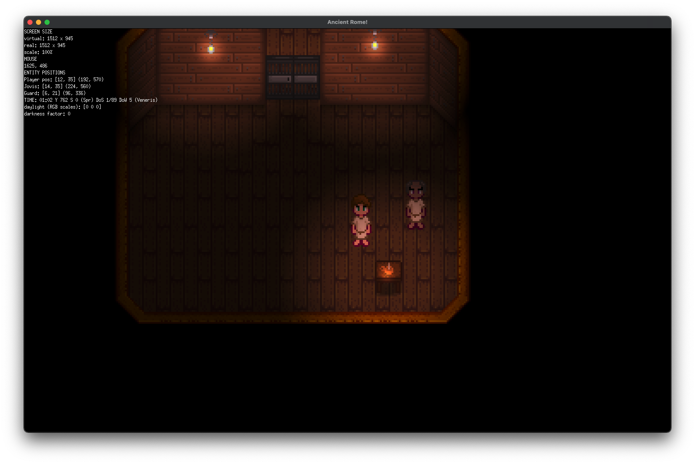

## Enhancement Ideas (for existing systems)

- Dialog
  - I've noticed that dialog text writes to the screen pretty fast, and if you are trying to read along with the speed of the dialog, it's hard to notice things like 
  when one sentence ends and the next begins. I think I'd like to add some more nuanced "pacing" to dialogs; either I will introduce some notation that will tell the
  dialog when to "pause writing" (or slow down), or I might just do something simple like this: anytime a "sentence ending" character is reached (./?/!), 
  the writing pauses for a second. That way, It feels a little more like as the text is writing to the dialog box, it's following a natural pace as though it's being spoken.
- Background music / sound effects 
  - right now, the game is still very silent. I'm thinking of just putting some "place holder" BGM in so that the game feels more alive. I don't have my own music, of course,
  so maybe I'll throw in some morrowind music or something. Of course, I'll be removing it eventually once I get around to figuring out the songs for a game.

## Next Steps

1) continue designing the "starting quest", which is the quest the player would initially spawn into the world playing in. So far, the idea is this:
  - Player spawns into a ship hold; this is similar to Morrowind, and they are apparently a prisoner of some sort.
  - Player leaves the boat and enters some kind of government building ("Census & Excise?") and sorts out character creation.
    - up until this point, the player may be hidden in some kind of clothing with a hood, so that you can't see what they look like until the character has been designed.
  - After character creation, the player finds out he will be sent off to a new location (avoiding too many spoilers here) and the game does some kind of "fade to black" transition.

2) Improve dialog flow (read above)

3) Update Character Builder to allow setting some of the new fields in a CharacterDef, like:
  - DialogProfileID 
  - ScheduleID (a default schedule for tasks, when none are assigned)

4) Oh, and probably more artwork. I'm gonna need to design some more maps, and probably would like to improve the "prison ship" map that I've been using.

# 2026-02-12

I've gotten things fixed up a bit, and have started working on the dialog for the opening "scene" of the game. So that's very exciting, and I'm ready to keep working on it.

I've also finished up making the AudioManager, so now we have a good basis for gradually implementing more advanced audio playing logic, as the need arises in the future.

Right now, I'm back in the Character Builder and making some more updates. The main things I've decided I want/need to add are:

1) Input field for setting the DialogProfileID and default footstepSFX set (that's a must)

2) Extending the name system to have both a "Display Name" and "Full Name", and also adding a "Class Name".

Number 2 there is just something that I think will add more flavor to the game. It also makes logical sense, since this game is going to be set in the classical Roman world.
So, we will need to have simple "display names" that are what characters are referred to as in regular gameplay interactions, but for some "flavor" we can allow some characters,
especially Roman elites, to have fuller names.

## A More Nuanced Naming System

### The "Full Name"

In classical Rome, Romans usually followed a naming convention that included multiple names, not just a "first" and "last" name.

I'm probably going to mix it up a bit here, since I looked it up a long while back and am just attempting to remember the details now. But I think it goes like this:

"Praenomen" (I think that's what it's called): Essentially the "first name" or "personal name". There was a small set of these, things like Marcus, Gaius, Publius, etc.

"Nomen": I think this roughly equates to "family name" or "clan name". There are a lot of these, and they are things like "Cornelius", "Claudius", "Julius", etc.
I usually think of Julius Caesar's "first name" being Julius, but I believe that's actually his clan's name; his "Praenomen" is Gaius, I believe.

"Cognomen": Now, it's possible I'm getting this mixed up with "Nomen", but I believe this one is sort of a "nickname" that can be passed down. They usually have some sort of 
literal-ish meaning, or at least are often derived from actual Latin words. I think Julius Caesar's cognomen must've been "Caesar" then? For Scipio Africanus, I think "Scipio"
is his cognomen.

"Honorary Titles/nicknames": I don't remember the actual name for this, but I believe you can get an extra name tacked on the end if you are extra special.
In the example I gave above, Scipio Africanus' "honorary title" is "Africanus" actually. I think it literally means "the African", however don't get that twisted: he was a Latin Roman,
and not from anywhere near Africa to my knowledge; Instead, he got the title since he was conquered Carthage, which was situated in Northern Africa, and therefore it sort of has more of
a ring of "conqueror of Africa" too. I think there were others of these thrown around, like Britannicus, or Asiaticus, etc.

Ok, so that's probably riddled with mistakes, but you get the picture: Romans can have a lot of names.
So, while it might be nice to add some details in, like calling Scipio "Publius Cornelius Scipio Africanus", it can also be burdensome to always have that name shown.
Actually, it would be very annoying and confusing if all of the Roman characters had these excessively long names, and you had to keep track of them all.

So, instead, I think we can also keep a "Display Name".

### The "Display Name"

This will just be a shorter, more manageable and easy to use/remember name. It will more or less be "what a character is called" in dialog or anywhere else you would see his name
in game interfaces, etc. The Full Name will just be a detail you can find on his profile, to give players more context or even identify specific historical characters.

So, for example, instead of a character running around using the name "Publius Cornelius Scipio Africanus", I think we could shorten this to a nice "display name" of 
just "Scipio Africanus". That's how I usually hear his name referenced anyway. Instead of "Gaius Julius Caesar", we can just use "Julius Caesar".

For some extremely well known characters, like emperor Augustus, I'll just make his display name "Augustus" probably.

### Will all characters have full names? What about non-Roman culture characters?

I don't think most characters will have full names. This will be reserved for specific characters who have some historicity to them, or are otherwise very special or important 
to a major questline. So, due to this, I can imagine that only the elite of the elite will have these long "full names". I might use the "full name" section to include extra fancy 
titles, when appropriate.

If I have time to do more research on different cultures present in the game, maybe they will have more nuanced naming systems too. But until that happens, I predict the full name 
category will mainly be used by Romans, or other historical characters who had famous nicknames maybe. 

## A Different, but Bigger Topic: Skills, Attributes, and Levels

I'm pretty sure I've gone over this topic already before, so I won't explain the concepts of Skills, Attributes, etc here. But, as a quick reference,
these things basically are intended to function the same as in games like Morrowind.

I'm back in the Character Builder, and I've decided I need to go ahead and tackle the issue of calculating levels based on skills, how attributes and levels are influenced
by each other, and other things like adding a "class" system.

### A Class System 

First thing I'll explain is the idea of a "class". To be honest, it doesn't really mean much for the player, because I don't think the player will be choosing a specific class,
unless they want to as a means of convenience and to avoid spending time manually choosing skills, attributes, etc.

But the main motivation for me to make a class system is just for speeding up NPC character creation. I don't want to have to manually set each and every skill/attribute for every
character. I'd rather pick a class, set a level for the character, and let it compute the skills and attributes for me. Then, I can handle adding traits for extra flavor.

Here's what I'm thinking (I'm also just inventing this as I type, using this as a thinking space). A class defines:

"Favored attributes": Simply, these attributes get a boost right from the start.

"Major and Minor (and misc) skills": setting a skill as a major or minor skill affect the following:

- a higher base skill level: major skills start out with a bigger base than minor, which starts out bigger than misc.
- how much a skill increase affects overall level-up progress (major being more significant than minor, etc)

Note: I believe in Morrowind, misc skill increases did not contribute to level growth (I think?). But in this game, they will contribute to level growth. Just not as much 
as major and minor skills.

Now, for each "level", we will calculate a valid number for each skill and attribute. But, these skill and attribute levels will be distributed based on what was selected for 
major and minor skills.

> Note: this is me explaining how the "automatic character creating" system will work. For actual players, they will just hone their skills however they like and their attributes
and skills will change organically based on that.

#### A Level Calculation Model 

Let's remind ourselves how leveling up works, and its relationship to Attributes:

If you gain enough level-ups in skills, you increase in your overall character level.
Each skill has a different "weight" in this calculation since major skills are more important than minor skills, which are more important than "misc" skills.

Here's a formula for calculating levels which looks decent. 

> Level = 1 + floor( (WeightedSkillTotal - BaseSkillTotal) / K )

WeightedSkillTotal: sum of all skills with weights (weights applied to major and minor skills)
BaseSkillTotal: starting skill baseline 
K: how much skill growth equals one level

Skill Weights:

- Major: 3 
- Minor: 2 
- Misc: 1

So... 

> WeightedSkillTotal = 3(sum of major skills) + 2(sum of minor skills) + (sum of misc skills)

Let's also clarify how BaseSkillTotal works, since that is also needed. Each major skill will have a base of a certain level (starting at level 1).
The same applies to Minor and Misc skills. Let's set them like this:

- BaseMajor: 30
- BaseMinor: 15
- BaseMisc: 5

So, now we can calculate the BaseSkillTotal like this:

> BaseSkillTotal = 30(number of major skills) + 15(number of minor skills) + 5(number of misc skills)

Finally, we choose a value for K. K is a number of "weighted skill points per level", which means if the (weighted) skill points reaches a certain number, we have reached
the next level.

To decide this value, we can sort of reverse engineer a value based on how fast we want leveling to occur.

Let's say, for each level, we could expect some sort of "rate of change" like this to each level group.

Major rate: 5 
Minor rate: 4 
Misc rate: 2

What this means is, maybe on average, we would expect 5 levels of increase to all major skills, 4 increases to minor skills, and 2 increases to misc skills.
This is of course not going to be "true" for a player who is leveling up organically (all misc skills definitely won't be always going up by 2, for example) but
it sets an expectation for what we could expect as an "overall, averaged character" at a given level.

So, you take these "rates" and multiply them by the _number_ of skills in its category, and then multiply by the weight of skills in that category too:

> Major Gain = (number of major skills) * (major rate) * (major weight)
>
> Minor Gain = (... same thing for minor skills, rate, and weight)
>
> ...

And finally, you add them all up to calculate a value for K:

> K = MajorGain + MinorGain + MiscGain

Now we have all the pieces needed to calculate a level based on skills.

### To be continued 

I think this whole skill and attributes topic is a lot bigger than I initially realized, so I'm going to pick up on the topic again in a later post.
For now, I'm satisfied with this level calculating formula, and I know I can reverse it to ultimately figure out how to generate skill levels for a character of a certain level.

Next time, I think we will need to dive into the topic of: how do attributes and skills affect gameplay, fighting, and other mechanics? That's gonna be a pretty big topic I imagine.

# 2026-02-11

... Whew! Finally finished that massive refactor I started a few days ago. In short, I moved almost everything I could think of into this new Defs/State dichotomy.
Everything from characters, items, shopkeepers, dialog, body parts (for entity bodies), skills, traits, etc are now all cleaned up and defined with Definitions in a
`data/defs` package, and where applicable, with States in `data/state`. I'm pretty sure by now I've edited damn near all of the files in this project - at least, anything that
directly deals with in-game concepts and state. But, I'm much happier with this setup, and I also feel like I understand how things will work going forward much better.
There was always a looming question hanging over my head which I never really understood until now: "How will I save and load a game playthrough?".

I'll go ahead and just sum up the details of how this "Defs/State" system works, and any rules I have going forward if I end up implementing new features or concepts in the game
engine.

## The "Defs/State" System 

This basically means, all game data will be broken down into one of two things (if it's to be saved and is not temporary runtime stuff).
I'm guessing in the last post I started diving into these concepts, but let's try to give them a good definition now that this refactor is done and I've gone through all the
code changes.

### Definitions 

A "Definition" is something that defines a "starting point", or also can define "what is possible to occur" for a particular concept in the game.

Let's look at the "Character" concept in the game.

> By the way, up until now, I've largely been using the word "Entity" instead of "Character". I've stopped using Entity for really anything besides the runtime concept of 
showing a character in a game map; the "entity" is just a shell in the world that is associated with a specific character, and can move, fight, etc.

A Character has a definition that defines things like:

- what items does this character start with when it is instantiated in the game world?
- what are its base skills?
- what is it's body/skin definition?

... and pretty much anything else that might be considered "immutable" (unchangeable). Some of these things **will** change at some point, but they also serve to
define how a character that is spawned into the game using this Def would start out. What items it initially has, it's initial skill levels, etc.

### State 

A "State" essentially keeps track of the ongoing progression of something in the game. It's what is saved when you "save the game", and it's what's loaded back in when you
start up a previous save.

Using the Character example again, the Character's state will tell you the current skill levels, the current items in the character's inventory, etc.
As things change during a playthrough, the State is where those details are saved and remembered.

## Saving and Loading Games 

So, with these definitions in mind, it becomes a lot clearer exactly what you need to save and load for a specific playthrough.

The Definitions are immutable, so there's nothing to "save" here. As long as the game can access these same definitions every time, there's no problem.

So, for saving the game, you really just need to save all of the States for anything in the world that matters and that needs to be remembered between play sessions.
I think that simplifies things very nicely, and it makes it clear too about what data to include in a save file. Just get all the states for anything that has a state in the whole game,
and save it in a file.

## Going Forward: New Rules

From now on, here are some new rules I will try to remember and strictly adhere to:

1) Whenever creating a new concept, ALWAYS design it by Def and State first.
- Create the necessary structs and interfaces that define these two concepts, and put them in the correct data packages.
- Do this first, since it will help in the long run. Don't build something really massive and THEN go back and try to split up the pieces.

2) Clearly separate the concepts of State and Def from eachother, and ALSO (especially) from Runtime.
- I might go as far as just defining three structs for any new concepts going forward: Def, State, and Runtime. And the concept itself will wrap these three.
- It's just nice to have these things broken up cleanly. It will probably lead to cleaner code too. 

For now, I think these rules will work nicely. If I run into any new issues in the future, I'll add em here.

## Next Up 

Ok, I know I've been claiming that I'm about to start working on quests for a while now... but I think I'm really finally getting to that point!
A couple likely things that _could_ come up besides quest work though:

1) Update CharacterBuilder to support choosing DialogProfileIDs
- (I haven't introduced this concept yet here, but I will in the future. Basically, this just defines how a character behaves in a dialog session.)

2) Misc bug fixes. I did a massive refactor, so I'm sure there are bound to be at least a few places where I've accidentally broken things. Hopefully no more major refactors...

3) Redo the sound system: planning to make a centralized sound player, for a couple reasons:
- I want to manage it all in a single place, so that sounds playing simultaneously are aware of each other and there can be some managing done if needed.
- Also, reduce memory usage. The current system means each entity will load its own set of audio data, but that doesn't make sense. I think all audio data should be loaded 
into a single, centralized sound manager so that there isn't duplicate memory usage anywhere.

# 2026-02-08

Currently going through another learning moment - I've discovered that I've kind of fused together the concepts of "State" and "Runtime" in a lot of places.
I'm just now learning why I will want to ensure these two things are decoupled and clearly delineated. I'll go into the details of that concept here, and point out some of the 
main challenging points with how things are currently set up. My goal is to get most of this worked out as soon as possible, so I can get cracking again on the actual game content.

## "Definitions", "State", and "Runtime"

These are three concepts that I've been gradually understanding better and better as I've been working on this. Until now, though, I haven't given it too much thought.
The main reason is probably because, up until now, I've been mainly just testing things out, getting them to work, and not worrying about overall architecture.
But now as I see the pieces come together and I'm ready to really get into game development, I see a lot of flaws and potential problems with how I've designed a lot of the 
structs for things like entities, NPCs, dialog, etc.

## First, Dialog 

I started on this realization when I was working on improving the dialog system. I basically realized that I should try to rewrite it better, since before it was basically put 
together just for testing, and it was well before a lot of the other concepts of the game were starting to be imagined and planned.

After working through things with ChatGPT, and aiming for a "morrowind style" dialog system, I found that my current schema for dialogs was all out of whack.
It was really just way too unsophisticated for what I was wanting. I needed reusable topics, with responses that rely on conditions about the player, game state, or
conversation memory, and since things were so different I settled on rewriting all of the dialog schema and logic.

Eventually I had a nicely designed system, and it was also decoupled nicely into these concepts of "definitions" (topic definitions, dialog profile definitions, etc)
and "dialog state" - which topics the player has discussed before, what kind of decisions he's made. Really, just a map of strings that serves as a memory system for dialogs.

Definitions were hard-coded and retrieved by ID from a centralized data store. State represented data that we want to persist in save-games and be loadable into a dialog session.

Runtime logic is pretty much everything else that you need for the dialog system to work: statuses, UI flags, timers, etc. These should not be saved or persisted anywhere, as they 
vanish once a dialog session has ended.

## Next, NPCs 

Once I had this shiny new-and-improved system for dialogs (and it only really took me about a day and a half, luckily), I realized I probably need to do the same for NPCs.
At this current point, NPCs could be defined like this:  a wrapper around an entity that allows for "smart" or scheduled behavior, like fighting, following daily schedules, or any 
miscellaneous task that you want to assign. Much as the player is a wrapper around an entity and allows the player to control it, the NPC is the same and allows an entity to 
"come to life".

I started to realize that the current definition for NPCs is pretty messy though. Firstly, there is no "NPC Def" yet. NPCs basically are just given an entity ID, and that data is
loaded into it so it can start doing things in the map with that entity. I started trying to de-couple the NPC in the same way, picking out "Definition" data from "State" data, etc.
However, I've now noticed that a lot of the NPC's "definition" data actually lies in the entity itself. The same with it's state - it's health, inventory items, skills, etc are 
all defined within the entity right now. 

## So, Entity first then

Actually, once in the past I must've been slightly moving along this path, albeit at an earlier stage of realization, and I had done the 
due diligence of splitting off the "character data" from the runtime logic. I even split off the "UI controller" for the entity, which is called a Body. 
So, it's not all bad, and that is definitely not a bad place to be starting from now. I think I had made this decision to split the entity data up as such because of the
character builder; I needed a single struct that would represent who the entity/character actually "is". I didn't want to save off a bunch of runtime logic flags and values into 
a JSON, I just wanted to save off things like the entity's items, name, ID, skills, etc.

So, now I need to go one step further: I need to split this CharacterData struct up into two things:

1) The Entity's Definition: what is the immutable data and identity of this entity/character?
2) The Entity's State: what are the details about this entity that will change over time, and that we should save in between playing sessions?

Once I have these things determined, then I have to figure out how this should work with NPCs.

### Q: Does an entity have a "state"? Or is that just part of the NPC's state?

This is something that I'm trying to figure out now, so let's just dive into it.
I guess the crux of the issue is, are there ever entities in the world that aren't either a Player or NPC?

... I'm thinking the answer is no. First of all, what's the point of an entity that isn't either one of those? I don't think it will have any capabilities at all.
It won't be able to engage in dialog, it won't be able to fight, and it won't be able to walk around on its own or do anything besides stand there.
Plus, I don't see why I couldn't just make an empty little NPC wrapper for an entity, even if it wasn't going to do anything besides stand there.

So let's settle it: "an entity's state is just part of its container player/npc's state."

I guess the implication here is, when we load an NPC and it's spinning up it's inner entity, it will have to pass to it an `EntityState` struct. Same with the Player.
And when saving the game, each NPC will save its inner entity's `EntityState` into its own state data.

### Q: Does an entity have a "def"?

I think the answer here is yes. The reason being, you can reuse a single entity def for multiple NPCs. Imagine there's a basic entity definition for a legionary soldier.
If there were two NPCs who represent just rank-and-file legionaries, then this entity def could be reused.

## Last: How Should Save Data Work?

This is likely going to play a part in this issue, so I'll need to get this figured out now too.

Until now, I've only had "temporary" solutions for saving data. Like I said above, I save CharacterData into JSON files, which can then be loaded at runtime.
I think ultimately, it will probably end up something like this:

Definitions:

- either hard-coded in a code file somewhere (especially for more simple data, like dialog topic content)
- or, saved as a JSON file, for data that is more complex and won't be written or defined by hand. E.g. character definitions from character builder.

State:

- all game state, including dialog state, NPC state, etc, will be saved in a big save file. I'm not sure what format - I guess it could be a JSON - but I also like 
the idea of something more opaque so you can't just open the file and start making changes all willy nilly.

## Next Steps 

Anyway, I just wanted a chance to write this all out to help me put it all into context and contemplate my approach. I think for now, I'm going to get this Entity vs NPC thing
worked out, get those definitions centralized in the "definition manager" (as I've taken to calling it), and once that is done I'll look around if there are yet more places I need 
to fix up. Hopefully not many more, because I really feel like I've been in a cycle of refactoring and rewriting code over time. I guess that's the consequence of doing something
new and learning lessons along the way.

I think moving forward, I should make sure to split all data along these lines of "runtime", "def", and "state". This is only important for data concepts that might need to be
saved and reloaded though, so if I'm designing a UI component, it may not be as important. But, for quests as an example (probably the next major thing I'll be architecting),
I'll definitely make sure to design it from the start along these three pillars, probably simply as structs named as such.

# 2026-02-03

## Attributes Screen of Character Builder

I've finished up a basic version of the "Attributes" page of the character builder. This is what I've settled on calling it, but in the last post I was referring to it as 
the "stats" or "skills" page. This page lets you do two main things: 1) set the base attribute and skill levels of a character, and 2) add traits to the character.
Altogether, these things will calculate the attributes and skills of a character.

### Attributes vs Skills 

This concept of "attributes" and "skills" is very much the same as what you will find in games like Morrowind:

There are a set of attributes which describe general "skill areas" you might say. If a player has a high "strength" attribute level, then all skills related to that attribute 
will be positively influenced.

A skill is more specific and tied directly to some kind of specific weapon type, mechanic, or other concept in the game. The "blade" skill affects how well your character uses 
a blade-style weapon like a sword or knife, for example. The "repair" skill affects how good your character is at repairing his armor or weapons. All of these skills have 
"governing attributes" (as Morrowind terms it) which are just attributes that are linked to the skill. The blade skill, for example, might have governing attributes of "Strength"
and "Martial" for example. I won't go into the weeds of things from here though, since a lot of this is still not really defined yet in terms of this game I'm making.
But this gives you the general picture.

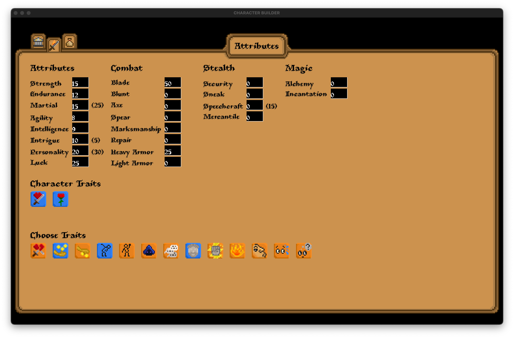

### Traits 

This is a concept I snagged from Crusader Kings 2 - a game I've spent countless hours playing as well.

Basically, a trait can represent and cause a few different things:

1) chiefly, they can buff or debuff attributes and skills. 

Take the "brave" trait that I've come up with now: It increases the "Martial" attribute but damages the "Intrigue" attribute.
This modifies the character's skills and traits, but their base levels remain the same. So if a character has a "base" Martial level of 15, and then the character earns the
"brave" trait, that Martial level is modified up to 25. If they were to lose the trait at some point, they would lose this modification to their Martial level.

2) dialog and other worldly interactions can be influenced or changed.

One thing I'm definitely planning to do is have traits play into dialog options. Suppose you are in a dialog situation where someone challenges you to a fight.
If you have the brave trait, perhaps there will be some penalty to declining fight (since a truly "brave" character perhaps would never do so).
Or, if you had the "timid" trait, perhaps it is the other way around and it either the accept-fight option is disabled, or comes with a penalty.

I think this will add a lot of fun and interesting dynamics to the game. Perhaps there are humorous or ridiculous dialog options that ordinarily you wouldn't want to choose, 
but unfortunately your character recently acquired the "lunatic" trait which can randomly cause them to be forced to do the ridiculous dialog options. This could be frustrating,
of course, but in my experience playing games like CK2, it actually is kind of fun and makes your role-playing experience a little more sincere.

3) informs about the character's personality, background, or other context - which makes for a little more "immersive" role-playing.

One thing that makes CK2 more fun is how you can look at a character's profile and see which traits they have - which can sort of paint a picture of who they are:

"Oh, I see, this guy is a priest, he's a drunkard, and he believes he's a werewolf."

Especially in a game like CK2 where there are lots of random events that occur involving other characters, it can make for a lot of funny moments. I don't know how much "random events"
this game would have, but either way it will add a little more color to the game I think.

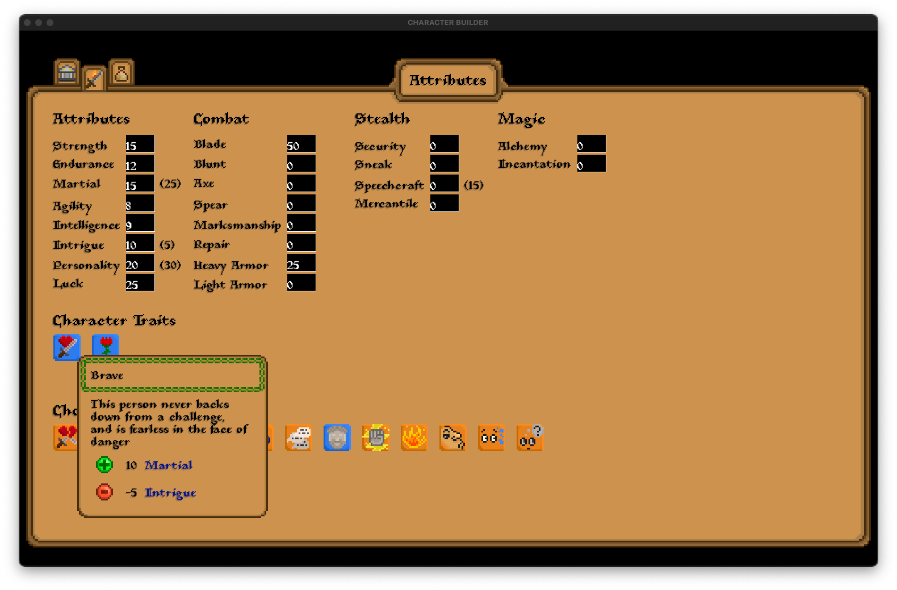

## Up Next 

Now that I've made pretty much everything the character builder needs, I think I'm in a good position to start working more seriously on the following:

1) Combat system 

I've already worked on this a little so far, and it's in a very primitive form as of now. Basically, characters can use a shield to block, and do a slash with a sword.
I've also made a mechanic where, if you are holding the right mouse button ("right clicking") then the character will face towards the mouse pointer even while walking.
The idea here is, it helps you focus on facing towards an opponent while still being able to move freely and not have to turn away.

I do believe that overall, the combat system won't be super sophisticated in this first version of the game I'm planning. One constraint is that it's hard to define too many 
body animations since every time a new frame is created, that means more drawing work for every equipable item. I'd like to be able to create a lot of items, so I've been trying to keep 
unique body animation frames to a minimum and reuse them when I can. But, the downside there of course is the animations are not quite as "pretty" and can look slightly awkward at times.
If I were really good at this art stuff, maybe I could optimize the frames to look really smooth for multiple different animations.

So, anyway, here are some ideas I might pursue in the combat system:

- add a "stun"/"recoil" animation, which happens when a character is hit by an attack.
- add a "backslash", which happens if you swing your sword immediately after a first swing has ended. Like a sword being swung back and forth. Adds a tiny bit of color to the combat,
although not much.
- add a stab attack for swords. maybe this would be triggered if you are moving in a certain direction? or maybe if you attack while bracing with your shield? But, adding more attack 
options and mechanics there would improve things a lot, since they are pretty dull and repetitive right now.
- adding ranged weapons like bows, javelins, etc. this will definitely happen at some point, but probably later on.
- oh, and of course, factor in the skills and attributes into combat. I need to do some things like define how weapons' damage is calculated, and then factor in skill 
and attribute levels. This will be really important and have big implications on how the game overall is played, so will take some careful planning.

2) Quest system, and improve dialog system

What I'm really excited to get cracking on is getting the first quests created. I'm not exactly sure where to start, but maybe it would make sense to just start creating the opening 
game scenes and the first quests as you begin a new playthrough. I'm envisioning an opening scene very similar to Morrowind, where you arrive on a boat. So, something like that,
add in the character creation screens (basically just copying the character builder, with some limitations), and then an initial quest that involves dialog.
The dialog system is still very basic and not very sophisticated yet, so I'm sure it will be getting a lot of reworking as I go.

...

For now, I think I might just move on to option 2, because that's what I'm really excited for. I've been spending a lot of time poring over character animations and stuff for a while,
so let's give that a break and work on option 2 some more, until we are at our first combat-related quest in the game.

# 2026-01-30

## Improvements to the Character Builder

In the past couple days, I've been continuing to add new features to the character builder to help facilitate building new characters and NPCs in the future.
I think this will be a vital part of the game development process, so I've spent some time trying to make it work well, fixing up bugs, and eventually I plan for it to have everything 
you would want or need when designing a new NPC to place into a game.

From the start, it was all on a single page: there were options to choose which body armor, headwear, and weapons to equip, and then a dropdown menu to choose which animation to demo.
It was really originally made just to help with the design process for the player and its animations. But by now, I've made it so you can save the characters off to a JSON file, and this
has become the actual tool I plan to use for creating any and every NPC. Perhaps once everything is fully refined and streamlined in terms of code, I will be able to write some code 
that can auto-generate some generic NPCs too.

So, by now with the vision of it being a fully fleshed character designer, I decided to add an inventory page. This inventory page lets you add items to the character's inventory and 
set their gold. When you add armor to the character from the "Appearance" screen, it adds that armor item to the inventory too, as you would expect.

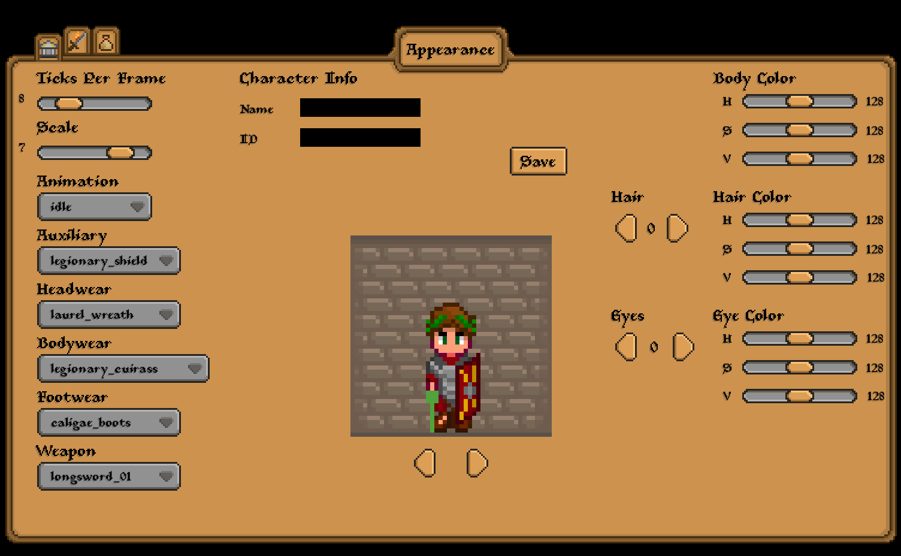

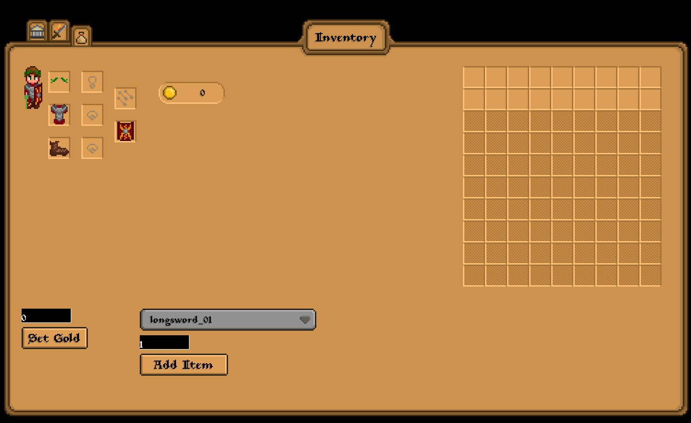

### Next Up for Character Builder 

I need to polish up a couple things on the inventory page, but everything already seems to be working as expected so next I'll probably move on to the stats page.
This "stats" or "skills" page will show all the details about what level the character is, how much stamina and HP it has, what levels its skills are, etc. I'm assuming this will 
be a lot more work than the inventory page since I will also be making a lot of decisions about the game and its mechanics as I go. Perhaps I'll just stick with the basic concepts 
for now, and then as the regular game development proceeds and the different concepts with combat etc mature, then I'll finish it up here. However, I do think it's better to have 
all of this figured out and finished up before I really start work on the game, because if I need to go back and change things later that could get messy, especially for characters 
that I've already made (e.g. I might have to go back and clean up character definitions if I change them after they've been created).

# 2026-01-28

## Choosing a Name for the Engine

Up until this point, this game engine has just been called "2d-game-engine". I think it's time we actually chose a name for this thing. 

Since I'm planning to make a game set in the classical Roman world, I think something in that theme would be cool. I think using Greek and Roman names for tech-related projects
is quite popular already though, so I'll need to get creative and avoid overly common names.

Ideas:

- Mundus: means "world" or "universe". Seems fitting, since this is ultimately for designing a world.
- Saturn: father of the gods.

The "Saturn Engine" maybe? And in go, I could either name it `saturn` or `saturnEngine`. I like Saturn because it's nice and simple, and it also has a couple different
ways it can be represented: perhaps the logo could be something like the shape of the planet Saturn, but then in other places there can be greco-roman themes to remind you
that it's also a reference to the god Saturn. 

I'll keep this is the front-runner for now, and maybe soon I'll get to work on changing the name of this go module.

# 2026-01-23

A new update on the status of the character builder: I've changed some of the layout, added new fields for things like footwear, and have finished up (for now) a full 
suit of legionary armor (headwear, shield, boots, bodywear, etc). Things seem to be working pretty well, and I think we've pretty much covered all the different animations we'll need
for the first version of the game I'm planning to make. Here's how it looks:

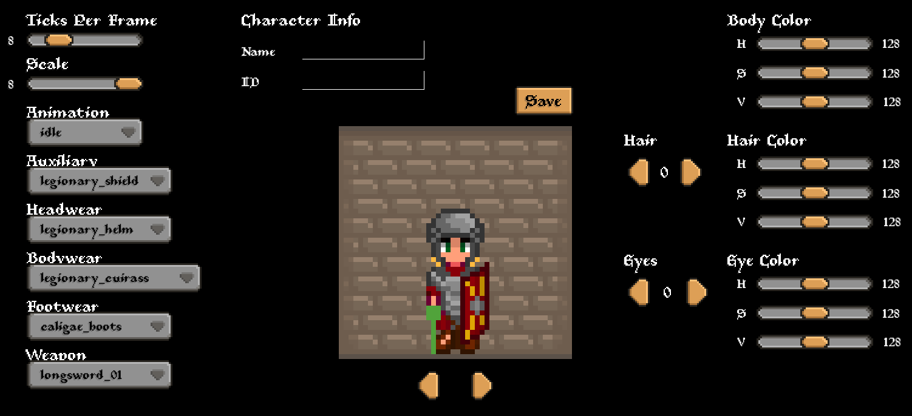

# 2026-01-22

Ran into an interesting problem today, which ultimately ended up being my mistake, but I remembered that we are doing something tricky here with the body image frames,
so I wanted to take a second to quickly go over what we do and why.

## Entity Body System and Render Order

Our entity body system is a bit complex: we have multiple body parts (eyes, body, arms, legs, hair, equiped body, equiped legs, etc) which all need to move together to create the
resulting animation frames for an entity. This gets complicated and tricky really quick: If you want to add new animation frames, you have to make sure all the pieces sync up together
correctly. Also, when drawing these different pieces (in ebiten, on the screen) we have to figure out which parts draw before the others. This gets a little more complicated when you
factor in that when the entity is facing different directions, the drawing order will change (or certain things are excluded altogether).

Consider the sword slash animation. Generally, I want the hair set to appear on top of the body, because that makes sense doesn't it. I also want the hair set to appear on top of body
armor, in case the character has long hair (It might cover the shoulders). This is fine, and this all works alright with the arms, since I render the arms below the body armor too.

So, we have a render order of: body, arms, body armor, hair

However, when the character is facing up, this changes some things. The sword slash animation has the arm cocked back behind the character's head, and therefore his hand would show "above" the hair (since the hand is _behind_ the head, but we are facing _up_). But, this causes a problem: we still want the hair to draw on top of the body armor, but the body armor needs to
draw on top of the arms! There's a conflict here, because we can't draw the arms both below the body armor and above the hair.

## "Subtracting" Arms from Body Armor

So, the solution to this was a bit creative: Ebiten has some image "blending" functions that let you do things like cut out overlapping portions of two images.
In my code, I've been referring to this as "subtraction", and to get around the above problem, I "subtract" the arms body set by the body equipment set.
What this means is, if part of an arms animation frame is covered by the body armor, that portion is cut from the frame. That way, I can draw the arms body set "on top" of the body armor
without it actually showing up on top of it.

So, creative solution, yes. Also definitely adds some complexity to this code. That's for sure. But, I think it's a good enough trade off, because the alternate would probably include
making more and more frames for different possibilities and having some tricky logic in the code for detecting these different cases. Also, luckily we only really need to define a body 
parts definition once and keep reusing it. Once everything is working smoothly, I shouldn't have to touch it much anymore. But of course, anytime I do have to touch it, there are more
risks involved and I have to retest things carefully.

## Takeaways: Added Complexity, and How to Cope with it

I think in an ideal world (at least, the most simple world) I would just have a simple set of frames for every entity body animation, and not need to have everything split up into
different moving parts that need to be synchronized and drawn in the correct order. If the character only had a few possible sets of clothing and hair styles, this might be feasible,
but since this game will include lots and lots of different sets of armor, clothes, hair styles, etc, we need to make things as customizable as possible to accomodate that.

While I'm working with a lot of complexity here, one thing I keep making more robust as development continues is all of the validation and panic cases in the code.
The quicker my code can identify something is wrong, the better, as I can nip the issue in the bud. For this image subtraction issue, I ran into quite the confusing issue because suddenly,
the arms-body armor subtraction seemed to stop working. After adding new validation checks to everything, I realized that the image being used as the "subtractor" (the body armor image)
was empty... how? Well, I made a silly mistake and accidentally shifted the rows of the body armor animation frames, so suddenly an empty tile from the tileset was being used.
An annoying setback, but now I have further validation that checks if an image is "empty" and panics if so. So, if this same issue happens in the future, I should be able to catch it 
much quicker, and a lot earlier in the call stack.


# 2026-01-21

Back from New Years travel, but have finished up some refactoring that I started just before leaving. Took a little while to figure out where I left off - in hindsight, probably better
to not start that kind of big change until I was back, but we're back up and running!

I was refactoring the entity body system a bit: I've split the legs off of the body into its own body part, so that it can act independently of the head and torso.
The main reason this was necessary is that we need to be able to do some animations while both sitting and standing, or while riding a horse, etc.
For example, a character will need to be able to do the "drink from glass" animation while both standing and sitting. Also, a character should be able to swing a sword while both 
standing on the ground or riding a horse. It adds more flexibility to the character animations which is good.

But, the downside is that it complicates defining an entity's body frames a bit more. I used to just be able to clearly look at which frames were for which, but now that arms, legs, and
body are all split into their own tiles, it's trickier to spot the right ones that are supposed to be used together to form the actual full body animation frame. But, luckily I won't need
to do this much since I there won't be many different body set options. For clothing and armor, it's a little easier since there are just two parts: the torso/arms and the legs.

Speaking of which, I'm considering if I want to add support for equipping different leg equipment that differs from the body/torso equipment.
For example, maybe a character would want to wear some body armor like a legionary cuirass, but then be allowed to wear a different set of armor on the legs such as chainmail greaves.

Once I've ensured all the bugs are worked out of the new refactored body system, I'll move back on to improving/testing the combat system, improving NPC fighting AI, and then start
working on the first opening scenes and quests. A goal I have is to have some early stages of the game and the opening sequences mostly done by June, since I'll be going to the US and
can share the progress I've made with friends and family and get their feedback.

# 2025-12-03

Making more progress on the entity body animations and mechanics; I've added an additional "auxiliary" item type: the shield.

Shields use the same arm image as torches do, but they differ in a few ways:

1. they don't have an idle animation
2. they have an additional animation they support: blocking. torches can't do this, so I'll have to add some logic somewhere to handle preventing torches from running the blocking animation.

This just adds another case of special handling to the existing logic of the entity body and its animations, so it makes me wonder if I should review the code
and look for a way to further simplify or streamline things like animations. Currently, each animation is enumerated as specific fields of a BodyPart.
But, I'm wondering if it would be smarter and more scalable to instead make some kind of animations map where new animations can be simply registered in a single place,
and then in each location in the code where things like animations are handled, we can just iterate over the map of animations.

Anyway, I'm guessing I'll be spending the rest of this week and possibly next week finalizing some of these animations and entity body mechanics.
I want to get it working rock solid before I completely move on to other things. For one, if I narrow all the animations down now, then I will be able to make armor and weapons
more safely (without the risk of needing to redo or touch them up later).

I'm also thinking through how shields will work with combat. I think I have a few ideas to nerf them a bit, so that they aren't too overpowered (we don't want people to just
hold the block key forever until the enemy hits, and then just attack the enemy while they are stunned).

- While blocking, entities can't move. So, you sacrifice mobility for safety
- When holding up the shield, it takes a split second for the shield to actually reach its real effectiveness. This prevents players from just quickly spamming the block right as an attack is landing.
- if the entity is out of stamina, the shield can no longer withstand power attacks. power attacks sap the stamina from the blocking entity, and a power attack on a blocking enemy does not stagger the attacker. So, if someone is being stubborn and just sitting there holding the shield, an attacker can just hack away with power attacks if they want to break through (and they have the stamina).
- perfectly timed blocks (right at the instant of the strike, about) could trigger a "parry" where the defender counters the attack with an attack of his own.

Not sure if I'll use all of these ideas, but just wanted to brainstorm some real quick. Hopefully I can get the blocking combat mechanics working soon.

# 11/27/2025

A little snapshot of the current state of the Character Builder. I made this to facilitate creating new characters and NPCs in the game.
I've realized that this will probably be a very key thing for the future development of this game, so I'll be investing some time in making it work well,
adding new customizations and inputs, etc. Ultimately, something very similar will probably be used when players are starting a new playthrough and
designing their own characters.

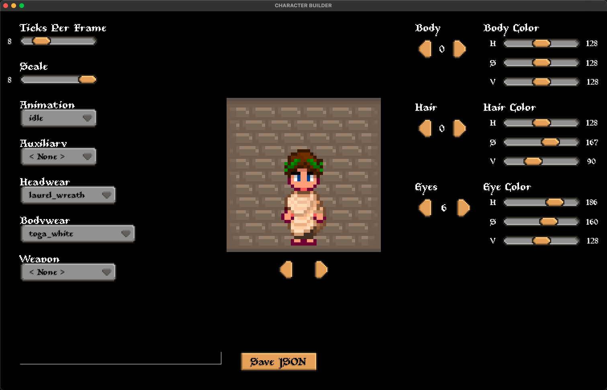

# 11/21/2025

Starting this development blog to document the journey of creating this game. By now, development is already well underway, but also
probably just only really getting started.

Full history up to this point:

- started on this project, a 2d game engine, about a year or two ago (Looks like Feb 2024, according to git).
- went on a long hiatus at some point, most likely when I started my job at Hexabase.
- near the end of my time at Hexabase (mid to late 2025), I decided to pick things back up. At this point, the game engine was still very clunky and only had some basic concepts developed, like rendering maps and supporting a character walking around the screen. However, I decided to basically rip out a lot of the old logic and rewrite it, as I wasn't satisfied with how it worked. I also realized I need to change how I handle maps and animations, etc since I wanted to make use of the Tiled map editor.

So, at this point, I've been working full time on this for the past few months (August to November) and I've made a lot of considerable progress.
As of now, here are some of the major things that are working pretty well:

- Tiled maps and tileset integration is fully supported, and maps can be easily created and run in the game.
- Tiled tilesets are also widely used for any case where we need an image; it is pretty convenient to use their framework to easily organize and get tiles, frames, etc.
- Entities (NPCs, the player, etc) have been implemented and are pretty matured at this point; support for movement, collisions, animations, etc is pretty good at this point.
- NPC logic is still in its infancy, but I have created a "tasks" system to organize NPC behavior, into tasks such as "follow another entity", "attack another entity", etc. I foresee this growing in maturity until eventually there are really advanced tasks for all sorts of behaviors, and even full day schedules.
- Items have been developed to a basic level of functionality; the player has an inventory, and items can be put in the inventory. Items cannot be actually equiped yet, but that is next up.
- A trading screen and trading mechanics have been implemented, as well as a money system; the player can start a trade session and trade their items for gold, or use gold to buy items, and upon completing the trading transaction those item movements persist as expected.
- basic fighting mechanics have been implemented. Entities can do simple melee attacks on each other, and if hit there is a simple damage flicker animation and they get bumped backwards. Things like health and other vitals still need to be implemented though.

## Next Steps

So, I'm feeling pretty good about where we are at so far: a lot of the basic mechanics are doing well. Here are some things I'm planning to work on next:

- Equipping items: since the entity body can now show equipped items in all of its animations, now I need to make the body actually sync to what is equipped in the entity's inventory. If the player equips a certain helmet, I need to sync that to the body, basically. Same with weapons, auxiliary items, etc.
- Continue improving the combat system: since combat will be a big part of the game, I want to make sure it feels smooth and interesting. I don't want it to just be a single animation that you just repeatedly trigger over and over with left clicks until one of you dies. There should be certain strategies you can develop, different mechanics like power attacks, stamina involved in some way, etc. Also, it shouldn't feel frustrating or clunky.
- Continue to improve and finalize the player animations; this needs to be figured out and finished up in the early stages of this game's development, since every time an entity animation changes, I have to retest the animation's performance in the game, remake the affected clothing assets, etc. Ideally I get this squared away as soon as possible, so that I can start spending more time on new item artwork and not have the risk of needing to remake them later on.

## Lessons learned so far

Here are some big things that I've learned so far, which I've basically adopted as coding rules by now:

1. For complex and frequently used structs, always make a "constructor" function

Usually I name these "New[Struct Name]"; essentially a constructor for an object. Instead of directly instantiating a struct, use this function to guarantee that all the necessary inputs have been set, all necessary validation is done, etc. This makes things a lot easier, as you can then assume a lot of things to be confirmed throughout the rest of the lifecycle of the component or code feature.

2. Always panic and crash when state is found to be wrong (instead of trying to correct things and continue)

Basically the idea is this: if there is ever a point in the code where something is known to be incorrect, we want to crash. We don't want to ever tolerate that bad state, because that can just lead to more bad things down the road: it could materialize into other problems in other areas, and if we just continue to "work around" it, things get messy quick. I find it simpler to just add lots of assertions and panics in functions wherever I can think of a possible bad state, so that when it ends up happening - which is more often than you'd think - you can immediately nip it in the bud. Another tip is, ideally you put these assertions as close as possible to where the problem could originate. Putting the assertions/panics in the Update loop will definitely _notice_ the issue, but you won't be able to tell where that bad state actually started. So, anytime you manipulate data or process some action - those are good places to put a bunch of assertions.
